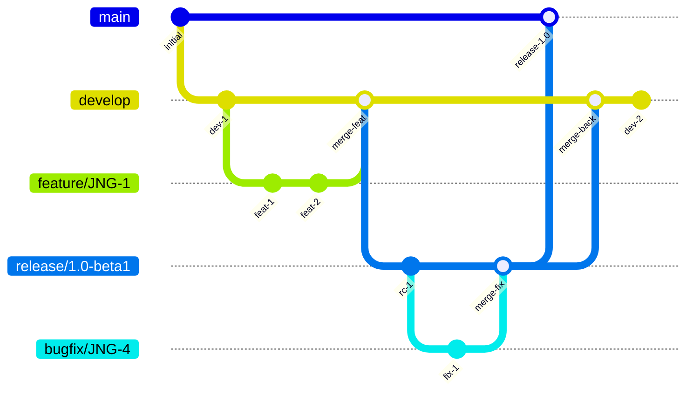
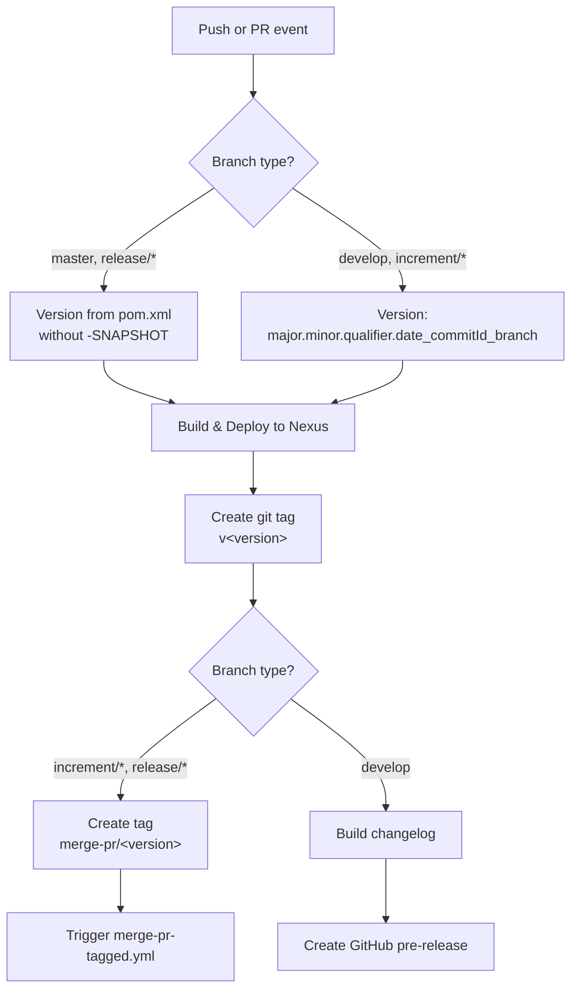
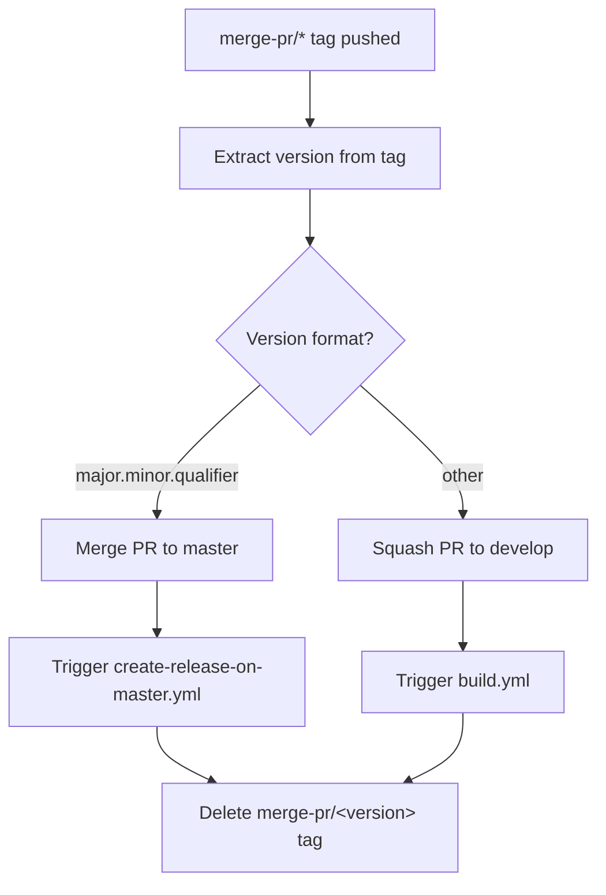
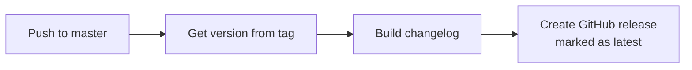
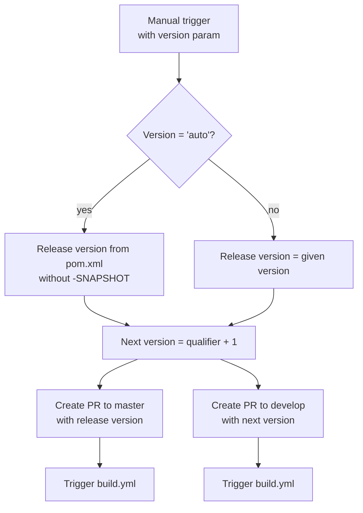

# Development Version and Branch Handling

This document describes the branching strategy, versioning policy, and CI/CD workflows for JUDO Runtime Core.

## Branches

The versioning policy follows [GitFlow](https://www.atlassian.com/git/tutorials/comparing-workflows/gitflow-workflow):

| Branch Pattern | Purpose |
|----------------|---------|
| `develop` | Latest development sources of the current active version |
| `feature/JNG-NUMBER_short_summary` | Feature branches based on `develop` for new features |
| `release/X.Y.Z` or `X_Y_betaN` | Release branches (the `release/` prefix is reserved for CI) |
| `bugfix/JNG-NUMBER_short_summary` | Bug fixes based on release branches; must be applied to release and development branches of newer versions |
| `support/JNG-NUMBER_short_summary` | Support branches based on release branches; same merge-forward rules as bugfix |
| `master` | Latest released sources of the current active version |

## Version Numbers

Versions follow semantic versioning with these rules:

- **Feature branches:** Do not change version numbers
- **`develop` branch:** 2nd number incremented when a release branch starts
- **Bugfix branches:** No version change — applied on release branches during pre-release testing
- **Support branches:** 3rd number incremented when started; merged back to release branch on update release (without merging to master)
- **Hotfix branches:** 4th number incremented when started; applied to both release and master branches

## GitHub Actions Workflows

### build.yml — Main Build Pipeline

Triggered on pushes to `develop` and pull requests to `develop`, `master`, `increment/*`, and `release/*`.

### merge-pr-tagged.yml — PR Merge Automation

Triggered when a `merge-pr/*` tag is pushed. Handles automatic merging of PRs to the correct target branch.

### create-release-on-master.yml — Release Creation

Triggered on pushes to `master`. Creates a GitHub release with a generated changelog.

### release.yml — Manual Release Trigger

Manually triggered with a version parameter (`auto` or a specific `major.minor.qualifier` version).

## Development Rules

> **Important:** There is no commit without a ticket number. Every pull request and commit must include a JIRA reference in the format `JNG-xxx`.

Issue tracking is managed in [JIRA](https://blackbelt.atlassian.net/jira/dashboards).
