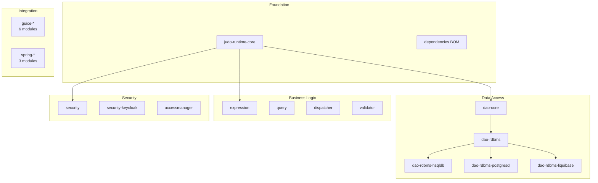

# Contributing to JUDO Runtime Core

## Development Environment

Before contributing, ensure your environment meets these requirements:

- **Java 21** (LTS) or later
- **Maven 3.8.3** or later
- Compliance with the [judo-community CONTRIBUTING guide](https://github.com/BlackBeltTechnology/judo-community/blob/develop/CONTRIBUTING.adoc)

## Code Structure

This is a multi-module Maven project with 31 submodules organized in layers:



## Submitting an Issue

Before submitting, search the [issue tracker](https://github.com/BlackBeltTechnology/judo-runtime-core/issues) — your problem may already be reported or resolved.

To help us reproduce and fix bugs quickly, include:

- Output of `java -version` and `mvn -version`
- Your `pom.xml` or `.flattened-pom.xml` (when applicable)
- A minimal use-case that reproduces the failure

> **Important:** We will request a minimal reproduction case. Isolating the problem is essential for efficient diagnosis and fixing.

File new issues via the [issue form](https://github.com/BlackBeltTechnology/judo-runtime-core/issues/new/choose).

## Submitting a Pull Request

This project follows [GitHub's standard forking model](https://guides.github.com/activities/forking/). Fork the repository before submitting pull requests.

## Build Commands

```bash
# Run tests only
mvn clean test

# Full build with install
mvn clean install

# Build a single module
mvn clean install -pl judo-runtime-core-dao-rdbms

# Run a specific test class
mvn clean test -pl judo-runtime-core-jackson -Dtest=LocalDateTimeSerializerTest

# Skip tests entirely
mvn clean install -DskipTests
```
