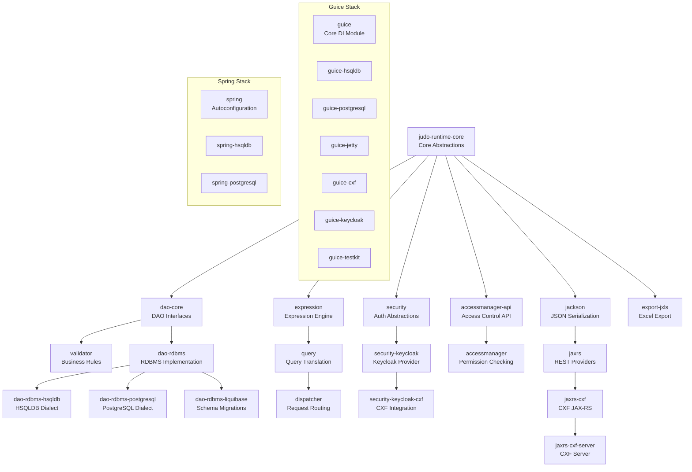
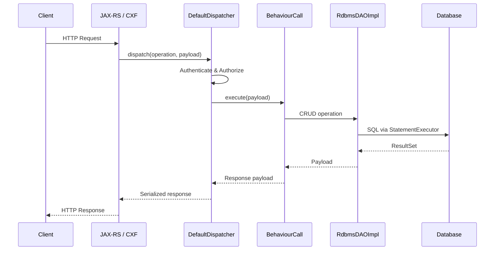

# JUDO Runtime Core

[](https://github.com/BlackBeltTechnology/judo-runtime-core/actions/workflows/build.yml)

## Introduction

JUDO Runtime Core is the backend runtime framework for the [JUDO platform](https://github.com/BlackBeltTechnology/judo-community). It provides the full server-side stack — data access, business logic dispatching, security, validation, query translation, and REST API serving — all driven by JUDO metamodels (ASM, RDBMS, Expression, Query, etc.).

The framework ships two parallel dependency injection stacks: **Google Guice** for standalone/embedded deployments and **Spring Boot** for Spring-based applications. Both stacks wire the same core modules with database-specific dialects for HSQLDB (development/testing) and PostgreSQL (production).

## Module Architecture

The 31 modules form a layered dependency graph. Core abstractions sit at the top, with concrete implementations and integration modules below.



## Key Runtime Flow

This sequence shows the primary request processing path from an incoming REST call through the dispatcher to the database and back.



## Technology Stack

| Category | Technology | Version |
|----------|------------|---------|
| JVM | Java | 21 (LTS) |
| Build | Maven | 3.8.3+ |
| Code Generation | Lombok | 1.18.38 |
| DI (primary) | Google Guice | 5.1.0 |
| DI (alternative) | Spring Boot | 3.5.0 |
| REST | Apache CXF | 3.6.2 |
| Servlet Container | Jetty | 10.0.24 |
| Production DB | PostgreSQL | 42.7.7 (driver) |
| Dev/Test DB | HSQLDB | 2.6.1 |
| Connection Pool | HikariCP | 5.0.0 |
| Schema Migration | Liquibase | 4.9.1 |
| JSON | Jackson | 2.17.2 |
| Auth | Keycloak | 17.0.1 |
| Parser | ANTLR | 4.5.1-1 |
| Testing | JUnit 5 | 5.13.4 |
| Mocking | Mockito | 5.17.0 |
| Integration Tests | TestContainers | 1.21.1 |

## Build

```bash
# Full build with tests
mvn clean install

# Skip tests
mvn clean install -DskipTests

# Build parent POM only
mvn clean install -DskipModules=true

# Single module
mvn clean install -pl judo-runtime-core-dao-rdbms

# Run specific test
mvn clean test -pl judo-runtime-core-jackson -Dtest=LocalDateTimeSerializerTest
```

## Quick Start

1. **Clone and build:**
   ```bash
   git clone https://github.com/BlackBeltTechnology/judo-runtime-core.git
   cd judo-runtime-core
   ./mvnw clean install
   ```

2. **Choose your DI framework:**
   - Guice → `judo-runtime-core-guice-*` modules
   - Spring → `judo-runtime-core-spring-*` modules

3. **Choose your database:**
   - Development/testing → `*-hsqldb` modules (in-memory)
   - Production → `*-postgresql` modules

## Context

This project is a building block of the [judo-community](https://github.com/BlackBeltTechnology/judo-community) aggregator project. See the corresponding documentation for how this module fits into the broader JUDO ecosystem.

## Contributing

See [CONTRIBUTING.md](CONTRIBUTING.md) for guidelines on submitting issues and pull requests.

## License

[Eclipse Public License - v 2.0](https://www.eclipse.org/legal/epl-2.0/)
