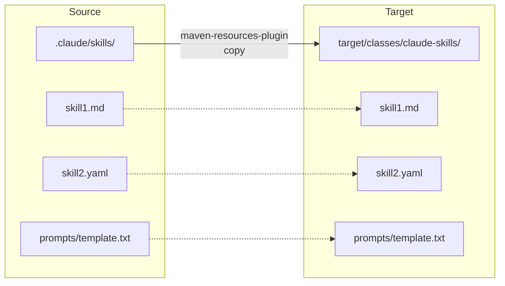
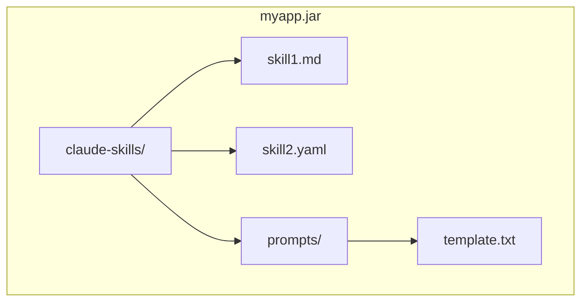
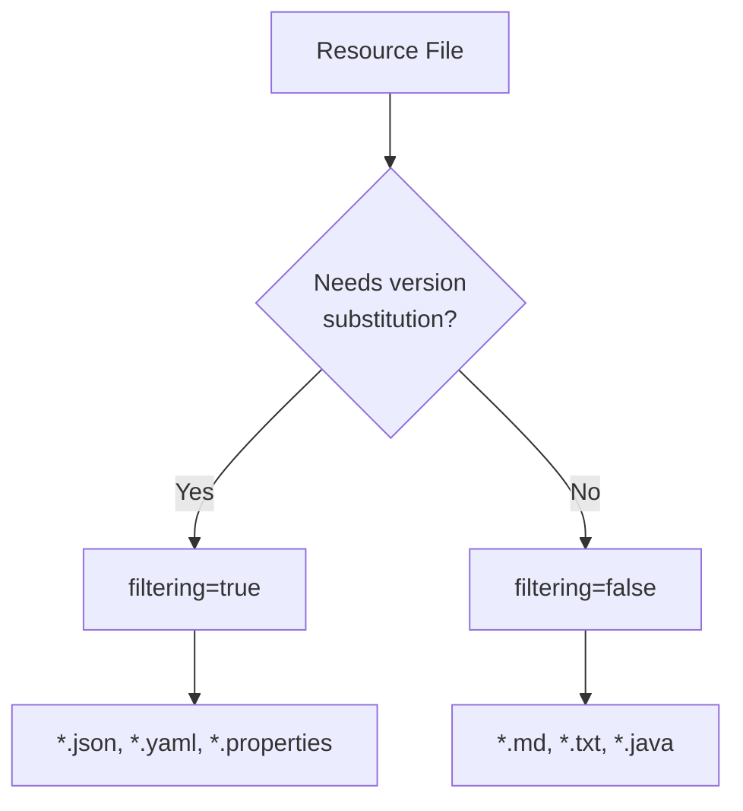

# Including Skill Files in JAR

This document describes how to package skill files (interceptor configurations, workflow definitions, AI prompts, etc.) into your application JAR for runtime access.

## Maven Configuration

Add this plugin configuration to your `pom.xml`:

```xml
<plugin>
    <groupId>org.apache.maven.plugins</groupId>
    <artifactId>maven-resources-plugin</artifactId>
    <executions>
        <execution>
            <id>copy-claude-skills</id>
            <phase>process-resources</phase>
            <goals>
                <goal>copy-resources</goal>
            </goals>
            <configuration>
                <outputDirectory>${project.build.outputDirectory}/claude-skills</outputDirectory>
                <resources>
                    <resource>
                        <directory>${basedir}/.claude/skills</directory>
                        <filtering>false</filtering>
                    </resource>
                </resources>
            </configuration>
        </execution>
    </executions>
</plugin>
```

## How It Works

### Build Time Flow



### Runtime JAR Structure



## Accessing Files at Runtime

### Java

```java
// Load a skill file from classpath
InputStream is = getClass().getResourceAsStream("/claude-skills/skill1.md");
String content = new String(is.readAllBytes(), StandardCharsets.UTF_8);

// Or using ClassLoader
ClassLoader cl = Thread.currentThread().getContextClassLoader();
InputStream is = cl.getResourceAsStream("claude-skills/prompts/template.txt");
```

### Spring

```java
@Value("classpath:claude-skills/skill1.md")
private Resource skillResource;

public String loadSkill() throws IOException {
    return new String(skillResource.getInputStream().readAllBytes());
}
```

## Configuration Options

| Option | Description |
|--------|-------------|
| `outputDirectory` | Where files are copied in the build output |
| `directory` | Source directory for skill files |
| `filtering` | Set to `true` to enable Maven property substitution |
| `includes` | Glob patterns to include specific files |
| `excludes` | Glob patterns to exclude files |

### Example with Filtering

If you need Maven properties substituted in your files:

```xml
<configuration>
    <outputDirectory>${project.build.outputDirectory}/claude-skills</outputDirectory>
    <resources>
        <resource>
            <directory>${basedir}/.claude/skills</directory>
            <filtering>true</filtering>
            <includes>
                <include>**/*.yaml</include>
                <include>**/*.properties</include>
            </includes>
        </resource>
        <resource>
            <directory>${basedir}/.claude/skills</directory>
            <filtering>false</filtering>
            <includes>
                <include>**/*.md</include>
                <include>**/*.txt</include>
            </includes>
        </resource>
    </resources>
</configuration>
```

### Filtering Decision Flow



## Use Cases

- **AI/LLM prompts** - Package prompt templates for runtime use
- **Workflow definitions** - Include n8n or other workflow configs
- **Interceptor configurations** - JSON/YAML configs for dynamic interceptor behavior
- **Documentation** - Bundle skill documentation for introspection
