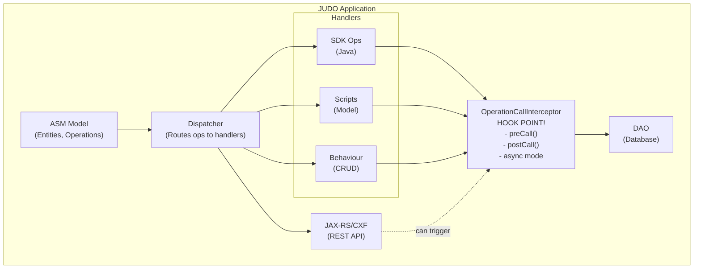
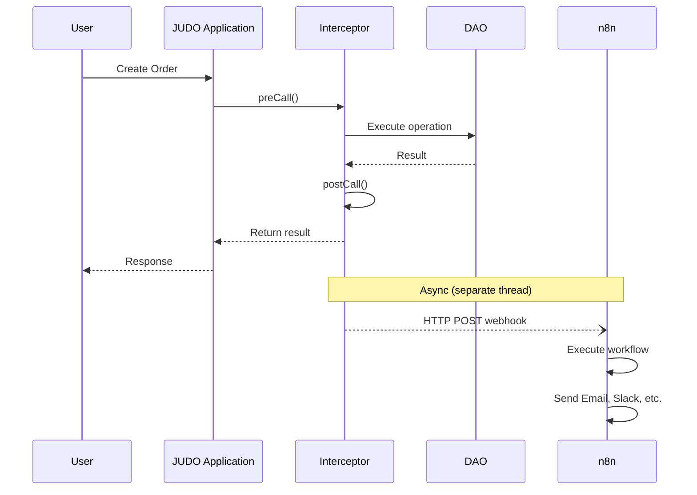
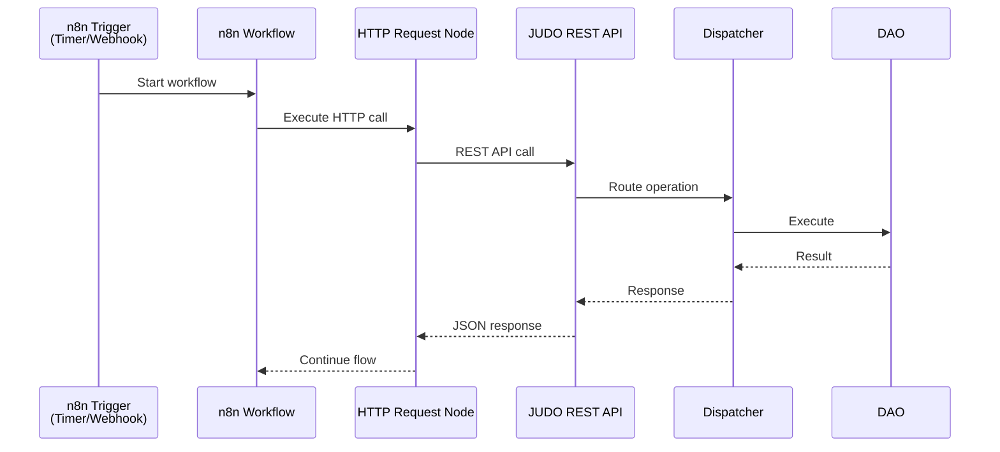
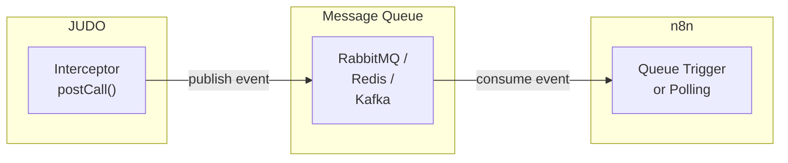
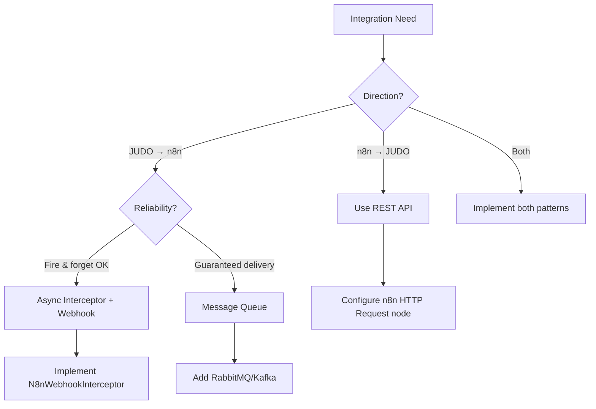

# JUDO Runtime Core - n8n Integration Plan

This document explores integration patterns between JUDO-generated applications and n8n workflow automation.

## Current JUDO Architecture



## Key Integration Point: OperationCallInterceptor

The `OperationCallInterceptor` interface (`judo-runtime-core-dispatcher`) provides hooks for integration:

| Method | Purpose |
|--------|---------|
| `getName()` | Unique interceptor identifier |
| `getOperations(AsmModel)` | Filter which operations to intercept (empty = all) |
| `async()` | If true, runs on separate thread (non-blocking) |
| `terminateOnException()` | Whether errors stop execution |
| `ignoreDecoratedCall()` | Skip the original operation entirely |
| `preCall(operation, input)` | Transform input before operation |
| `postCall(operation, input, result)` | React after operation completes |

---

## Integration Patterns

### Pattern 1: JUDO → n8n (Outbound Events)

JUDO operations trigger n8n workflows via webhooks.



#### Example Implementation

```java
public class N8nWebhookInterceptor implements OperationCallInterceptor {
    
    private final HttpClient httpClient;
    private final String n8nWebhookUrl;
    
    @Override
    public String getName() { return "n8n-webhook"; }
    
    @Override
    public boolean async() { return true; }  // Non-blocking!
    
    @Override
    public Collection<EOperation> getOperations(AsmModel asmModel) {
        // Filter to specific operations, e.g., only "Order" entity creates
        return asmModel.getOperations().stream()
            .filter(op -> op.getName().startsWith("create") && 
                         op.getEContainingClass().getName().equals("OrderService"))
            .collect(toList());
    }
    
    @Override
    public Object postCall(EOperation operation, Object input, Object result) {
        // Fire webhook to n8n after successful operation
        httpClient.post(n8nWebhookUrl, Map.of(
            "event", operation.getName(),
            "entity", operation.getEContainingClass().getName(),
            "payload", result
        ));
        return result;
    }
}
```

### Pattern 2: n8n → JUDO (Inbound Calls)

n8n workflows call JUDO REST APIs.



This pattern works out of the box - JUDO already exposes REST APIs via JAX-RS/CXF. n8n's HTTP Request node can call any operation defined in your model.

---

## Alternative: Message Queue Architecture

For guaranteed delivery and reliability, consider adding a message queue:



**Benefits:**
- Guaranteed delivery with retries
- Buffering if n8n is slow or down
- Decoupled scaling
- Event replay capability

---

## Implementation Considerations

### Decision Flow



### Questions to Answer

1. **Direction of integration?**
   - JUDO → n8n (events trigger workflows)
   - n8n → JUDO (workflows call JUDO APIs)
   - Bidirectional

2. **Workflow types?**
   - Notifications (email, Slack) on entity changes
   - Data sync with external systems (CRM, ERP)
   - Complex approval workflows
   - Scheduled data processing

3. **Reliability requirements?**
   - Fire-and-forget acceptable?
   - Need guaranteed delivery?
   - Should events queue if n8n is down?

4. **Volume expectations?**
   - Events per second/minute
   - Affects whether async interceptors suffice or need message queue

### Security Considerations

- n8n webhook authentication (API keys, JWT)
- JUDO API authentication for inbound calls (Keycloak integration)
- Network security (VPN, firewall rules)
- Payload encryption for sensitive data

### Observability

- Log all webhook calls (success/failure)
- Metrics for latency and error rates
- Dead letter queue for failed events
- Correlation IDs for tracing across systems

---

## Next Steps

1. **Decide on integration direction** and primary use cases
2. **Prototype** a simple interceptor that posts to n8n webhook
3. **Evaluate reliability needs** - webhook vs message queue
4. **Design event schema** - consistent payload structure
5. **Implement authentication** - secure the integration
6. **Add monitoring** - ensure visibility into integration health

---

## Related Files

- `judo-runtime-core-dispatcher/src/main/java/.../OperationCallInterceptor.java` - Main hook interface
- `judo-runtime-core-dispatcher/src/main/java/.../OperationCallInterceptorProvider.java` - Interceptor registration
- `judo-runtime-core-dispatcher/src/main/java/.../DefaultDispatcher.java` - Dispatcher that invokes interceptors
