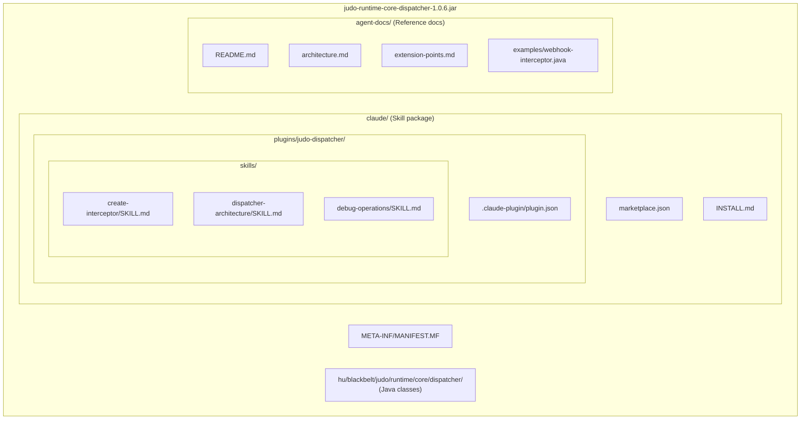
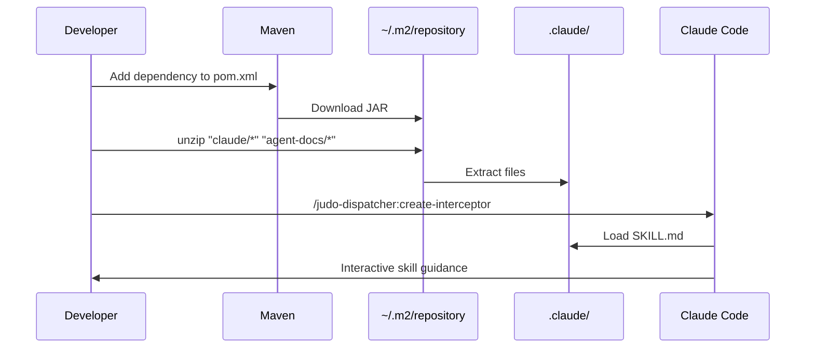
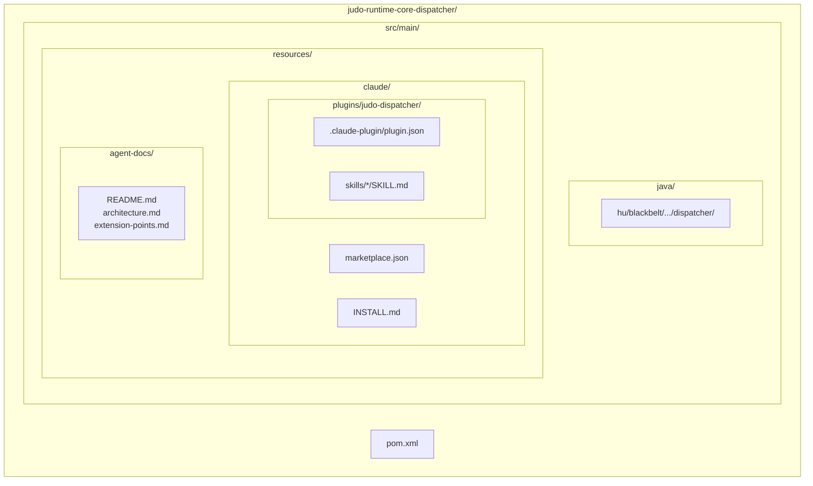
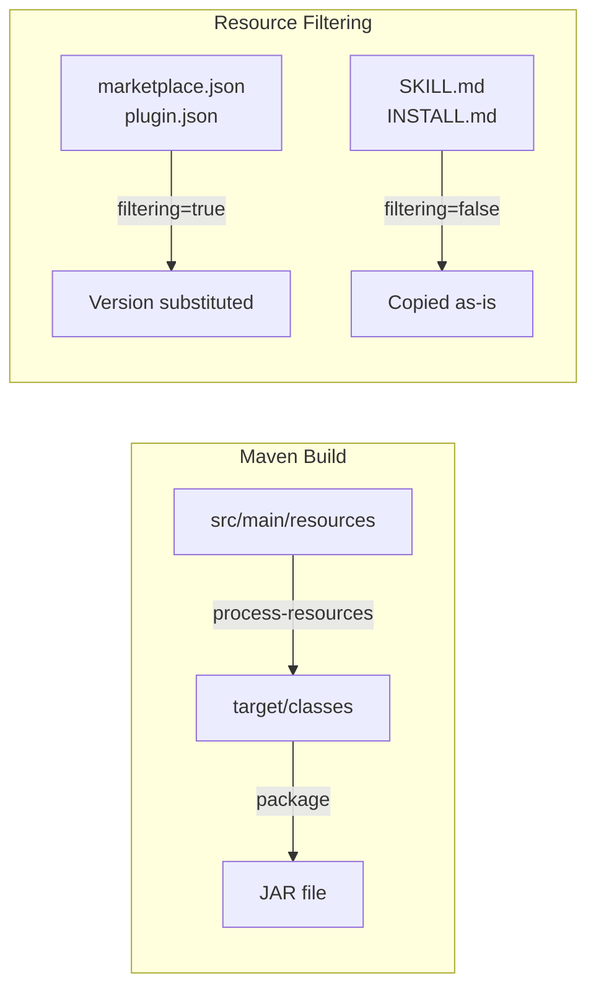
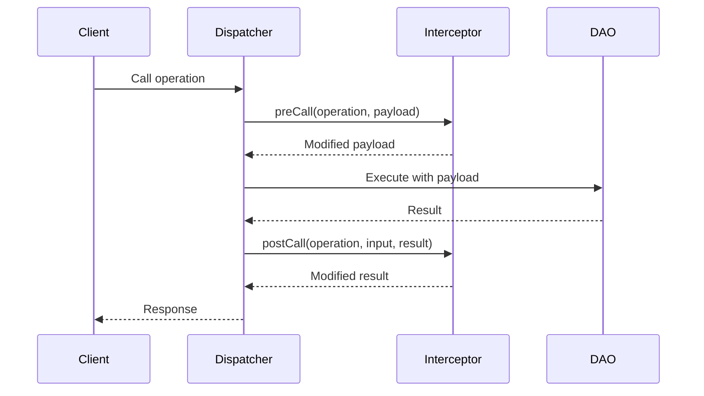
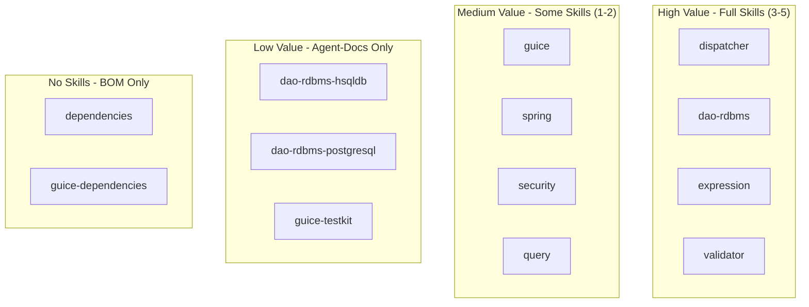
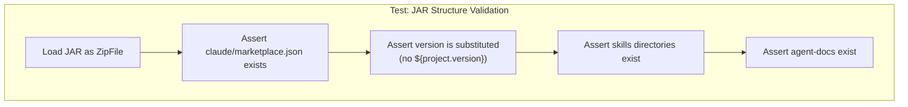
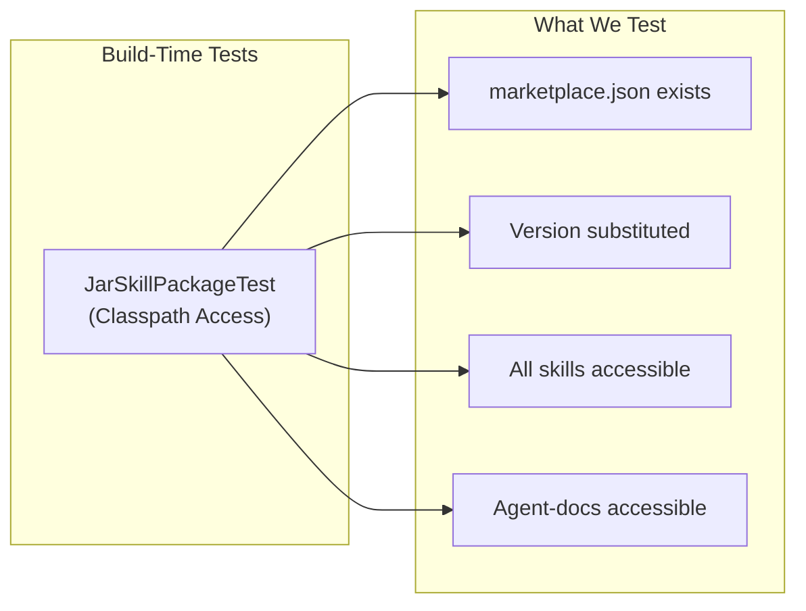

# Submodule Agent Docs & Skills Architecture

This document describes the architecture for making each JUDO Runtime Core submodule a self-contained skill package with embedded documentation, discoverable and installable from its JAR.

## Vision

Each module produces a JAR that contains:
- Java classes (existing)
- `claude/` directory with marketplace, plugins, and skills
- `agent-docs/` directory with reference documentation
- `INSTALL.md` with extraction instructions

### JAR Structure



## Consumer Experience



---

## Module Structure

### Source Layout



### Maven Configuration

Add to each submodule's `pom.xml`:

```xml
<build>
    <resources>
        <!-- Standard resources -->
        <resource>
            <directory>src/main/resources</directory>
            <excludes>
                <exclude>claude/**</exclude>
            </excludes>
        </resource>
        <!-- Claude resources with filtering for version substitution -->
        <resource>
            <directory>src/main/resources</directory>
            <filtering>true</filtering>
            <includes>
                <include>claude/marketplace.json</include>
                <include>claude/plugins/*/.claude-plugin/plugin.json</include>
            </includes>
        </resource>
        <!-- Claude resources without filtering -->
        <resource>
            <directory>src/main/resources</directory>
            <filtering>false</filtering>
            <includes>
                <include>claude/INSTALL.md</include>
                <include>claude/plugins/*/skills/**</include>
                <include>agent-docs/**</include>
            </includes>
        </resource>
    </resources>
</build>
```

### Build Flow



---

## File Specifications

### marketplace.json

```json
{
  "name": "judo-runtime-core-dispatcher",
  "version": "${project.version}",
  "description": "JUDO Dispatcher - Operation routing, interceptors, and request handling",
  "groupId": "hu.blackbelt.judo.runtime",
  "artifactId": "judo-runtime-core-dispatcher",
  "repository": "https://github.com/BlackBeltTechnology/judo-runtime-core",
  "plugins": [
    {
      "name": "judo-dispatcher",
      "path": "./plugins/judo-dispatcher",
      "description": "Skills for working with JUDO Dispatcher"
    }
  ],
  "agentDocs": "./agent-docs"
}
```

### INSTALL.md

```markdown
# Installing JUDO Dispatcher Skills

## Module Information
- **GroupId**: hu.blackbelt.judo.runtime
- **ArtifactId**: judo-runtime-core-dispatcher
- **Version**: ${project.version}

## Prerequisites
- Claude Code CLI installed
- Maven project with this dependency

## Installation

### Option 1: Extract from Maven cache

```bash
# Find the JAR
JAR=~/.m2/repository/hu/blackbelt/judo/runtime/judo-runtime-core-dispatcher/${project.version}/judo-runtime-core-dispatcher-${project.version}.jar

# Extract to current project
unzip -o "$JAR" "claude/*" "agent-docs/*" -d .
```

### Option 2: Using Maven dependency plugin

```bash
# Copy JAR to target
mvn dependency:copy -Dartifact=hu.blackbelt.judo.runtime:judo-runtime-core-dispatcher:${project.version} -DoutputDirectory=./tmp

# Extract
unzip -o ./tmp/judo-runtime-core-dispatcher-${project.version}.jar "claude/*" "agent-docs/*" -d .
rm -rf ./tmp
```

### Option 3: One-liner

```bash
mvn dependency:copy -Dartifact=hu.blackbelt.judo.runtime:judo-runtime-core-dispatcher:${project.version} -DoutputDirectory=/tmp/judo-skill && unzip -o /tmp/judo-skill/*.jar "claude/*" "agent-docs/*" -d . && rm -rf /tmp/judo-skill
```

## Available Skills

| Skill | Command | Description |
|-------|---------|-------------|
| Create Interceptor | `/judo-dispatcher:create-interceptor` | Step-by-step guide to create operation interceptors |
| Architecture | `/judo-dispatcher:dispatcher-architecture` | Understand dispatcher internals |
| Debug Operations | `/judo-dispatcher:debug-operations` | Troubleshoot operation execution |

## Verification

After installation, verify skills are available:

```bash
ls -la .claude/plugins/judo-dispatcher/
cat claude/marketplace.json
```
```

### plugin.json

```json
{
  "name": "judo-dispatcher",
  "version": "${project.version}",
  "description": "Skills for JUDO Dispatcher - interceptors, operation routing, variable resolution",
  "homepage": "https://github.com/BlackBeltTechnology/judo-runtime-core/tree/develop/judo-runtime-core-dispatcher",
  "skills": [
    {
      "name": "create-interceptor",
      "path": "./skills/create-interceptor",
      "description": "Create custom operation interceptors"
    },
    {
      "name": "dispatcher-architecture", 
      "path": "./skills/dispatcher-architecture",
      "description": "Understand dispatcher internals"
    },
    {
      "name": "debug-operations",
      "path": "./skills/debug-operations",
      "description": "Troubleshoot operation execution"
    }
  ]
}
```

---

## Example Skill: create-interceptor/SKILL.md

```markdown
---
name: create-interceptor
description: Step-by-step guide to create custom OperationCallInterceptor implementations in JUDO applications. Use when implementing webhooks, audit logging, input validation, result transformation, or any pre/post operation hooks.
metadata:
  author: BlackBelt Technology
  version: "${project.version}"
---

# Create Operation Interceptor

Guide for creating custom operation interceptors in JUDO applications.

## What is an Interceptor?

Interceptors allow you to hook into any operation (CRUD, scripts, SDK methods) to:
- Transform input before execution
- React to results after execution  
- Run async side-effects (webhooks, notifications)
- Replace the operation entirely

## Interceptor Flow



## Extension Point Interface

Implement `OperationCallInterceptor`:

```java
package hu.blackbelt.judo.runtime.core.dispatcher;

public interface OperationCallInterceptor {
    
    // Required: Unique name for this interceptor
    String getName();
    
    // Optional: Filter which operations to intercept (empty = all)
    default Collection<EOperation> getOperations(AsmModel asmModel) {
        return Collections.emptyList();
    }
    
    // Optional: Run on separate thread, outside transaction
    default boolean async() { return false; }
    
    // Optional: Stop execution if this interceptor throws
    default boolean terminateOnException() { return true; }
    
    // Optional: Skip the original DAO call entirely
    default boolean ignoreDecoratedCall() { return false; }
    
    // Optional: Called before operation executes
    default Object preCall(EOperation operation, Object payload) {
        return payload;
    }
    
    // Optional: Called after operation executes
    default Object postCall(EOperation operation, Object input, Object result) {
        return result;
    }
}
```

## Example: Webhook Interceptor

```java
public class WebhookInterceptor implements OperationCallInterceptor {
    
    private final HttpClient httpClient;
    private final String webhookUrl;
    
    @Override
    public String getName() { 
        return "webhook-interceptor"; 
    }
    
    @Override
    public boolean async() { 
        return true; // Non-blocking, runs on separate thread
    }
    
    @Override
    public Object postCall(EOperation operation, Object input, Object result) {
        httpClient.post(webhookUrl, Map.of(
            "event", operation.getName(),
            "entity", operation.getEContainingClass().getName(),
            "payload", result
        ));
        return result;
    }
}
```

## Registration with Guice

```java
public class MyInterceptorModule extends AbstractModule {
    @Override
    protected void configure() {
        Multibinder<OperationCallInterceptor> interceptors = 
            Multibinder.newSetBinder(binder(), OperationCallInterceptor.class);
        interceptors.addBinding().to(WebhookInterceptor.class);
    }
}
```

## See Also

- `agent-docs/extension-points.md` - All extension interfaces
- `judo-runtime-core-guice-testkit` - Testing utilities
```

---

## Module Categories & Skill Recommendations



| Module | Category | Recommended Skills |
|--------|----------|-------------------|
| `dispatcher` | Core | create-interceptor, architecture, debug-operations, variables |
| `dao-rdbms` | Core | custom-queries, query-debugging, dialect-extension |
| `expression` | Core | expression-syntax, custom-functions |
| `validator` | Core | custom-validators, validation-rules |
| `guice` | Integration | module-setup, dependency-injection |
| `spring` | Integration | autoconfiguration, spring-integration |
| `security` | Security | authentication-flow, custom-auth |
| `guice-testkit` | Testing | test-setup, interceptor-testing, fixtures |
| `dao-rdbms-hsqldb` | Dialect | (agent-docs only) |
| `dao-rdbms-postgresql` | Dialect | (agent-docs only) |
| `dependencies` | BOM | (none - no code) |

---

## Agent-Docs Structure

### README.md Template

```markdown
# JUDO Runtime Core - Dispatcher

## Overview

The Dispatcher module handles operation routing, request/response processing,
and provides extension points for interceptors and variable resolution.

## Key Concepts

- **Operations**: CRUD behaviors, scripts, SDK implementations
- **Interceptors**: Pre/post hooks for any operation
- **Variable Resolvers**: Provide context variables (user, timestamp, etc.)
- **Behaviours**: Built-in CRUD operations (create, update, delete, list, etc.)

## Extension Points

| Interface | Purpose |
|-----------|---------|
| `OperationCallInterceptor` | Hook into any operation |
| `OperationCallInterceptorProvider` | Provide multiple interceptors |
| `ActorResolver` | Resolve current user/actor |
| `VariableResolverManager` | Manage context variables |
| `DispatcherFunctionProvider` | Custom dispatcher functions |
```

### extension-points.md Template

```markdown
# Extension Points

## OperationCallInterceptor

**Purpose**: Hook into any operation for pre/post processing

**Interface**: `hu.blackbelt.judo.runtime.core.dispatcher.OperationCallInterceptor`

**Methods**:
| Method | Required | Description |
|--------|----------|-------------|
| `getName()` | Yes | Unique interceptor identifier |
| `getOperations(AsmModel)` | No | Filter operations (empty = all) |
| `async()` | No | Run outside transaction |
| `preCall(operation, payload)` | No | Before operation |
| `postCall(operation, input, result)` | No | After operation |

**Example**: See `skills/create-interceptor/SKILL.md`
```

---

## JUnit Test Strategy



### Test Implementation

```java
@Test
void jarContainsClaudeSkillPackage() throws Exception {
    Path jarPath = findBuiltJar("judo-runtime-core-dispatcher");
    
    try (JarFile jar = new JarFile(jarPath.toFile())) {
        // Verify marketplace.json exists and has version
        JarEntry marketplace = jar.getJarEntry("claude/marketplace.json");
        assertNotNull(marketplace, "marketplace.json should exist");
        
        String content = readEntry(jar, marketplace);
        assertFalse(content.contains("${project.version}"), 
            "Version should be substituted");
        assertTrue(content.contains("1.0.6"), 
            "Should contain actual version");
        
        // Verify plugin structure
        assertNotNull(jar.getJarEntry(
            "claude/plugins/judo-dispatcher/.claude-plugin/plugin.json"));
        assertNotNull(jar.getJarEntry(
            "claude/plugins/judo-dispatcher/skills/create-interceptor/SKILL.md"));
        
        // Verify agent-docs
        assertNotNull(jar.getJarEntry("agent-docs/README.md"));
    }
}
```

---

## Implementation Checklist

### Adding Skills to a New Module

Follow this checklist when adding skill packages to any JUDO submodule:

#### Step 1: Directory Structure

```bash
# Run from module root (e.g., judo-runtime-core-dispatcher/)
mkdir -p src/main/resources/claude/plugins/<module-short-name>/.claude-plugin
mkdir -p src/main/resources/claude/plugins/<module-short-name>/skills
mkdir -p src/main/resources/agent-docs/examples
```

#### Step 2: Core Files

- [ ] **`claude/marketplace.json`** - Module marketplace metadata
  ```json
  {
    "name": "judo-runtime-core-<module>",
    "version": "${project.version}",
    "description": "<Module description>",
    "plugins": [{"name": "<module-short-name>", "path": "./plugins/<module-short-name>"}]
  }
  ```

- [ ] **`claude/INSTALL.md`** - Extraction instructions with version placeholders

- [ ] **`claude/plugins/<module>/.claude-plugin/plugin.json`** - Plugin manifest
  ```json
  {
    "name": "<module-short-name>",
    "version": "${project.version}",
    "skills": [{"name": "<skill-name>", "path": "./skills/<skill-name>"}]
  }
  ```

#### Step 3: Skills (1-5 per module)

- [ ] Create `skills/<skill-name>/SKILL.md` for each skill
- [ ] **Add YAML frontmatter** following [Agent Skills standard](https://agentskills.io/specification):
  ```yaml
  ---
  name: <skill-name>
  description: <What the skill does AND when to use it. Include keywords for discovery. Max 1024 chars.>
  metadata:
    author: BlackBelt Technology
    version: "${project.version}"
  ---
  ```
  **Required fields:**
  - `name`: lowercase letters, numbers, hyphens only (max 64 chars)
  - `description`: describes what AND when to use (enables auto-discovery)
  
  **Optional fields:**
  - `metadata`: custom key-value pairs (author, version, etc.)
  - `license`: license name or reference
  - `compatibility`: environment requirements
  - `allowed-tools`: space-delimited pre-approved tools
- [ ] Include mermaid diagrams for architecture/flow visualization
- [ ] Provide working code examples
- [ ] Reference agent-docs for detailed documentation

#### Step 4: Agent Documentation

- [ ] **`agent-docs/README.md`** - Module overview
- [ ] **`agent-docs/architecture.md`** - Internal architecture with mermaid diagrams
- [ ] **`agent-docs/extension-points.md`** - All extension interfaces (if applicable)
- [ ] **`agent-docs/examples/`** - Working code examples

#### Step 5: Maven Configuration

Add to `pom.xml`:

```xml
<build>
    <resources>
        <!-- Standard resources without filtering -->
        <resource>
            <directory>src/main/resources</directory>
            <filtering>false</filtering>
            <excludes>
                <exclude>claude/marketplace.json</exclude>
                <exclude>claude/plugins/*/.claude-plugin/plugin.json</exclude>
                <exclude>claude/plugins/*/skills/*/SKILL.md</exclude>
            </excludes>
        </resource>
        <!-- Files with version substitution (JSON + SKILL.md frontmatter) -->
        <resource>
            <directory>src/main/resources</directory>
            <filtering>true</filtering>
            <includes>
                <include>claude/marketplace.json</include>
                <include>claude/plugins/*/.claude-plugin/plugin.json</include>
                <include>claude/plugins/*/skills/*/SKILL.md</include>
            </includes>
        </resource>
    </resources>
</build>
```

#### Step 6: JUnit Test

- [ ] Create `JarSkillPackageTest.java` in `src/test/java`
- [ ] Test marketplace.json accessibility via classpath
- [ ] Test version substitution (no `${project.version}` in output)
- [ ] Test all skill files are accessible
- [ ] Test agent-docs are accessible

#### Step 7: Verification

```bash
# Build the module
mvn clean package -pl judo-runtime-core-<module> -DskipTests

# Verify JAR structure
jar tf target/judo-runtime-core-<module>-*.jar | grep -E "(claude|agent-docs)"

# Run tests
mvn test -pl judo-runtime-core-<module> -Dtest=JarSkillPackageTest
```

---

## Testing Approach

### Test Types



### Test Implementation Pattern

Each module should have a `JarSkillPackageTest.java`:

```java
package hu.blackbelt.judo.runtime.core.<module>;

import org.junit.jupiter.api.Test;
import java.io.*;
import java.nio.charset.StandardCharsets;
import static org.junit.jupiter.api.Assertions.*;

class JarSkillPackageTest {

    @Test
    void marketplaceJsonAccessibleAndVersionSubstituted() throws Exception {
        try (InputStream is = getClass().getClassLoader()
                .getResourceAsStream("claude/marketplace.json")) {
            assertNotNull(is, "claude/marketplace.json should be accessible");
            
            String content = new String(is.readAllBytes(), StandardCharsets.UTF_8);
            assertFalse(content.contains("${project.version}"),
                "Version placeholder should be substituted");
            assertTrue(content.contains("judo-runtime-core-<module>"),
                "Should contain module name");
        }
    }

    @Test
    void skillFilesAccessible() {
        String[] expectedSkills = {
            "claude/plugins/<module>/skills/<skill-1>/SKILL.md",
            "claude/plugins/<module>/skills/<skill-2>/SKILL.md"
        };
        
        for (String skill : expectedSkills) {
            assertNotNull(
                getClass().getClassLoader().getResourceAsStream(skill),
                "Skill should be accessible: " + skill
            );
        }
    }

    @Test
    void agentDocsAccessible() {
        String[] expectedDocs = {
            "agent-docs/README.md",
            "agent-docs/architecture.md",
            "agent-docs/extension-points.md"
        };
        
        for (String doc : expectedDocs) {
            assertNotNull(
                getClass().getClassLoader().getResourceAsStream(doc),
                "Agent doc should be accessible: " + doc
            );
        }
    }
}
```

### Why Classpath Tests?

| Approach | Pros | Cons |
|----------|------|------|
| **Classpath (chosen)** | Simple, runs in IDE, tests consumer experience | Requires build first |
| JAR inspection | Tests actual JAR file | Complex setup, CI-only |
| Integration test | Full consumer simulation | Slow, external dependencies |

The classpath approach tests what consumers actually experience: loading resources from the JAR on classpath. If resources are accessible via `getResourceAsStream()`, they'll be accessible to Claude Code when the JAR is on the consumer's classpath.

### Test Execution

```bash
# Run skill package tests for all modules
mvn test -Dtest="**/JarSkillPackageTest"

# Run for specific module
mvn test -pl judo-runtime-core-dispatcher -Dtest=JarSkillPackageTest
```

---

## Questions & Decisions

### Resolved

1. **Resource filtering**: Use `<filtering>true</filtering>` for `marketplace.json` and `plugin.json` to substitute `${project.version}`

2. **agent-docs location**: Sibling to `claude/` at root of resources for cleaner separation

3. **Skills per module**: 3-5 for core modules, 1-2 or agent-docs only for simple modules

4. **Diagram format**: Mermaid for better LLM comprehension and token efficiency

### Open

1. **Aggregation**: Should there be a way to aggregate marketplaces from multiple JARs?

2. **Installation script**: Include `install.sh` in JAR, or separate tooling?

3. **Automation**: Build Maven plugin for skeleton generation, or manual creation?
