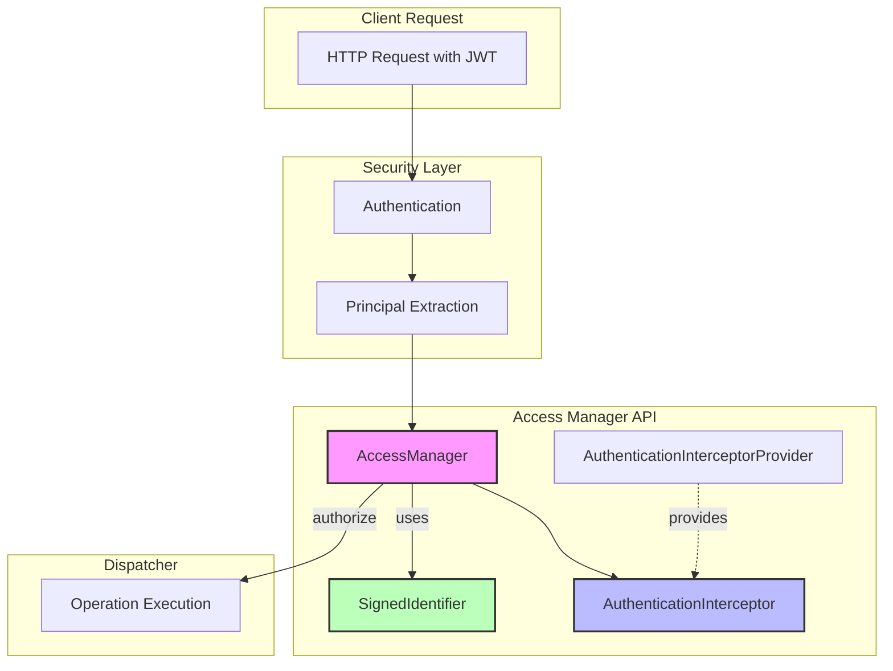
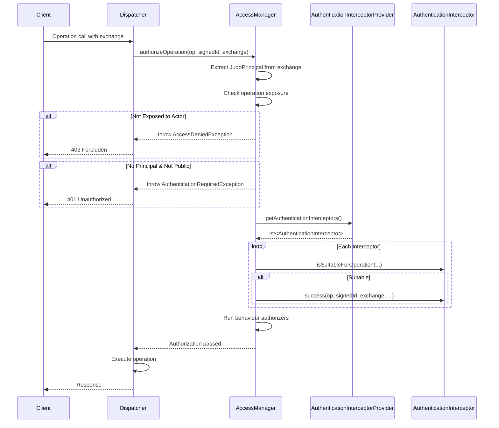
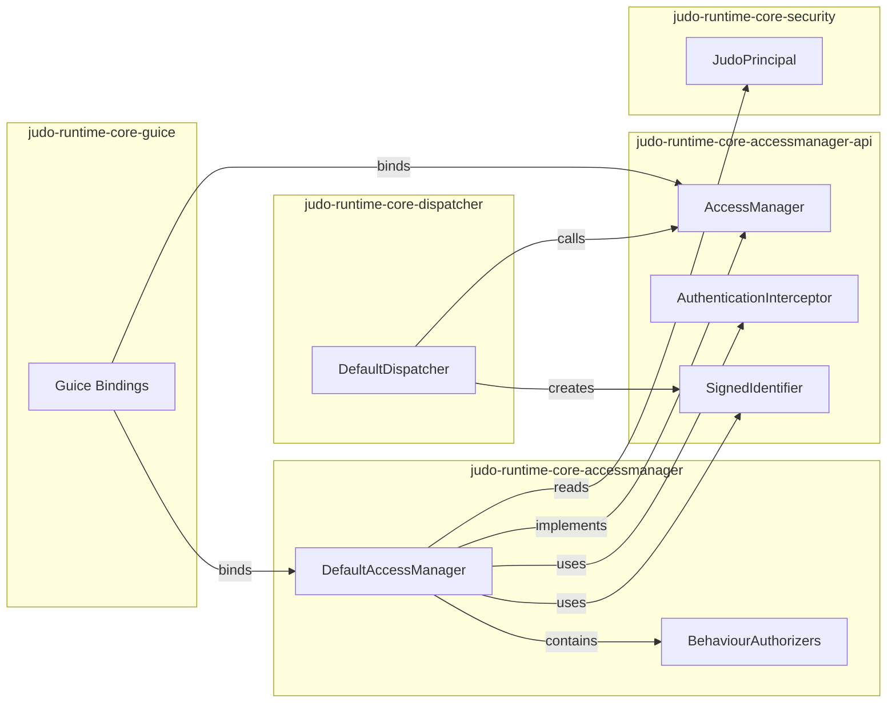

# JUDO Access Manager API Overview

Complete guide to the Access Manager API interfaces in JUDO Runtime Core.

## Overview

The Access Manager API module (`judo-runtime-core-accessmanager-api`) defines the core contracts for:
- **Operation Authorization** - Controlling access to operations based on actor/principal
- **Authentication Interception** - Hooking into the authentication/authorization lifecycle
- **Signed Identifiers** - Tracking entity instances in bound operations

This is a pure API module with no dependencies on implementation details, making it suitable for use across different runtime configurations.

## Architecture



## Core Interfaces

### AccessManager

The primary interface for authorizing operation calls. Implementations decide whether a given operation is allowed based on the principal, operation metadata, and signed identifier.

```java
package hu.blackbelt.judo.runtime.core.accessmanager.api;

/**
 * Access manager is used to check if a given operation call is allowed.
 */
public interface AccessManager {

    /**
     * Authorize an operation call.
     *
     * @param operation operation to call (EMF EOperation)
     * @param signedIdentifier signed identifier of bound operation
     * @param exchange exchange map containing request context
     */
    void authorizeOperation(EOperation operation, 
                           SignedIdentifier signedIdentifier, 
                           Map<String, Object> exchange);
}
```

**Key Points:**
- Throws `AccessDeniedException` if authorization fails
- Throws `AuthenticationRequiredException` if authentication is needed
- The `exchange` map contains `Dispatcher.PRINCIPAL_KEY` with the `JudoPrincipal`

### SignedIdentifier

Represents the identity of an entity instance used in bound operations. Contains metadata about how the instance was produced and its type information.

```java
package hu.blackbelt.judo.runtime.core.accessmanager.api;

@Getter
@Builder
public class SignedIdentifier {

    @NonNull
    private final String identifier;      // The unique identifier value

    private final ETypedElement producedBy;  // The operation/reference that produced this

    private final String entityType;      // Fully qualified entity type name

    private final Integer version;        // Optimistic locking version

    private final Boolean immutable;      // Whether the entity is read-only
}
```

**Usage Example:**
```java
SignedIdentifier signedId = SignedIdentifier.builder()
    .identifier("550e8400-e29b-41d4-a716-446655440000")
    .entityType("Model.Customer")
    .producedBy(getCustomerOperation)
    .version(1)
    .immutable(false)
    .build();
```

### AuthenticationInterceptor

Allows hooking into the authentication/authorization lifecycle at key points. Useful for custom logging, audit trails, or additional security checks.

```java
package hu.blackbelt.judo.runtime.core.accessmanager.api;

/**
 * Interceptor for authentication/authorization calls.
 */
public interface AuthenticationInterceptor {
    
    /**
     * Get the interceptor name for identification.
     */
    String getName();

    /**
     * Determine if this interceptor should handle the given operation.
     * Default: handles all operations.
     */
    default boolean isSuitableForOperation(EOperation operation, 
                                           String claim,
                                           String realm, 
                                           String client, 
                                           Map<String, Object> attributes) {
        return true;
    }

    /**
     * Called after principal extraction but BEFORE mapped principal load.
     * CAUTION: Actor-based expressions cannot be used here.
     */
    default void authenticate(String operationFullyQualifiedName,
                             Map<String, Object> exchange,
                             String claim,
                             String realm,
                             String client,
                             Map<String, Object> attributes) {}

    /**
     * Called after successful authorization, BEFORE operation execution.
     */
    default void success(EOperation operation,
                        SignedIdentifier signedIdentifier,
                        Map<String, Object> exchange,
                        String claim,
                        String realm,
                        String client,
                        Map<String, Object> attributes) {}
}
```

### AuthenticationInterceptorProvider

Factory interface for providing authentication interceptors. Allows dynamic registration of interceptors.

```java
package hu.blackbelt.judo.runtime.core.accessmanager.api;

public interface AuthenticationInterceptorProvider {
    
    default Collection<AuthenticationInterceptor> getAuthenticationInterceptors() {
        return new ArrayList<>();
    }
}
```

## Authorization Flow



## Implementation: DefaultAccessManager

The `judo-runtime-core-accessmanager` module provides `DefaultAccessManager`, which:

1. **Checks operation exposure** - Operations must be exposed to the actor via `@exposedBy` annotation
2. **Validates bound operations** - SignedIdentifier's `producedBy` must be accessible to the actor
3. **Runs behaviour authorizers** - CRUD operations validated by specialized authorizers
4. **Invokes interceptors** - Calls registered `AuthenticationInterceptor` instances

### Behaviour Authorizers

The default implementation includes authorizers for standard operations:

| Authorizer | Operation Type |
|------------|----------------|
| `ListAuthorizer` | List/query operations |
| `CreateInstanceAuthorizer` | Entity creation |
| `UpdateInstanceAuthorizer` | Entity updates |
| `DeleteInstanceAuthorizer` | Entity deletion |
| `RefreshAuthorizer` | Entity refresh |
| `SetReferenceAuthorizer` | Set single reference |
| `UnsetReferenceAuthorizer` | Clear single reference |
| `AddReferenceAuthorizer` | Add to collection reference |
| `RemoveReferenceAuthorizer` | Remove from collection reference |
| `GetReferenceRangeAuthorizer` | Get reference options |
| `GetInputRangeAuthorizer` | Get input parameter options |
| `GetTemplateAuthorizer` | Get entity templates |

## Implementing Custom Interceptors

### Example: Audit Logging Interceptor

```java
public class AuditLoggingInterceptor implements AuthenticationInterceptor {
    
    private final AuditService auditService;
    
    public AuditLoggingInterceptor(AuditService auditService) {
        this.auditService = auditService;
    }
    
    @Override
    public String getName() {
        return "audit-logging";
    }
    
    @Override
    public boolean isSuitableForOperation(EOperation operation, 
                                          String claim,
                                          String realm, 
                                          String client, 
                                          Map<String, Object> attributes) {
        // Only audit write operations
        Optional<AsmUtils.OperationBehaviour> behaviour = AsmUtils.getBehaviour(operation);
        return behaviour.isPresent() && 
               (behaviour.get() == AsmUtils.OperationBehaviour.CREATE_INSTANCE ||
                behaviour.get() == AsmUtils.OperationBehaviour.UPDATE_INSTANCE ||
                behaviour.get() == AsmUtils.OperationBehaviour.DELETE_INSTANCE);
    }
    
    @Override
    public void success(EOperation operation,
                       SignedIdentifier signedIdentifier,
                       Map<String, Object> exchange,
                       String claim,
                       String realm,
                       String client,
                       Map<String, Object> attributes) {
        auditService.log(AuditEvent.builder()
            .user(claim)
            .realm(realm)
            .operation(AsmUtils.getOperationFQName(operation))
            .entityId(signedIdentifier != null ? signedIdentifier.getIdentifier() : null)
            .timestamp(Instant.now())
            .build());
    }
}
```

### Example: Rate Limiting Interceptor

```java
public class RateLimitingInterceptor implements AuthenticationInterceptor {
    
    private final RateLimiter rateLimiter;
    
    @Override
    public String getName() {
        return "rate-limiter";
    }
    
    @Override
    public void authenticate(String operationFQN,
                            Map<String, Object> exchange,
                            String claim,
                            String realm,
                            String client,
                            Map<String, Object> attributes) {
        String key = claim + ":" + client;
        if (!rateLimiter.tryAcquire(key)) {
            throw new AccessDeniedException(ValidationResult.builder()
                .code("RATE_LIMIT_EXCEEDED")
                .level(ValidationResult.Level.ERROR)
                .build());
        }
    }
}
```

### Registering Interceptors with Guice

```java
public class CustomSecurityModule extends AbstractModule {
    
    @Override
    protected void configure() {
        bind(AuthenticationInterceptorProvider.class)
            .to(CustomInterceptorProvider.class);
    }
}

public class CustomInterceptorProvider implements AuthenticationInterceptorProvider {
    
    @Inject
    private AuditService auditService;
    
    @Override
    public Collection<AuthenticationInterceptor> getAuthenticationInterceptors() {
        return Arrays.asList(
            new AuditLoggingInterceptor(auditService),
            new RateLimitingInterceptor()
        );
    }
}
```

## Integration Points



## Error Handling

| Exception | HTTP Status | When Thrown |
|-----------|-------------|-------------|
| `AccessDeniedException` | 403 Forbidden | Operation not exposed to actor, CRUD permission denied |
| `AuthenticationRequiredException` | 401 Unauthorized | No principal for non-public operation, invalid token |

### Error Codes

| Code | Description |
|------|-------------|
| `ACCESS_DENIED` | Actor has no access to the operation |
| `ACCESS_DENIED_FOR_INSTANCE_OF_BOUND_OPERATION` | Actor cannot access the bound entity |
| `PERMISSION_DENIED` | CRUD flag not set on model element |
| `AUTHENTICATION_REQUIRED` | Operation requires authentication |
| `INVALID_TOKEN` | Token required but invalid/missing |

## Package Structure

```
hu.blackbelt.judo.runtime.core.accessmanager.api/
├── AccessManager.java               # Core authorization interface
├── AuthenticationInterceptor.java   # Lifecycle hook interface
├── AuthenticationInterceptorProvider.java  # Interceptor factory
└── SignedIdentifier.java           # Bound operation identifier
```

## See Also

- `judo-runtime-core-accessmanager` - Default AccessManager implementation
- `judo-runtime-core-security` - Authentication and JudoPrincipal
- `judo-runtime-core-dispatcher` - Operation dispatching
- `judo-runtime-core-guice` - Dependency injection bindings
