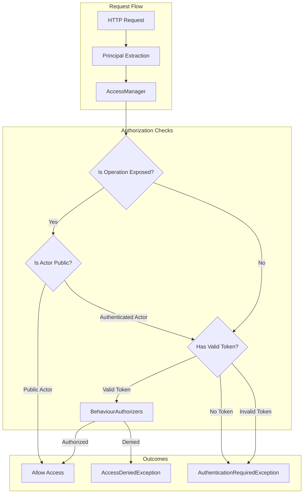
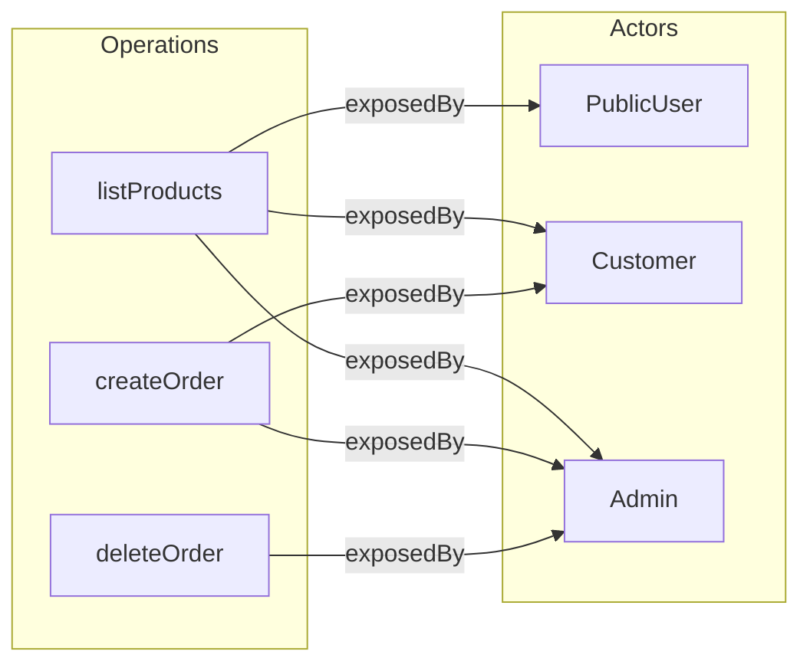
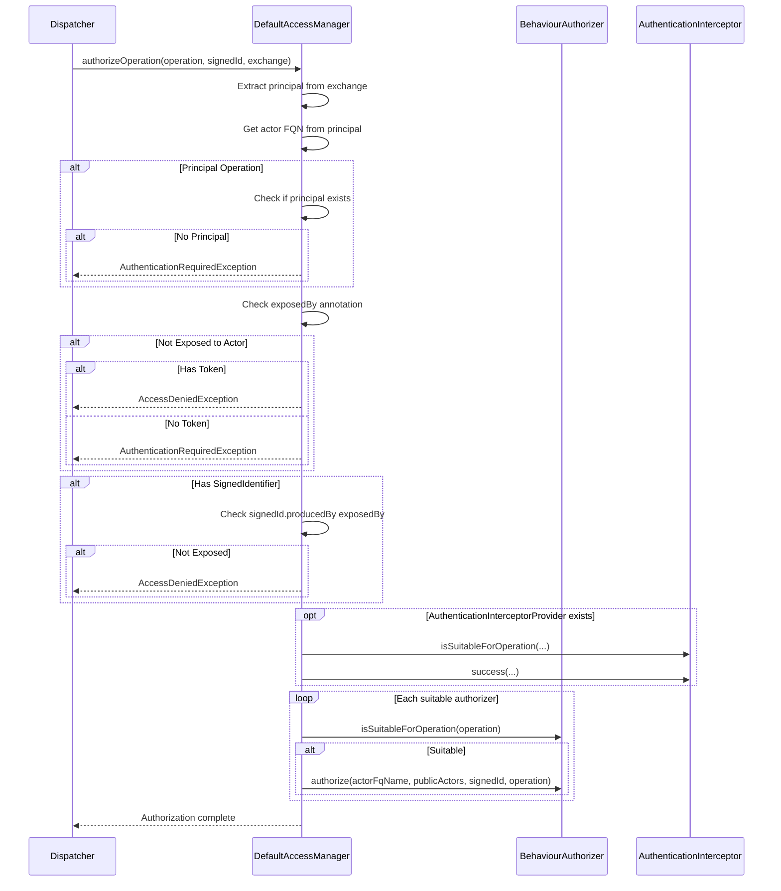
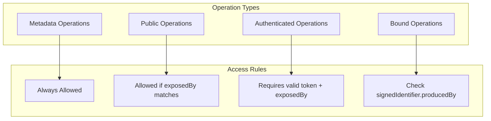

# JUDO Access Control Configuration

Complete guide to configuring access control rules in JUDO Runtime Core.

## Overview

JUDO Access Control provides a declarative authorization system based on:
- Actor types (public vs authenticated)
- Operation exposure annotations (`exposedBy`)
- Realm-based multi-tenancy
- CRUD permission flags (create, update, delete)
- Custom authentication interceptors

## Architecture



## Actor Types

### Public Actors

Actors without a `realm` annotation are considered public and do not require authentication:

```
// ASM Model annotation
@actorType
@realm("")  // Empty or missing realm = public actor
entity PublicUser {
    // ...
}
```

### Authenticated Actors

Actors with a `realm` annotation require valid authentication tokens:

```
// ASM Model annotation  
@actorType
@realm("my-realm")  // Non-empty realm = authenticated actor
entity AdminUser {
    // ...
}
```

## Operation Exposure

Operations must be explicitly exposed to actors using the `exposedBy` annotation:



### Exposure Rules

| Scenario | Annotation | Result |
|----------|------------|--------|
| Public operation | `@exposedBy(PublicUser)` | Anyone can access |
| Customer-only | `@exposedBy(Customer)` | Requires Customer token |
| Multi-actor | `@exposedBy(Customer, Admin)` | Either actor can access |
| Not exposed | No `exposedBy` | Access denied |

## DefaultAccessManager

The `DefaultAccessManager` is the core authorization component:

```java
@Builder
public DefaultAccessManager(
    @NonNull AsmModel asmModel, 
    AuthenticationInterceptorProvider authenticationInterceptorProvider
)
```

### Authorization Flow



## Configuration Examples

### Exposing Operations to Multiple Actors

```java
// In ASM model, operations are annotated with exposedBy
// The annotation value is the fully qualified name of the actor type

@exposedBy("Model.PublicActor")
@exposedBy("Model.AuthenticatedActor")
operation listItems() returns Item[];
```

### Detecting Public Actors

```java
// DefaultAccessManager identifies public actors during initialization
publicActors.addAll(asmUtils.all(EClass.class)
    .filter(c -> AsmUtils.isActorType(c) &&
        AsmUtils.getExtensionAnnotationByName(c, "realm", false)
            .map(a -> a.getDetails().get("value") == null || 
                      a.getDetails().get("value").isEmpty())
            .orElse(true))
    .map(AsmUtils::getClassifierFQName)
    .collect(Collectors.toSet()));
```

## Custom Authentication Interceptors

Implement `AuthenticationInterceptor` to add custom authorization logic:

```java
public class CustomAuthInterceptor implements AuthenticationInterceptor {
    
    @Override
    public String getName() {
        return "custom-auth";
    }
    
    @Override
    public boolean isSuitableForOperation(
            EOperation operation,
            String claim,
            String realm,
            String client,
            Map<String, Object> attributes) {
        // Return true if this interceptor should handle the operation
        return AsmUtils.getOperationFQName(operation).startsWith("Model.SecureService");
    }
    
    @Override
    public void success(
            EOperation operation,
            SignedIdentifier signedIdentifier,
            Map<String, Object> exchange,
            String claim,
            String realm,
            String client,
            Map<String, Object> attributes) {
        // Called after successful authorization
        // Add custom logic like audit logging, rate limiting, etc.
        log.info("User {} accessed {}", claim, AsmUtils.getOperationFQName(operation));
    }
}
```

### Registering Interceptors

```java
public class MyAuthInterceptorProvider implements AuthenticationInterceptorProvider {
    
    private final Collection<AuthenticationInterceptor> interceptors;
    
    public MyAuthInterceptorProvider() {
        interceptors = Arrays.asList(
            new CustomAuthInterceptor(),
            new AuditInterceptor()
        );
    }
    
    @Override
    public Collection<AuthenticationInterceptor> getAuthenticationInterceptors() {
        return interceptors;
    }
}
```

## Error Codes

| Code | Exception | Description |
|------|-----------|-------------|
| `INVALID_TOKEN` | `AuthenticationRequiredException` | Token is invalid or missing for principal operation |
| `ACCESS_DENIED` | `AccessDeniedException` | Operation not exposed to actor |
| `AUTHENTICATION_REQUIRED` | `AuthenticationRequiredException` | Token required for non-public operation |
| `ACCESS_DENIED_FOR_INSTANCE_OF_BOUND_OPERATION` | `AccessDeniedException` | No permission to access bound operation's instance |

## Access Control Matrix



## Special Operation Types

### Metadata Operations

Operations with `GET_METADATA` behaviour are always accessible:

```java
// These bypass exposure checks
final boolean metadataOperation = AsmUtils.OperationBehaviour.GET_METADATA
    .equals(AsmUtils.getBehaviour(operation).orElse(null));
```

### Principal Operations

Operations with `GET_PRINCIPAL` behaviour require a valid principal:

```java
// Returns 401 if no principal
if (principal == null && principalOperation) {
    throw new AuthenticationRequiredException(ValidationResult.builder()
        .code("INVALID_TOKEN")
        .level(ValidationResult.Level.ERROR)
        .build());
}
```

## Debugging Access Control

### Enable Debug Logging

```xml
<logger name="hu.blackbelt.judo.runtime.core.accessmanager" level="DEBUG"/>
```

### Common Log Messages

| Message | Meaning |
|---------|---------|
| `Authorizing {actor} on {operation}` | Authorization check starting |
| `Operation failed, operation is not exposed to the given actor` | exposedBy mismatch |
| `Operation failed, authentication token is required` | Missing token for non-public operation |
| `Principal has no permission to access instance of bound operation` | SignedIdentifier check failed |

## See Also

- `judo-runtime-core-accessmanager-api` - API interfaces
- `judo-runtime-core-security` - Authentication framework
- `judo-runtime-core-dispatcher` - Operation dispatching
- `/judo-runtime:permission-checking` - CRUD permission details
