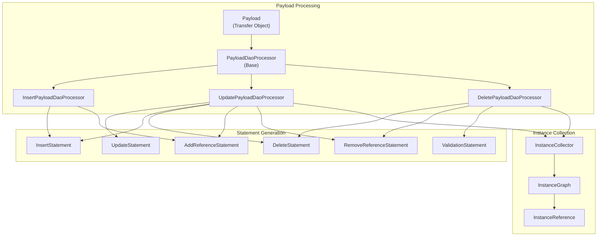
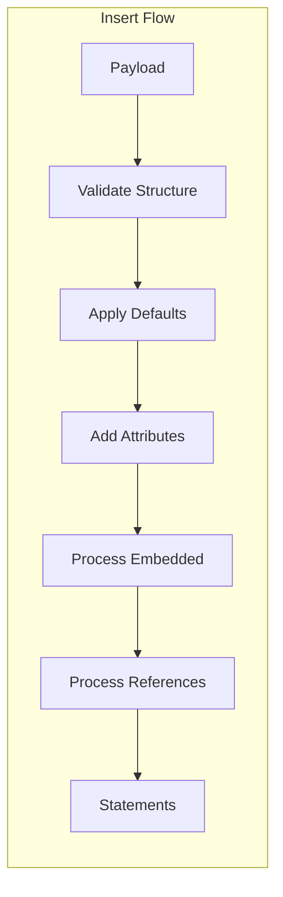
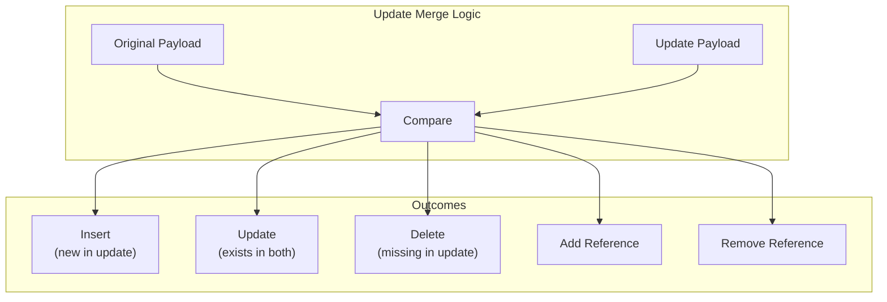
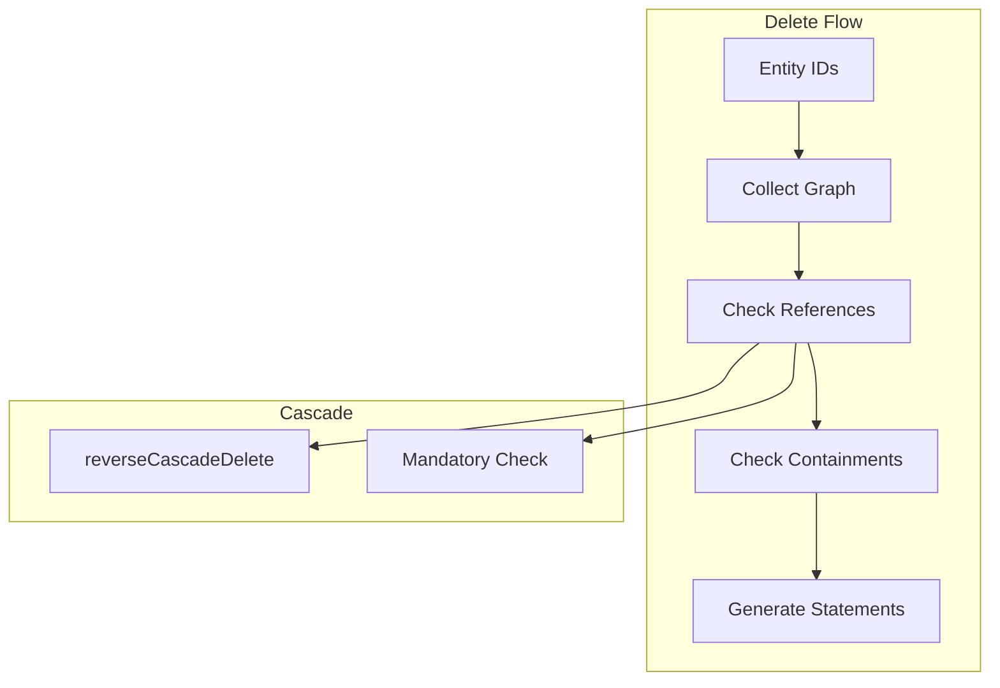
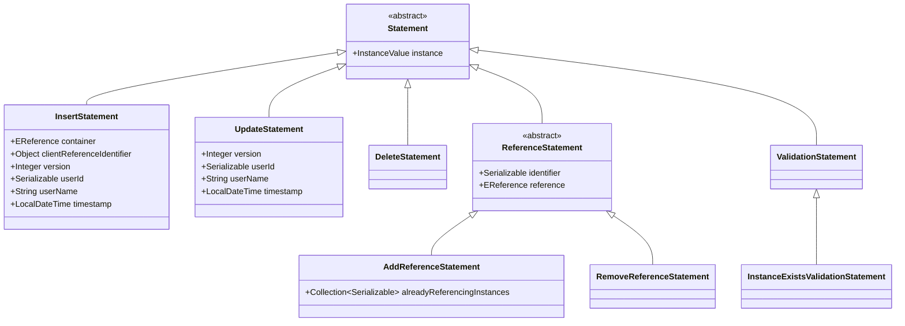
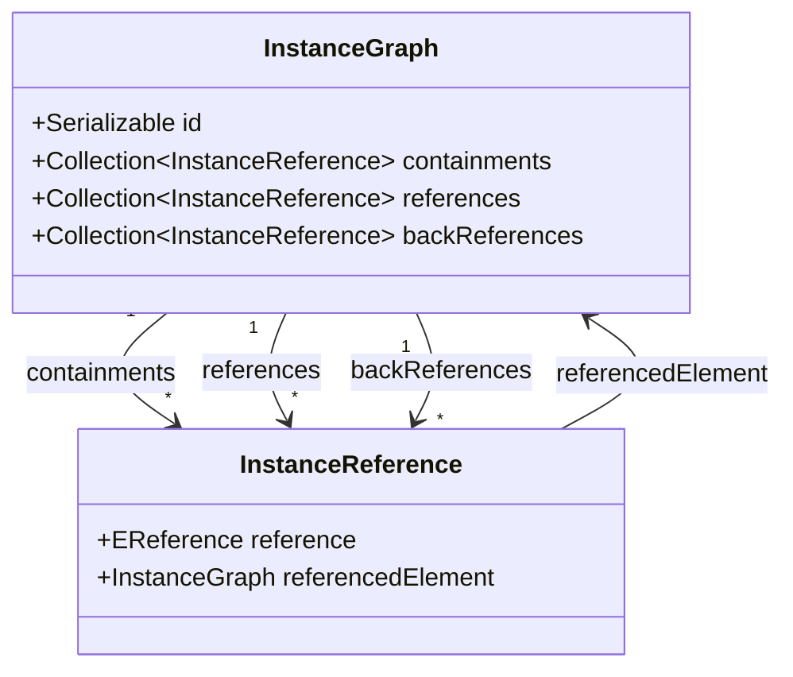

# JUDO DAO Core Patterns

Guide for understanding and working with the JUDO DAO Core layer patterns including processors, statements, and collectors.

## Architecture Overview



## Payload Processors

### PayloadDaoProcessor (Base Class)

The base class provides validation utilities and predicates for all processors.

```java
// Key predicates for structural feature filtering
PayloadDaoProcessor.isSingle          // Single-valued feature
PayloadDaoProcessor.isCollection      // Multi-valued feature  
PayloadDaoProcessor.isMandatory       // Required feature
PayloadDaoProcessor.isDerived         // Derived feature
PayloadDaoProcessor.isChangeable      // Changeable feature
PayloadDaoProcessor.isContainment     // Containment reference
PayloadDaoProcessor.hasOpposite       // Has opposite reference

// Payload inspection predicates
PayloadDaoProcessor.hasPayload(payload)           // Feature present in payload
PayloadDaoProcessor.hasPayloadNotNull(payload)    // Feature present and non-null
PayloadDaoProcessor.hasReferenced(payload, idName) // Contains referenced entity
PayloadDaoProcessor.hasEmbedded(payload, idName)   // Contains embedded entity
```

**Key Constants:**
```java
REFERENCE_ID = "__referenceId"    // Client reference identifier
ENTITY_TYPE_KEY = "__entityType"  // Entity type marker
VERSION = "__version"             // Optimistic lock version
```

### InsertPayloadDaoProcessor

Generates insert statements recursively for new entities.



**Rules:**
- Root type cannot have ID (that would be update)
- NULL relations are ignored
- Entities with ID are treated as references
- Entities without ID are inserted recursively

```java
InsertPayloadDaoProcessor processor = new InsertPayloadDaoProcessor(
    resourceSet, 
    identifierProvider,
    queryFactory, 
    instanceCollector,
    defaultValuesApplier,
    metadata
);

Collection<Statement> statements = processor.insert(
    mappedTransferObjectType,
    payload,
    checkMandatoryFeatures
);
```

### UpdatePayloadDaoProcessor

Handles updates with merge logic for embedded and referenced entities.



**Merge Scenarios:**
| Original | Update | Containment Action | Association Action |
|----------|--------|-------------------|-------------------|
| null | null | None | None |
| null | with ID | Error | Add reference |
| null | no ID | Insert new | Error |
| with ID | null | Delete instance | Remove reference |
| with ID | same ID | Update recursively | None |
| with ID | different ID | Error | Replace reference |

### DeletePayloadDaoProcessor

Handles deletions with cascade and back-reference checking.



**Back-reference handling:**
- `reverseCascadeDelete` annotation triggers cascade deletion
- Mandatory back-references without cascade cause error

## Statement Types

### Statement Hierarchy



### Statement Building

```java
// Insert statement
InsertStatement insert = InsertStatement.buildInsertStatement()
    .type(entityType)
    .identifier(identifierProvider.get())
    .clientReferenceIdentifier(payload.get(REFERENCE_ID))
    .container(containerReference)
    .version(1)
    .userId(metadata.getUserId())
    .username(metadata.getUsername())
    .timestamp(metadata.getTimestamp())
    .build();

// Update statement  
UpdateStatement update = UpdateStatement.buildUpdateStatement()
    .type(entityType)
    .identifier(existingId)
    .version(originalVersion)
    .userId(metadata.getUserId())
    .username(metadata.getUsername())
    .timestamp(metadata.getTimestamp())
    .build();

// Delete statement
DeleteStatement delete = new DeleteStatement(
    InstanceValue.buildInstanceValue()
        .type(entityType)
        .identifier(id)
        .build()
);

// Reference statements
AddReferenceStatement addRef = AddReferenceStatement.buildAddReferenceStatement()
    .type(ownerType)
    .reference(reference)
    .identifier(ownerId)
    .referenceIdentifier(targetId)
    .alreadyReferencingInstances(existingRefs)
    .build();

RemoveReferenceStatement removeRef = RemoveReferenceStatement.buildRemoveReferenceStatement()
    .type(ownerType)
    .reference(reference)
    .identifier(ownerId)
    .referenceIdentifier(targetId)
    .build();

// Validation statement
InstanceExistsValidationStatement validation = 
    InstanceExistsValidationStatement.buildInstanceExistsValidationStatement()
        .type(entityType)
        .identifier(id)
        .build();
```

## Instance Collection

### InstanceCollector Interface

```java
public interface InstanceCollector {
    // Collect graph for multiple instances
    Map<Serializable, InstanceGraph> collectGraph(
        EClass entityType, 
        Collection<Serializable> ids
    );
    
    // Collect graph for single instance
    InstanceGraph collectGraph(
        EClass entityType, 
        Serializable id
    );
}
```

### InstanceGraph Structure



**Usage in DeletePayloadDaoProcessor:**
```java
// Collect the full graph of an instance
InstanceGraph graph = instanceCollector.collectGraph(entityType, id);

// Navigate containments
for (InstanceReference containment : graph.getContainments()) {
    EReference ref = containment.getReference();
    InstanceGraph child = containment.getReferencedElement();
    // Process child recursively
}

// Check back-references before deletion
for (InstanceReference backRef : graph.getBackReferences()) {
    if (backRef.getReference().getLowerBound() > 0) {
        // Mandatory reference - cannot delete without cascade
    }
}
```

## Validation Patterns

### Mandatory Feature Checking

```java
// Check mandatory attributes
processor.checkMandatoryAttributes(attributes, payload);

// Check mandatory references
processor.checkMandatoryReferences(references, payload);

// Check mapped object structure
processor.checkMappedObjectStructure(transferType, parentReference);
```

### Reference Validation

```java
// Validate reference types match payload types
processor.checkReferences(references, payload);

// Check forbidden updates (opposite with lower bound)
processor.checkForbiddenReferenceUpdates(references, payload);

// Check associations cannot be embedded
processor.checkAssociationCannotBeEmbedded(references, payload);
```

## Optimistic Locking

The `UpdatePayloadDaoProcessor` supports optimistic locking:

```java
// Version check during update
if (optimisticLockEnabled) {
    Integer updateVersion = updatePayload.getAs(Integer.class, VERSION);
    if (updateVersion != null) {
        checkArgument(
            Objects.equals(updateVersion, originalVersion), 
            "Outdated instance to update"
        );
    }
}
```

## See Also

- `/judo-runtime:entity-mapping` - Entity to transfer object value mapping
- `judo-runtime-core-dao-rdbms` - RDBMS implementation of these patterns
