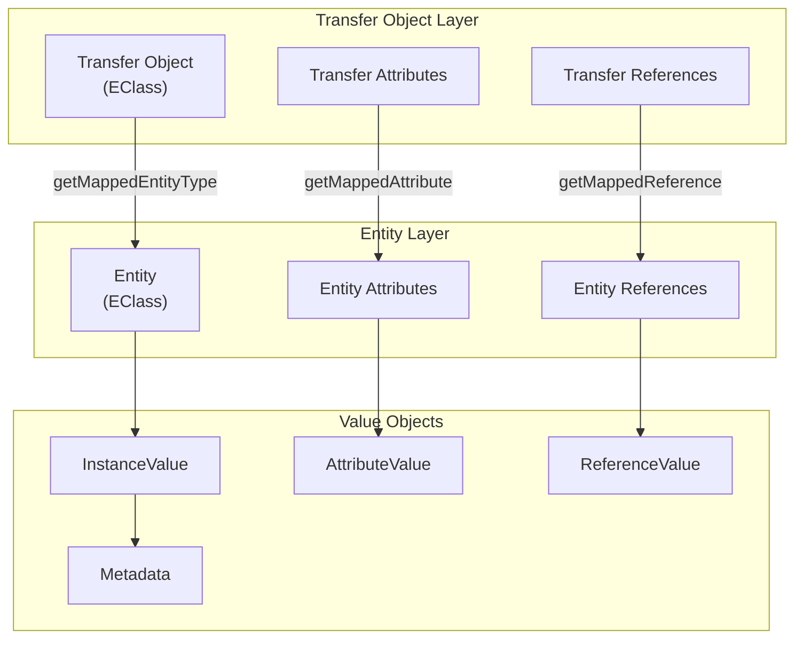
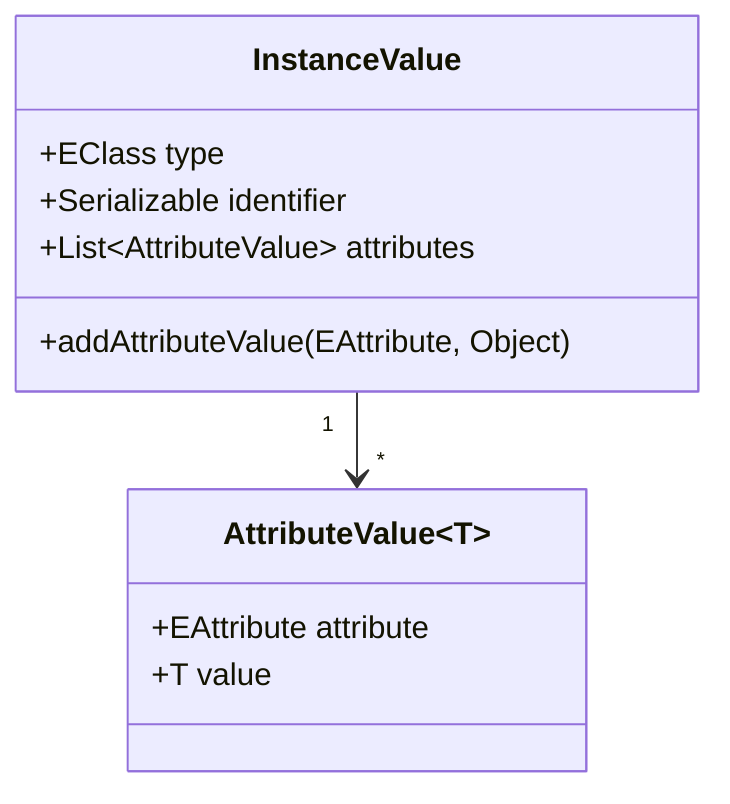
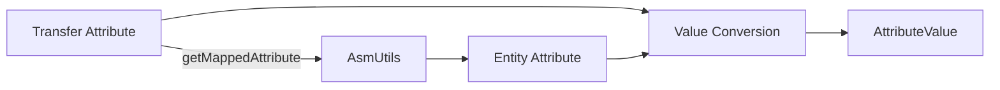
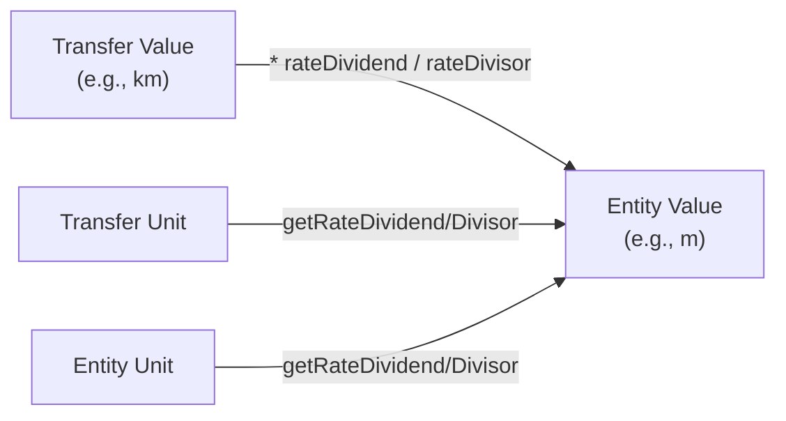
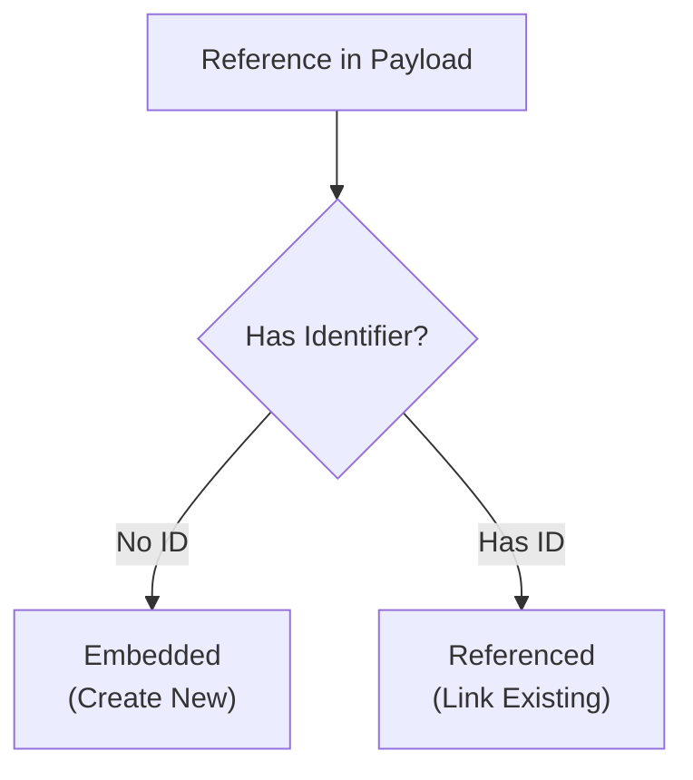
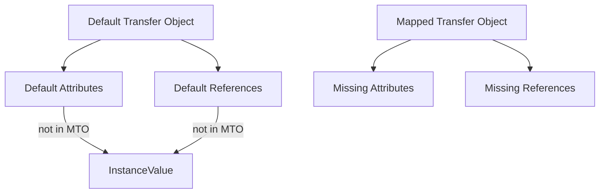
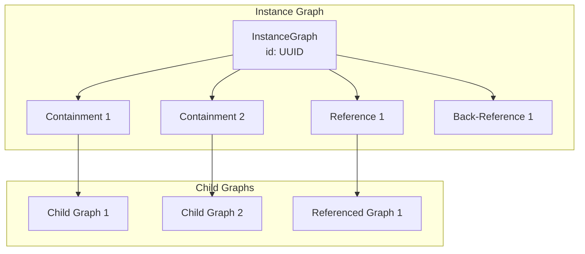

# Entity to Transfer Object Mapping

Guide for understanding how JUDO DAO Core maps between entity types and transfer objects using the values package.

## Mapping Architecture



## Value Objects

### InstanceValue

Represents an entity instance with its type, identifier, and attributes.



**Building InstanceValue:**
```java
InstanceValue instance = InstanceValue.buildInstanceValue()
    .type(entityType)          // EClass of the entity
    .identifier(uuid)          // Unique identifier
    .build();

// Add attributes
instance.addAttributeValue(
    entityAttribute,           // EAttribute from entity type
    convertedValue             // Value after type conversion
);
```

### AttributeValue

Holds a single attribute value with its metadata.

```java
AttributeValue<String> stringAttr = AttributeValue.attributeValueBuilder()
    .attribute(nameAttribute)
    .value("John Doe")
    .build();

AttributeValue<BigDecimal> decimalAttr = AttributeValue.attributeValueBuilder()
    .attribute(priceAttribute)
    .value(new BigDecimal("99.99"))
    .build();
```

### ReferenceValue

Represents a reference relationship with opposite identifiers.

```java
ReferenceValue ref = ReferenceValue.referenceValueBuilder()
    .type(ownerEntityType)
    .identifier(ownerId)
    .reference(orderReference)
    .oppositeIdentifiers(targetIds)  // Collection of target IDs
    .build();
```

### Metadata

Audit information attached to statements.

```java
Metadata metadata = Metadata.buildMetadata()
    .userId(currentUserId)           // Serializable user ID
    .username("john.doe")            // Username string
    .timestamp(LocalDateTime.now())  // Operation timestamp
    .build();
```

## Attribute Mapping

### Transfer to Entity Attribute Resolution



**Implementation:**
```java
// Get mapped entity attribute from transfer attribute
Optional<EAttribute> entityAttribute = asmUtils.getMappedAttribute(transferAttribute);

// Map transfer attributes to entity attributes
List<EAttribute> attributes = transferObjectType.getEAllAttributes().stream()
    .filter(isChangeable.and(a -> asmUtils.getMappedAttribute(a).isPresent()))
    .collect(toList());

// Add mapped attribute values to statement
attributes.stream()
    .collect(Collectors.toMap(
        identity(),
        a -> asmUtils.getMappedAttribute(a).orElse(a)
    ))
    .forEach((transferAttr, entityAttr) -> 
        statement.getInstance().addAttributeValue(
            entityAttr,
            getTransferObjectValueAsEntityValueFromPayload(
                payload, 
                transferAttr, 
                entityAttr
            )
        )
    );
```

### Measure Unit Conversion

When attributes have different measure units between transfer and entity types:



**Conversion Formula:**
```java
public Object getTransferObjectValueAsEntityValueFromPayload(
        Payload payload, 
        EAttribute transferAttribute, 
        EAttribute entityAttribute) {
    
    Object value = payload.get(transferAttribute.getName());
    
    Optional<Unit> transferUnit = modelAdapter.getUnit(transferAttribute);
    Optional<Unit> entityUnit = modelAdapter.getUnit(entityAttribute);
    
    if (value != null && transferUnit.isPresent() && entityUnit.isPresent()) {
        // Convert: (value * transferDividend * entityDivisor) 
        //        / (transferDivisor * entityDividend)
        BigDecimal decimal = entityUnit.get().getRateDivisor()
            .multiply(transferUnit.get().getRateDividend())
            .multiply(new BigDecimal(value.toString()))
            .divide(
                entityUnit.get().getRateDividend()
                    .multiply(transferUnit.get().getRateDivisor()),
                MEASURE_CONVERTING_SCALE,  // 20 decimal places
                RoundingMode.HALF_UP
            );
        
        // Return appropriate type
        if (modelAdapter.isInteger(entityAttribute.getEAttributeType())) {
            return decimal.toBigInteger();
        }
        return decimal;
    }
    
    return value;  // No conversion needed
}
```

## Reference Mapping

### Transfer to Entity Reference Resolution

```java
// Get mapped entity reference from transfer reference
Optional<EReference> entityReference = asmUtils.getMappedReference(transferReference);

// Filter changeable, mapped references
List<EReference> references = transferObjectType.getEAllReferences().stream()
    .filter(
        notParent(containerReference)
            .and(isChangeable)
            .and(r -> asmUtils.getMappedReference(r).isPresent())
    )
    .collect(toList());
```

### Embedded vs Referenced Detection



**Predicates:**
```java
// Check if payload contains embedded (new) entities
Predicate<EStructuralFeature> hasEmbedded = hasPayloadNotNull(payload).and(
    (isSingle.and(r -> !payload.getAsPayload(r.getName())
                              .containsKey(identifierName)))
    .or(isCollection.and(r -> payload.getAsCollectionPayload(r.getName()).stream()
                              .filter(c -> c.containsKey(identifierName))
                              .count() == 0))
);

// Check if payload contains referenced (existing) entities
Predicate<EStructuralFeature> hasReferenced = hasPayloadNotNull(payload).and(
    (isSingle.and(r -> payload.getAsPayload(r.getName())
                             .containsKey(identifierName)))
    .or(isCollection.and(r -> payload.getAsCollectionPayload(r.getName()).stream()
                              .filter(c -> c.containsKey(identifierName))
                              .count() > 0))
);
```

## Default Value Application

### Default Transfer Object Type

Entity types can have a `defaultRepresentation` annotation pointing to a default transfer object type:

```java
Optional<EClass> defaultTransferObjectType = AsmUtils
    .getExtensionAnnotationValue(mappedEntity, "defaultRepresentation", false)
    .map(name -> (EClass) asmUtils.resolve(name).orElse(null));
```

### Applying Defaults



```java
// Check if default DTO exists and differs from mapped TO
boolean applyDefaults = defaultTransferObjectType.isPresent() 
    && !AsmUtils.equals(defaultTransferObjectType.get(), mappedTransferObjectType);

if (applyDefaults) {
    // Apply defaults to entity payload
    defaultValuesApplier.accept(defaultTransferObjectType.get(), entityDefaults);
    
    // Add default attributes not present in mapped TO
    for (EAttribute dtoAttr : defaultTransferObjectType.get().getEAllAttributes()) {
        if (entityDefaults.get(dtoAttr.getName()) != null) {
            EAttribute mappedAttr = asmUtils.getMappedAttribute(dtoAttr).orElse(dtoAttr);
            
            // Check if not already mapped in transfer object
            boolean notMapped = mappedTransferObjectType.getEAllAttributes().stream()
                .noneMatch(ta -> AsmUtils.equals(mappedAttr, 
                    asmUtils.getMappedAttribute(ta).orElse(null)));
            
            if (notMapped) {
                statement.getInstance().addAttributeValue(
                    mappedAttr, 
                    getTransferObjectValueAsEntityValueFromPayload(
                        entityDefaults, dtoAttr, mappedAttr
                    )
                );
            }
        }
    }
}
```

## Instance Graph Collection

### Graph Structure for Mapping



**Usage in Update:**
```java
// Collect graph for update merge
InstanceGraph instanceGraph = instanceCollector.collectGraph(entityType, id);

// Navigate to find matching child for update
InstanceGraph childGraph = instanceGraph.getContainments().stream()
    .filter(ir -> ir.getReference().equals(entityReference) 
              && ir.getReferencedElement().getId().equals(childId))
    .map(InstanceReference::getReferencedElement)
    .findFirst()
    .orElseThrow(() -> new IllegalStateException(
        "Identifier not found in InstanceGraph: " + childId
    ));
```

## Payload Special Keys

| Key | Constant | Purpose |
|-----|----------|---------|
| `__referenceId` | `REFERENCE_ID` | Client-provided reference for new entities |
| `__entityType` | `ENTITY_TYPE_KEY` | Actual entity type name |
| `__version` | `VERSION` | Optimistic locking version |

```java
// Extract entity type from payload
if (payload.containsKey(ENTITY_TYPE_KEY)) {
    String entityTypeName = payload.getAs(String.class, ENTITY_TYPE_KEY);
    String fqName = asmUtils.getModel().get().getName() + "." + entityTypeName;
    entityType = (EClass) asmUtils.resolve(fqName).get();
}

// Get client reference for correlation
Object clientRef = payload.get(REFERENCE_ID);

// Check version for optimistic locking
Integer version = payload.getAs(Integer.class, VERSION);
```

## See Also

- `/judo-runtime:dao-patterns` - DAO processor and statement patterns
- `judo-meta-asm` - ASM metamodel and AsmUtils
- `judo-meta-measure` - Measure unit definitions
