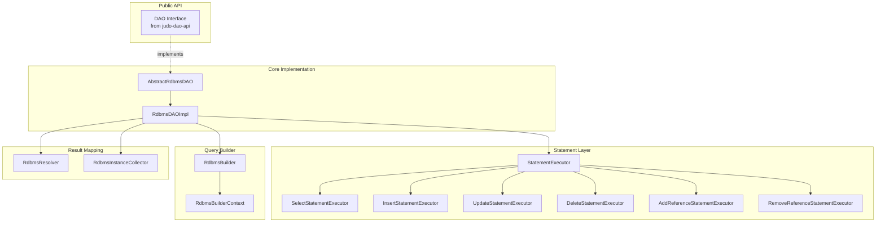
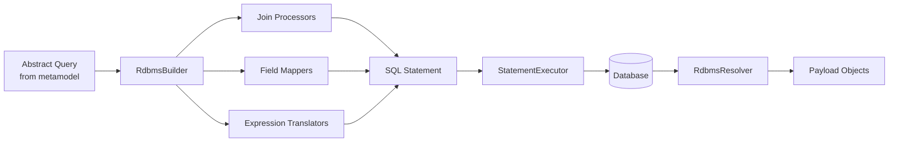

# judo-runtime-core-dao-rdbms

The RDBMS Data Access Object module — the largest and most complex module in JUDO Runtime Core. It provides the complete implementation for translating abstract JUDO data operations into SQL queries, executing them against relational databases, and mapping results back to JUDO payload objects.

## Architecture Overview

This module implements the `DAO` interface from `judo-dao-api` with a full RDBMS backend. The architecture is organized around three main concerns: **statement construction**, **query building**, and **result mapping**.

## Query Translation Pipeline

The query system converts abstract JUDO queries into SQL through a pipeline of mappers, join processors, and expression translators.

## Key Class Hierarchies

### Statement Types

The `dao-core` module defines abstract statement types; this module provides executors for each:

| Statement | Executor | Purpose |
|-----------|----------|---------|
| `InsertStatement` | `InsertStatementExecutor` | Create new records |
| `UpdateStatement` | `UpdateStatementExecutor` | Modify existing records |
| `DeleteStatement` | `DeleteStatementExecutor` | Remove records |
| `AddReferenceStatement` | `AddReferenceStatementExecutor` | Create associations |
| `RemoveReferenceStatement` | `RemoveReferenceStatementExecutor` | Remove associations |
| `InstanceExistsValidationStatement` | `EntityExistsValidationStatementExecutor` | Verify entity existence |
| `CheckUniqueAttributeStatement` | `CheckUniqueAttributeStatementExecutor` | Enforce uniqueness |

### Query Model

```mermaid
classDiagram
    class RdbmsField {
        <<abstract>>
    }
    class RdbmsColumn
    class RdbmsConstant
    class RdbmsParameter
    class RdbmsNamedParameter
    class RdbmsFunction
    class RdbmsNavigationFilter

    RdbmsField <|-- RdbmsColumn
    RdbmsField <|-- RdbmsConstant
    RdbmsField <|-- RdbmsParameter
    RdbmsField <|-- RdbmsNamedParameter
    RdbmsField <|-- RdbmsFunction
    RdbmsField <|-- RdbmsNavigationFilter

    class RdbmsJoin {
        <<abstract>>
    }
    class RdbmsTableJoin
    class RdbmsNavigationJoin
    class RdbmsQueryJoin
    class RdbmsCustomJoin

    RdbmsJoin <|-- RdbmsTableJoin
    RdbmsJoin <|-- RdbmsNavigationJoin
    RdbmsJoin <|-- RdbmsQueryJoin
    RdbmsJoin <|-- RdbmsCustomJoin

    class RdbmsMapper~T~ {
        <<abstract>>
    }
    class AttributeMapper
    class IdAttributeMapper
    class ConstantMapper
    class FunctionMapper
    class SubSelectMapper

    RdbmsMapper <|-- AttributeMapper
    RdbmsMapper <|-- IdAttributeMapper
    RdbmsMapper <|-- ConstantMapper
    RdbmsMapper <|-- FunctionMapper
    RdbmsMapper <|-- SubSelectMapper
```

### Join Processors

Join processors determine how tables are joined based on the query's navigation structure:

| Processor | Purpose |
|-----------|---------|
| `SimpleJoinProcessor` | Basic table joins |
| `ContainerJoinProcessor` | Container/containment joins |
| `FilterJoinProcessor` | Filter-based conditional joins |
| `CastJoinProcessor` | Type casting joins |
| `SubSelectJoinProcessor` | Subquery joins |
| `CustomJoinProcessor` | Custom join logic |
| `AncestorJoinsProcessor` | Inheritance hierarchy joins |

### Expression Translators

Over 60 translator classes handle conversion of JUDO expressions to SQL. These cover:

- **Comparisons:** String, Integer, Decimal, Date, Time, Timestamp, Enumeration
- **Logic:** Negation, Kleene three-valued logic
- **String operations:** Like, Matches, concatenation
- **Arithmetic:** Addition, subtraction, multiplication, division
- **Aggregations:** Count, sum, min, max, average

## Database Dialects

The `Dialect` interface abstracts database-specific SQL differences. Concrete implementations live in sibling modules:

- `judo-runtime-core-dao-rdbms-hsqldb` — HSQLDB dialect for development/testing
- `judo-runtime-core-dao-rdbms-postgresql` — PostgreSQL dialect for production

## Dependencies

This module depends on several JUDO metamodels for query resolution:

- `judo-meta-asm` — Abstract Syntax Model (entity types, attributes, relations)
- `judo-meta-rdbms` — Relational Database Model (table mappings)
- `judo-meta-expression` — Expression Model (computed fields, filters)
- `judo-meta-query` — Query Model (abstract query definitions)
