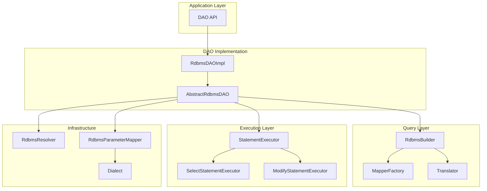

# JUDO Runtime Core - DAO RDBMS

## Overview

The DAO RDBMS module is the core data access layer for JUDO applications, providing sophisticated query translation, statement execution, and type mapping for relational databases.

## Key Concepts

- **Query Translation**: Converts abstract query models to SQL statements
- **Statement Executors**: Execute CRUD operations with proper transaction handling
- **Type Mapping**: Maps Java types to SQL types via `RdbmsParameterMapper`
- **Dialect Abstraction**: Database-specific behavior via `Dialect` interface
- **Metamodel Resolution**: Maps ASM metamodel to RDBMS metamodel

## Architecture



## Extension Points

| Interface | Purpose |
|-----------|---------|
| `Dialect` | Database dialect abstraction |
| `RdbmsParameterMapper` | Type mapping for SQL parameters |
| `MapperFactory` | Query element mappers |
| `RdbmsInit` | Database initialization |

## Quick Start

```java
// Get DAO instance
DAO dao = injector.getInstance(DAO.class);

// Query entities
List<Payload> results = dao.search(
    entityType,
    QueryCustomizer.builder()
        .filter("status == Status#ACTIVE")
        .orderBy("createdAt DESC")
        .build()
);

// Create entity
Payload created = dao.create(entityType, payload, null);

// Update entity
Payload updated = dao.update(entityType, payload, null);

// Delete entity
dao.delete(entityType, payload);
```

## Dependencies

- `judo-dao-api` - DAO interface contracts
- `judo-meta-asm` - Abstract Syntax Model
- `judo-meta-rdbms` - Relational Database metamodel
- `judo-meta-query` - Query metamodel
- `Spring JDBC` - Named parameter template
