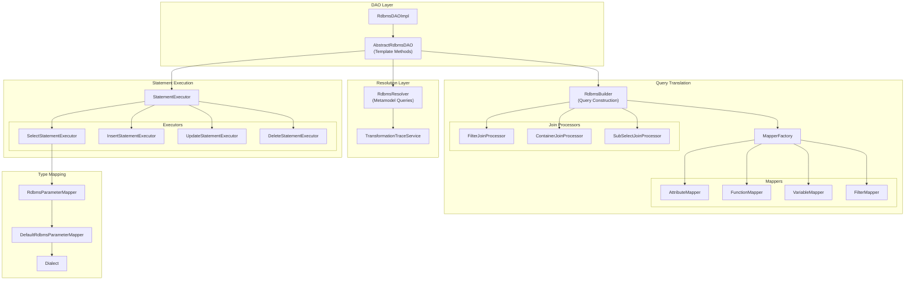
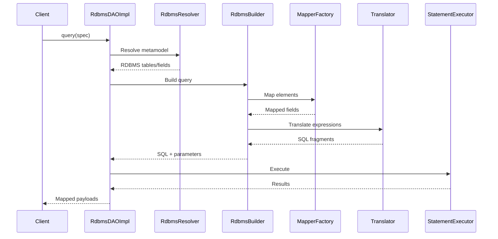
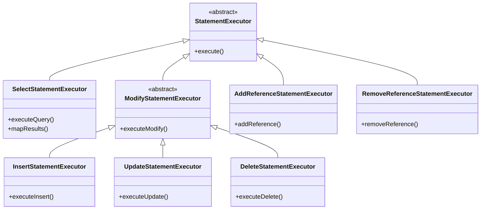
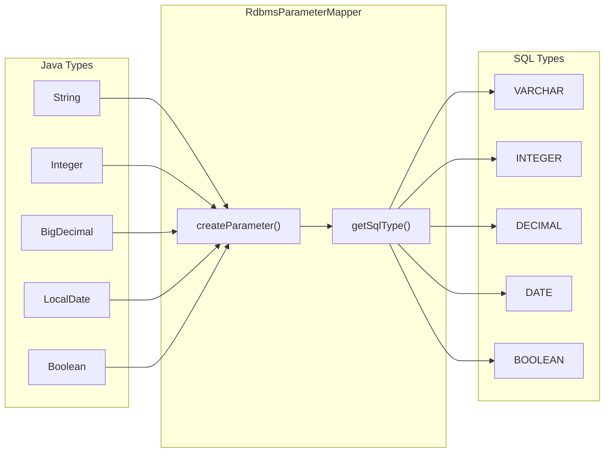
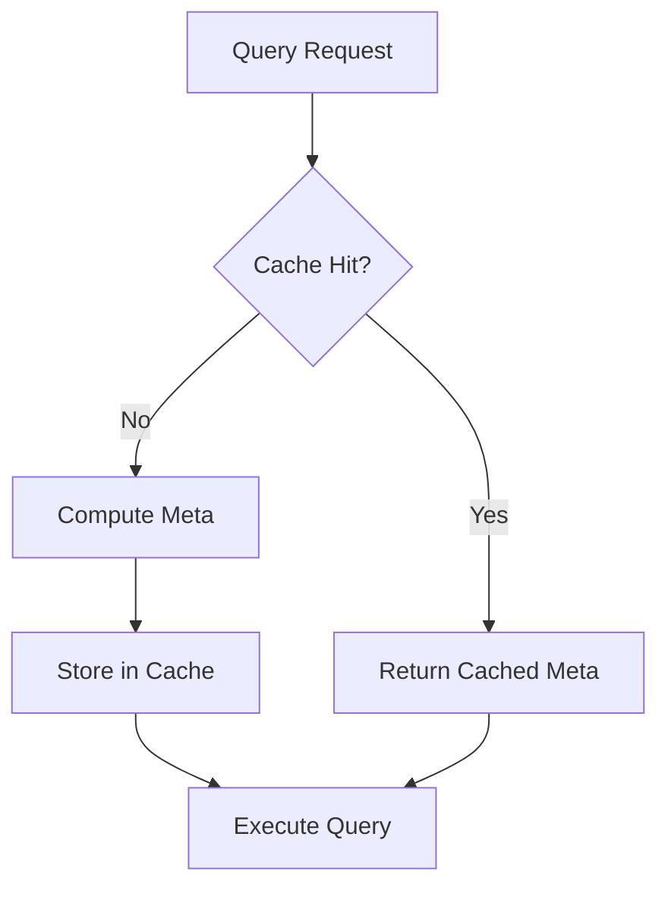

# DAO RDBMS Architecture

## Component Overview

## Query Translation Flow

## Statement Executor Hierarchy

## Type Mapping

## Caching Strategy

The `SelectStatementExecutor` uses a query meta cache:

