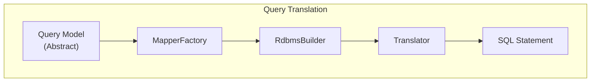

# Custom Query Extensions

Guide for extending the JUDO DAO RDBMS query translation layer with custom mappers and translators.

## Query Translation Architecture



## Extension Points

### 1. MapperFactory - Query Element Mapping

Implement `MapperFactory` to register custom query element mappers:

```java
public class CustomMapperFactory implements MapperFactory {
    
    @Override
    public Map<Class<?>, RdbmsMapper<?>> getMappers(RdbmsBuilder rdbmsBuilder) {
        Map<Class<?>, RdbmsMapper<?>> mappers = new HashMap<>();
        
        // Add custom mapper for your query element type
        mappers.put(CustomQueryElement.class, 
            new CustomQueryElementMapper(rdbmsBuilder));
        
        return mappers;
    }
}
```

### 2. RdbmsMapper - Element Translation

Extend `RdbmsMapper` for custom query elements:

```java
public class CustomQueryElementMapper extends RdbmsMapper<CustomQueryElement> {
    
    public CustomQueryElementMapper(RdbmsBuilder rdbmsBuilder) {
        super(rdbmsBuilder);
    }
    
    @Override
    public RdbmsField map(CustomQueryElement element, 
                          RdbmsBuilderContext context) {
        // Translate to RDBMS field
        return RdbmsField.builder()
            .name(element.getFieldName())
            .sqlType(element.getSqlType())
            .build();
    }
}
```

### 3. Translator - Expression Translation

Add custom expression translators:

```java
public class CustomExpressionTranslator 
    implements Function<CustomExpression, Expression> {
    
    @Override
    public Expression apply(CustomExpression expr) {
        // Transform custom expression to standard expression
        return new StringConstant(expr.evaluate());
    }
}

// Register with Translator
translator.register(CustomExpression.class, 
    new CustomExpressionTranslator());
```

## Built-in Mappers

| Mapper | Purpose |
|--------|---------|
| `AttributeMapper` | Maps attribute selectors to SQL columns |
| `FunctionMapper` | Maps function calls to SQL functions |
| `VariableMapper` | Maps variables to SQL parameters |
| `FilterMapper` | Maps filter expressions to WHERE clauses |

## Join Processors

Custom join strategies can be implemented via processors:

| Processor | Use Case |
|-----------|----------|
| `FilterJoinProcessor` | Filter-based joins |
| `ContainerJoinProcessor` | Container relationship joins |
| `SubSelectJoinProcessor` | Subquery-based joins |
| `CustomJoinProcessor` | Custom join conditions |

## Registration with Guice

```java
public class CustomQueryModule extends AbstractModule {
    @Override
    protected void configure() {
        Multibinder<MapperFactory> mapperFactories = 
            Multibinder.newSetBinder(binder(), MapperFactory.class);
        mapperFactories.addBinding().to(CustomMapperFactory.class);
    }
}
```

## See Also

- `agent-docs/architecture.md` - Full DAO architecture
- `/judo-dao-rdbms:query-debugging` - Debug SQL generation
