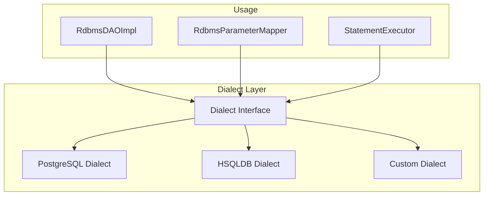

# Dialect Extension

Guide for adding support for new database dialects in JUDO DAO RDBMS.

## Dialect Architecture



## Dialect Interface

The `Dialect` interface is minimal:

```java
package hu.blackbelt.judo.runtime.core.dao.rdbms;

public interface Dialect {
    
    /**
     * Returns the dialect name (e.g., "postgresql", "hsqldb")
     */
    String getName();
    
    /**
     * Returns the dual table name for SELECT without FROM
     * (e.g., "DUAL" for Oracle, empty for PostgreSQL)
     */
    String getDualTable();
}
```

## Creating a Custom Dialect

### Step 1: Implement the Interface

```java
package com.example.dialect;

import hu.blackbelt.judo.runtime.core.dao.rdbms.Dialect;

public class MySQLDialect implements Dialect {
    
    @Override
    public String getName() {
        return "mysql";
    }
    
    @Override
    public String getDualTable() {
        return "DUAL";
    }
}
```

### Step 2: Create Dialect Provider

```java
package com.example.dialect;

import hu.blackbelt.judo.runtime.core.dao.rdbms.Dialect;
import javax.inject.Provider;

public class MySQLDialectProvider implements Provider<Dialect> {
    
    @Override
    public Dialect get() {
        return new MySQLDialect();
    }
}
```

### Step 3: Register with Guice

```java
public class MySQLDialectModule extends AbstractModule {
    
    @Override
    protected void configure() {
        bind(Dialect.class).toProvider(MySQLDialectProvider.class);
    }
}
```

## Database-Specific Considerations

### Type Mapping

Override `RdbmsParameterMapper` for database-specific types:

```java
public class MySQLParameterMapper extends DefaultRdbmsParameterMapper {
    
    @Override
    public int getSqlType(String targetDbType) {
        switch (targetDbType.toLowerCase()) {
            case "json":
                return Types.LONGVARCHAR; // MySQL JSON type
            case "tinyint":
                return Types.TINYINT;
            default:
                return super.getSqlType(targetDbType);
        }
    }
}
```

### SQL Generation

Some dialects require custom SQL syntax:

| Feature | PostgreSQL | MySQL | HSQLDB |
|---------|------------|-------|--------|
| Boolean | `TRUE/FALSE` | `1/0` | `TRUE/FALSE` |
| String concat | `\|\|` | `CONCAT()` | `\|\|` |
| Limit | `LIMIT n` | `LIMIT n` | `LIMIT n` |
| Offset | `OFFSET n` | `OFFSET n` | `OFFSET n` |
| Returning | `RETURNING *` | Not supported | Not supported |

### RdbmsInit Implementation

For schema initialization:

```java
public class MySQLRdbmsInit implements RdbmsInit {
    
    @Override
    public void execute(DataSource dataSource) {
        // MySQL-specific initialization
        try (Connection conn = dataSource.getConnection()) {
            // Set session variables, create functions, etc.
            conn.createStatement().execute(
                "SET sql_mode = 'STRICT_TRANS_TABLES'"
            );
        }
    }
}
```

## Existing Dialect Modules

| Module | Database | Key Features |
|--------|----------|--------------|
| `judo-runtime-core-dao-rdbms-hsqldb` | HSQLDB | In-memory, development |
| `judo-runtime-core-dao-rdbms-postgresql` | PostgreSQL | Production, full features |

## Testing Your Dialect

```java
@Test
void testDialectConfiguration() {
    Dialect dialect = injector.getInstance(Dialect.class);
    
    assertThat(dialect.getName()).isEqualTo("mysql");
    assertThat(dialect.getDualTable()).isEqualTo("DUAL");
}

@Test
void testTypeMapping() {
    RdbmsParameterMapper mapper = injector.getInstance(RdbmsParameterMapper.class);
    
    assertThat(mapper.getSqlType("json")).isEqualTo(Types.LONGVARCHAR);
}
```

## See Also

- `agent-docs/extension-points.md` - All extension interfaces
- `/judo-dao-rdbms:query-debugging` - Debug SQL issues
