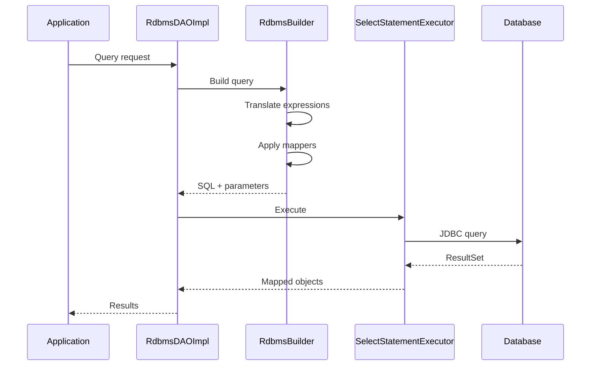
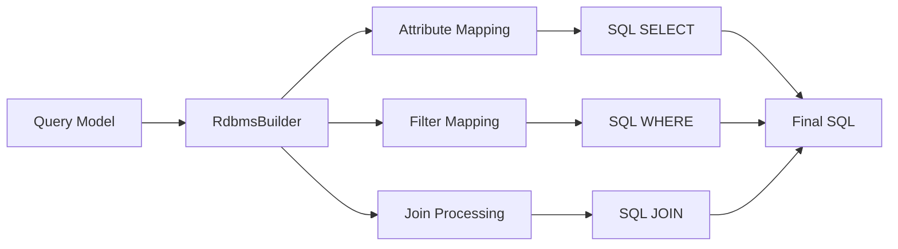
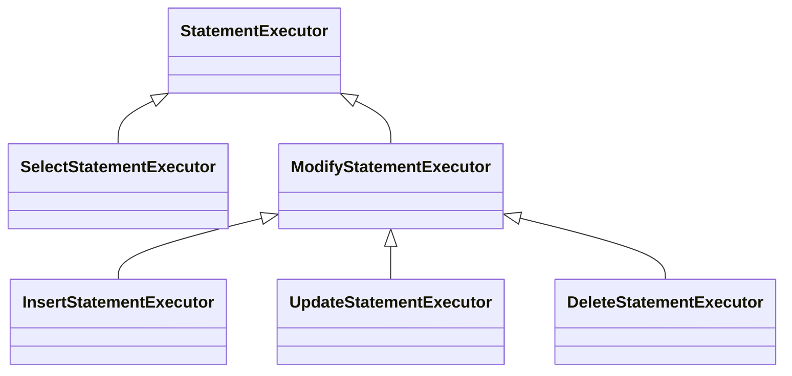

# Query Debugging

Troubleshooting guide for JUDO DAO RDBMS query translation and SQL generation.

## Query Execution Flow



## Enable Debug Logging

```xml
<!-- logback.xml -->
<logger name="hu.blackbelt.judo.runtime.core.dao.rdbms" level="DEBUG"/>
<logger name="hu.blackbelt.judo.runtime.core.dao.rdbms.query" level="TRACE"/>
<logger name="org.springframework.jdbc" level="DEBUG"/>
```

## Common Issues

### Issue 1: Wrong SQL Generated

**Symptoms**: Query returns unexpected results or SQL syntax errors

**Debug Steps**:
1. Enable TRACE logging for `query` package
2. Check `RdbmsBuilder` output
3. Verify mapper registration

```java
// Debug: Print generated SQL
log.debug("Generated SQL: {}", selectStatement.getSql());
log.debug("Parameters: {}", selectStatement.getParameters());
```

### Issue 2: Missing Joins

**Symptoms**: Related entities not loaded, null references

**Checklist**:
1. Check `RdbmsResolver.rdbmsJunctionTable()` for M:N relations
2. Verify join processor selection
3. Check foreign key mappings in RDBMS metamodel

```java
// Debug join resolution
RdbmsReference ref = resolver.rdbmsReference(eReference);
log.debug("Join table: {}", ref.getJunctionTable());
log.debug("FK columns: {}", ref.getForeignKeyColumns());
```

### Issue 3: Type Conversion Errors

**Symptoms**: `ClassCastException`, wrong data types

**Debug**:
```java
// Check parameter mapping
RdbmsParameterMapper mapper = ...;
Parameter param = mapper.createParameter(value, targetType);
log.debug("SQL Type: {}, Value: {}", param.getSqlType(), param.getValue());
```

### Issue 4: Performance Issues

**Symptoms**: Slow queries, N+1 problems

**Analysis**:
1. Check query caching: `SelectStatementExecutorQueryMetaCache`
2. Profile join strategies
3. Review batch fetching configuration

```java
// Enable query timing
long start = System.currentTimeMillis();
List<?> results = dao.query(querySpec);
log.info("Query took {}ms, returned {} rows", 
    System.currentTimeMillis() - start, results.size());
```

## Tracing Query Translation



## Key Debug Points

| Component | What to Check |
|-----------|---------------|
| `RdbmsResolver` | Metamodel resolution |
| `RdbmsBuilder` | Query construction |
| `MapperFactory` | Element mapping |
| `Translator` | Expression translation |
| `StatementExecutor` | SQL execution |

## Statement Executor Hierarchy



## See Also

- `/judo-runtime:custom-queries` - Extend query translation
- `/judo-runtime:dialect-extension` - Database-specific debugging
