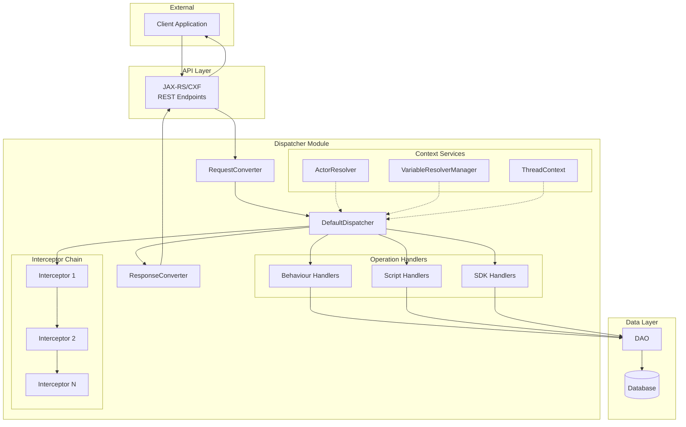
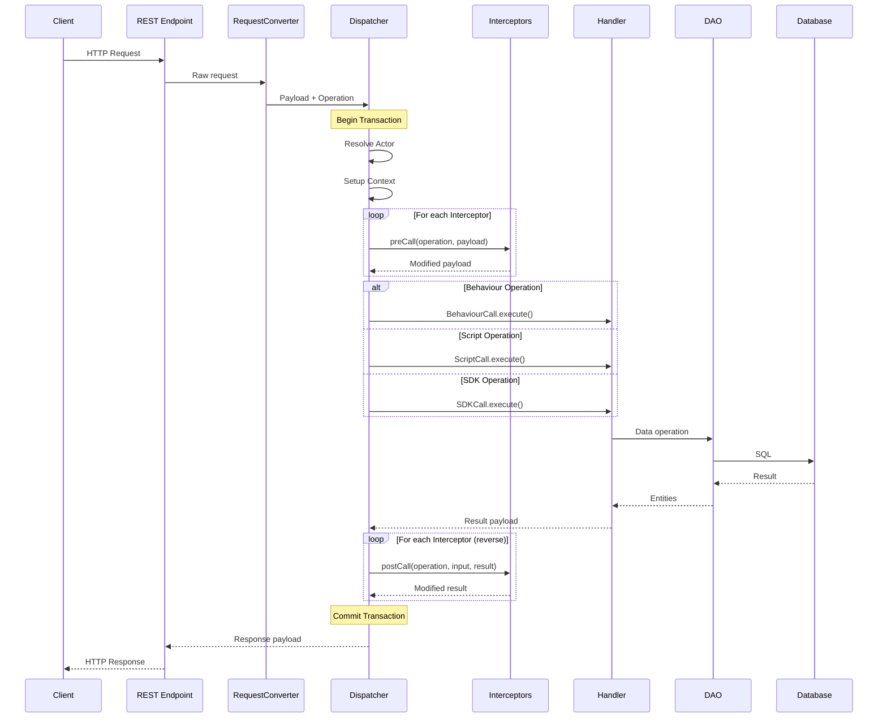
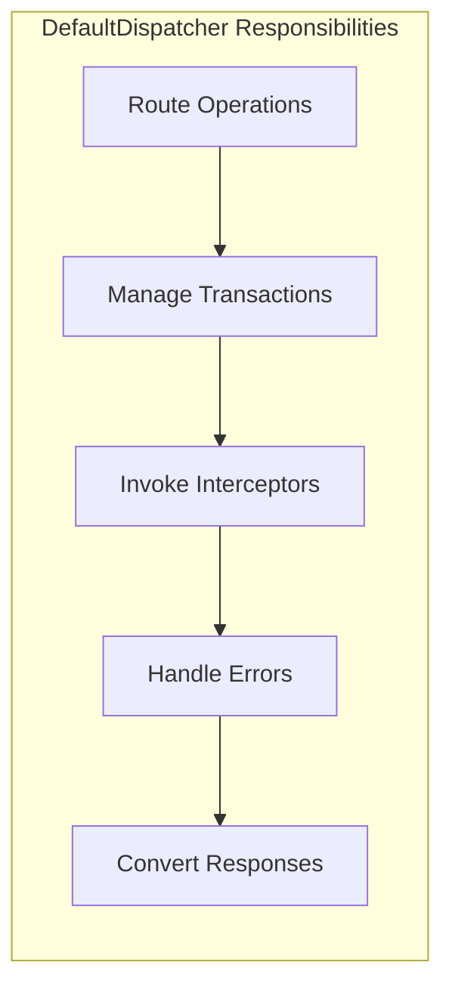
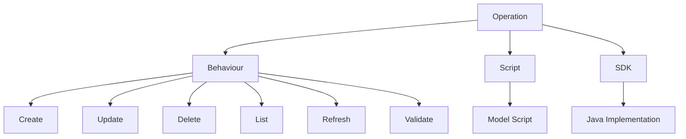
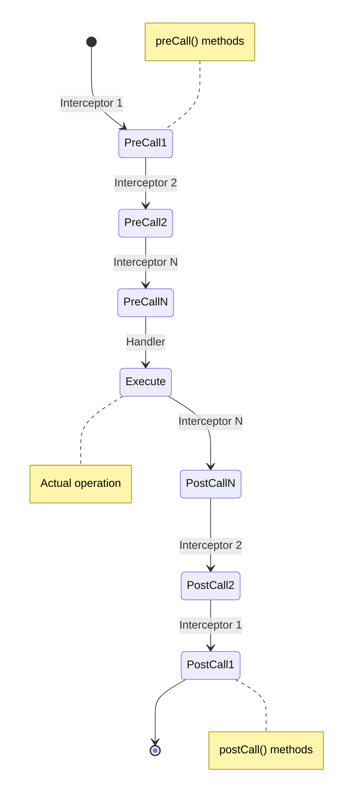
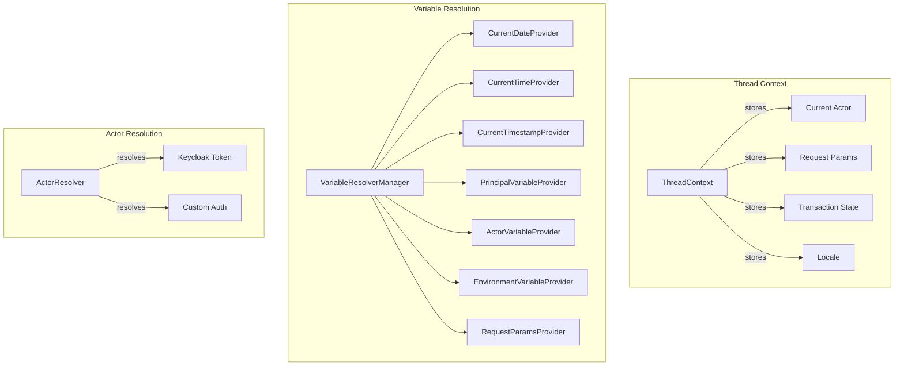
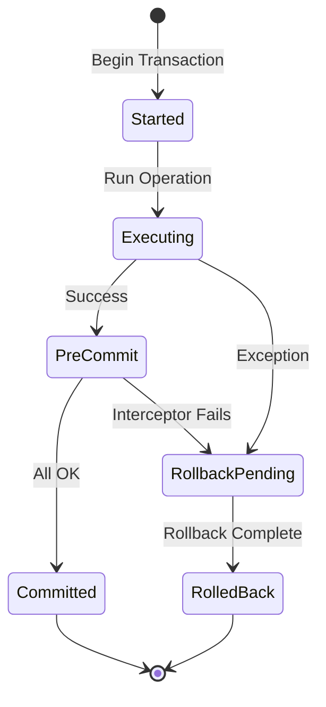
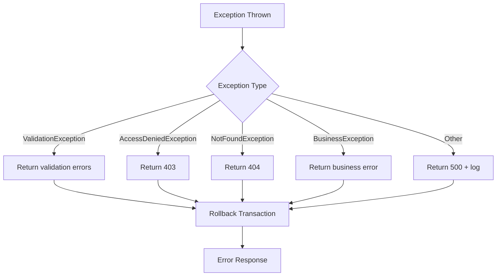
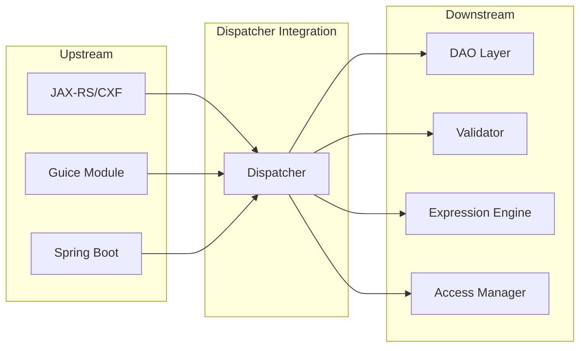

# Dispatcher Architecture

## System Overview

## Request Processing Flow

## Component Details

### DefaultDispatcher

The central orchestrator that:

Key methods:
- `dispatch(operation, payload)` - Main entry point
- `callOperation()` - Routes to appropriate handler
- `callInterceptors()` - Manages interceptor chain

### Operation Types

### Behaviour Handlers

| Handler | Purpose | Key Method |
|---------|---------|------------|
| `CreateInstanceCall` | Create new entity | `execute()` |
| `UpdateInstanceCall` | Update entity | `execute()` |
| `DeleteInstanceCall` | Delete entity | `execute()` |
| `ListCall` | Query entities | `execute()` |
| `RefreshCall` | Reload from DB | `execute()` |
| `GetTemplateCall` | Default values | `execute()` |
| `ValidateCreateCall` | Pre-create validation | `execute()` |
| `ValidateUpdateCall` | Pre-update validation | `execute()` |
| `AddReferenceCall` | Add to relation | `execute()` |
| `RemoveReferenceCall` | Remove from relation | `execute()` |
| `SetReferenceCall` | Set relation | `execute()` |
| `UnsetReferenceCall` | Clear relation | `execute()` |

### Interceptor Chain

### Context Management

## Transaction Management

Transaction boundaries:
- Opened before first interceptor `preCall()`
- Committed after last interceptor `postCall()`
- Rolled back on any exception
- Supports `alwaysRollback` for testing

## Error Handling

## Integration Points

