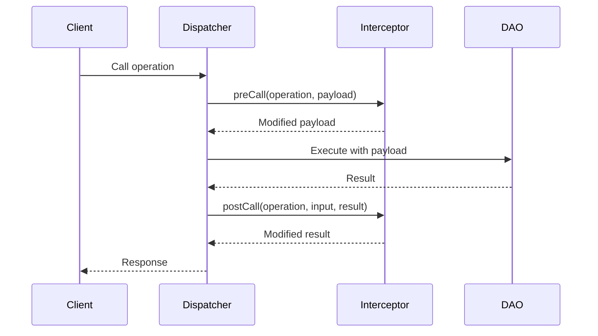

# Create Operation Interceptor

Guide for creating custom operation interceptors in JUDO applications.

## What is an Interceptor?

Interceptors allow you to hook into any operation (CRUD, scripts, SDK methods) to:
- Transform input before execution
- React to results after execution
- Run async side-effects (webhooks, notifications)
- Replace the operation entirely

## Interceptor Flow



## Extension Point Interface

Implement `OperationCallInterceptor`:

```java
package hu.blackbelt.judo.runtime.core.dispatcher;

public interface OperationCallInterceptor {
    
    // Required: Unique name for this interceptor
    String getName();
    
    // Optional: Filter which operations to intercept (empty = all)
    default Collection<EOperation> getOperations(AsmModel asmModel) {
        return Collections.emptyList();
    }
    
    // Optional: Run on separate thread, outside transaction
    default boolean async() { return false; }
    
    // Optional: Stop execution if this interceptor throws
    default boolean terminateOnException() { return true; }
    
    // Optional: Skip the original DAO call entirely
    default boolean ignoreDecoratedCall() { return false; }
    
    // Optional: Called before operation executes
    default Object preCall(EOperation operation, Object payload) {
        return payload;
    }
    
    // Optional: Called after operation executes
    default Object postCall(EOperation operation, Object input, Object result) {
        return result;
    }
}
```

## Method Reference

| Method | Required | Default | Description |
|--------|----------|---------|-------------|
| `getName()` | Yes | - | Unique interceptor identifier |
| `getOperations(AsmModel)` | No | empty list | Filter operations to intercept (empty = all) |
| `async()` | No | `false` | Run on separate thread, outside transaction |
| `terminateOnException()` | No | `true` | Stop execution if this interceptor throws |
| `ignoreDecoratedCall()` | No | `false` | Skip the original DAO call entirely |
| `preCall(operation, payload)` | No | passthrough | Called before operation executes |
| `postCall(operation, input, result)` | No | passthrough | Called after operation executes |

## Example: Webhook Interceptor

```java
public class WebhookInterceptor implements OperationCallInterceptor {
    
    private final HttpClient httpClient;
    private final String webhookUrl;
    
    public WebhookInterceptor(HttpClient httpClient, String webhookUrl) {
        this.httpClient = httpClient;
        this.webhookUrl = webhookUrl;
    }
    
    @Override
    public String getName() { 
        return "webhook-interceptor"; 
    }
    
    @Override
    public boolean async() { 
        return true; // Non-blocking, runs on separate thread
    }
    
    @Override
    public Collection<EOperation> getOperations(AsmModel asmModel) {
        // Only intercept create operations on Order entity
        return asmModel.getOperations().stream()
            .filter(op -> op.getName().startsWith("create"))
            .filter(op -> op.getEContainingClass().getName().equals("OrderService"))
            .collect(Collectors.toList());
    }
    
    @Override
    public Object postCall(EOperation operation, Object input, Object result) {
        // Fire webhook after successful operation
        httpClient.post(webhookUrl, Map.of(
            "event", operation.getName(),
            "entity", operation.getEContainingClass().getName(),
            "timestamp", Instant.now().toString(),
            "payload", result
        ));
        return result;
    }
}
```

## Registration with Guice

```java
public class MyInterceptorModule extends AbstractModule {
    
    @Override
    protected void configure() {
        // Register interceptor with Multibinder
        Multibinder<OperationCallInterceptor> interceptors = 
            Multibinder.newSetBinder(binder(), OperationCallInterceptor.class);
        
        interceptors.addBinding().to(WebhookInterceptor.class);
    }
    
    @Provides
    @Singleton
    WebhookInterceptor provideWebhookInterceptor(HttpClient httpClient) {
        return new WebhookInterceptor(httpClient, "https://n8n.example.com/webhook/orders");
    }
}
```

## Registration with Spring

```java
@Configuration
public class InterceptorConfig {
    
    @Bean
    public OperationCallInterceptor webhookInterceptor(HttpClient httpClient) {
        return new WebhookInterceptor(httpClient, "https://n8n.example.com/webhook/orders");
    }
}
```

## Testing with JUDO TestKit

See `judo-runtime-core-guice-testkit` for testing utilities:

```java
@JudoTest
class WebhookInterceptorTest {
    
    @Test
    void shouldFireWebhookOnCreate(TestOperationCallInterceptorProvider interceptorProvider) {
        // Register mock interceptor
        MockWebhookInterceptor mock = new MockWebhookInterceptor();
        interceptorProvider.addInterceptor(mock);
        
        // Execute operation
        orderService.createOrder(newOrder);
        
        // Verify webhook was called
        assertThat(mock.getCapturedEvents()).hasSize(1);
    }
}
```

## Common Patterns

### Audit Logging

```java
@Override
public Object postCall(EOperation operation, Object input, Object result) {
    auditLogger.log(
        operation.getName(),
        getCurrentUser(),
        input,
        result
    );
    return result;
}
```

### Input Validation

```java
@Override
public Object preCall(EOperation operation, Object payload) {
    if (payload instanceof Map) {
        validate((Map<?, ?>) payload);
    }
    return payload;
}
```

### Result Transformation

```java
@Override
public Object postCall(EOperation operation, Object input, Object result) {
    if (result instanceof Payload) {
        return enrichPayload((Payload) result);
    }
    return result;
}
```

## See Also

- `agent-docs/extension-points.md` - All extension interfaces
- `agent-docs/examples/webhook-interceptor.java` - Full example
- `judo-runtime-core-guice-testkit` - Testing utilities
