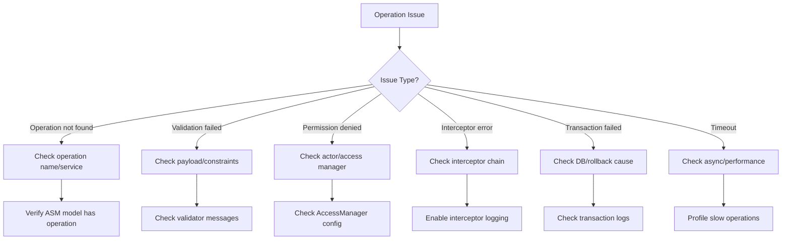
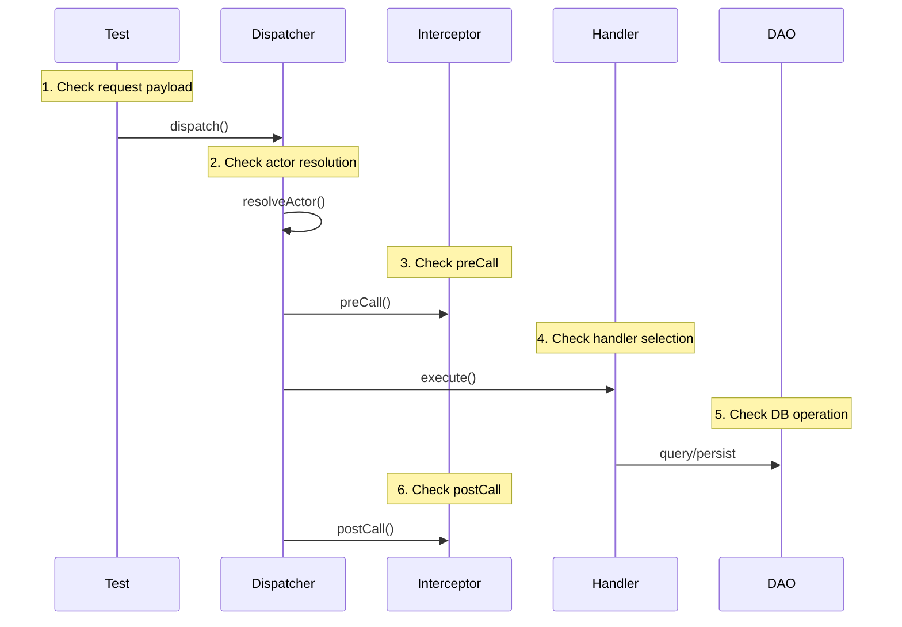

# Debug Operations

Troubleshooting guide for JUDO Dispatcher operation execution issues.

## Common Issues



## Diagnostic Checklist

### 1. Enable Debug Logging

```xml
<!-- logback.xml or logback-test.xml -->
<logger name="hu.blackbelt.judo.runtime.core.dispatcher" level="DEBUG"/>
<logger name="hu.blackbelt.judo.runtime.core.dao" level="DEBUG"/>
<logger name="hu.blackbelt.judo.runtime.core.validator" level="DEBUG"/>
```

### 2. Check Operation Registration

```java
// Verify operation exists in ASM model
AsmUtils.getOperations(asmModel)
    .filter(op -> op.getName().equals("myOperation"))
    .forEach(op -> {
        System.out.println("Found: " + op.getName());
        System.out.println("Container: " + op.getEContainingClass().getName());
    });
```

### 3. Trace Request Flow



## Troubleshooting Scenarios

### Operation Not Found

**Symptoms**: `OperationNotFoundException` or 404 response

**Checklist**:
1. Verify operation name matches ASM model exactly (case-sensitive)
2. Check service/entity name is correct
3. Ensure model is loaded correctly
4. Verify REST endpoint path mapping

```java
// Debug: List all available operations
asmModel.getResourceModel().getContents().stream()
    .filter(EClass.class::isInstance)
    .map(EClass.class::cast)
    .flatMap(c -> c.getEOperations().stream())
    .forEach(op -> log.info("Operation: {}.{}", 
        op.getEContainingClass().getName(), 
        op.getName()));
```

### Validation Errors

**Symptoms**: `ValidationException` with constraint violations

**Checklist**:
1. Check required fields are present
2. Verify data types match schema
3. Check custom validator implementations
4. Review constraint annotations in model

```java
// Debug: Capture validation details
try {
    dispatcher.dispatch(operation, payload);
} catch (ValidationException e) {
    e.getViolations().forEach(v -> {
        log.error("Field: {} - Message: {}", 
            v.getPropertyPath(), 
            v.getMessage());
    });
}
```

### Permission Denied

**Symptoms**: `AccessDeniedException` or 403 response

**Checklist**:
1. Verify actor is authenticated
2. Check actor has required role/permission
3. Review AccessManager configuration
4. Check operation-level access rules

```java
// Debug: Check current actor
ActorResolver actorResolver = injector.getInstance(ActorResolver.class);
Optional<EClass> actor = actorResolver.getActor();
log.info("Current actor: {}", actor.map(EClass::getName).orElse("NONE"));
```

### Interceptor Failures

**Symptoms**: Unexpected behavior, silent failures, or `InterceptorCallBusinessException`

**Checklist**:
1. Check interceptor registration order
2. Verify `async()` flag if timing issues
3. Check `terminateOnException()` behavior
4. Add logging to interceptor methods

```java
// Debug interceptor
public class DebugInterceptor implements OperationCallInterceptor {
    private static final Logger log = LoggerFactory.getLogger(DebugInterceptor.class);
    
    @Override
    public String getName() { return "debug"; }
    
    @Override
    public Object preCall(EOperation op, Object payload) {
        log.info("PRE: {} - payload: {}", op.getName(), payload);
        return payload;
    }
    
    @Override
    public Object postCall(EOperation op, Object input, Object result) {
        log.info("POST: {} - result: {}", op.getName(), result);
        return result;
    }
}
```

### Transaction/Rollback Issues

**Symptoms**: Data not persisted, unexpected rollbacks

**Checklist**:
1. Check for exceptions during operation
2. Verify transaction boundaries
3. Check `alwaysRollback` test settings
4. Review constraint violations

```java
// Debug: Add transaction logging
@Override
public Object postCall(EOperation op, Object input, Object result) {
    TransactionStatus status = TransactionAspectSupport.currentTransactionStatus();
    log.info("Transaction rollback-only: {}", status.isRollbackOnly());
    return result;
}
```

### Performance Issues

**Symptoms**: Slow operations, timeouts

**Checklist**:
1. Check N+1 query issues
2. Review async interceptor usage
3. Profile database queries
4. Check for blocking I/O in interceptors

```java
// Debug: Time operations
long start = System.currentTimeMillis();
Object result = dispatcher.dispatch(operation, payload);
log.info("Operation {} took {}ms", operation.getName(), 
    System.currentTimeMillis() - start);
```

## Testing Utilities

Use `judo-runtime-core-guice-testkit` for debugging:

```java
@JudoTest
class DebugTest {
    
    @Test
    void debugOperation(DAO dao, Dispatcher dispatcher) {
        // Access internals for debugging
        Payload result = dispatcher.dispatch(
            "MyService", 
            "myOperation", 
            Payload.map("input", "value")
        );
        
        // Check result
        assertThat(result).isNotNull();
    }
}
```

## Log Analysis

### Key Log Patterns

| Pattern | Meaning |
|---------|---------|
| `Dispatching operation:` | Operation started |
| `Resolved actor:` | Actor context set |
| `Invoking interceptor:` | Interceptor called |
| `Operation completed:` | Success |
| `Operation failed:` | Check following exception |
| `Rolling back transaction` | Transaction reverted |

### Sample Debug Session

```
DEBUG Dispatching operation: OrderService.createOrder
DEBUG Resolved actor: AdminUser
DEBUG Invoking interceptor: validation-interceptor (preCall)
DEBUG Invoking interceptor: audit-interceptor (preCall)
DEBUG Executing CreateInstanceCall for Order
DEBUG SQL: INSERT INTO orders (id, ...) VALUES (?, ...)
DEBUG Invoking interceptor: audit-interceptor (postCall)
DEBUG Invoking interceptor: webhook-interceptor (postCall, async)
DEBUG Operation completed: OrderService.createOrder
```

## See Also

- `/judo-dispatcher:create-interceptor` - How to create interceptors
- `/judo-dispatcher:dispatcher-architecture` - Understanding internals
- `agent-docs/extension-points.md` - All extension interfaces
