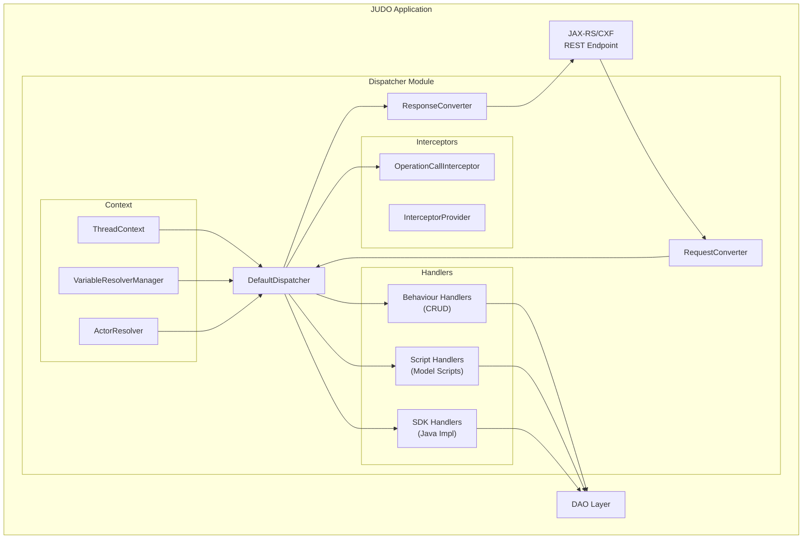
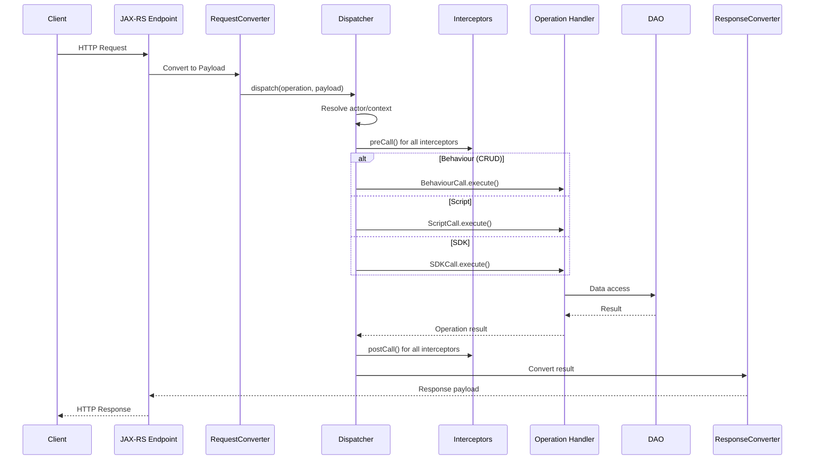
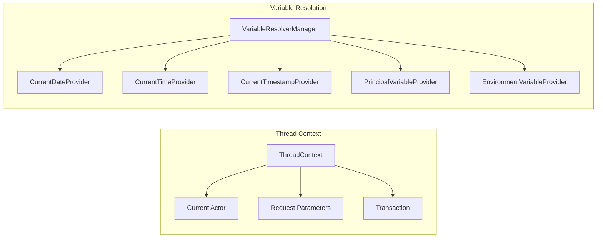
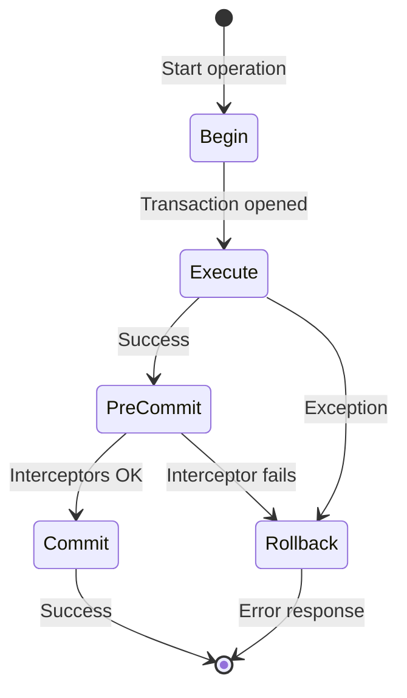

# Dispatcher Architecture

Understanding the JUDO Dispatcher internals for advanced customization and debugging.

## Overview

The Dispatcher is the central routing component that handles all operation calls in a JUDO application. It routes requests to the appropriate handler (behaviour, script, or SDK implementation) and manages interceptors, transactions, and context.

## Architecture Diagram



## Request Flow



## Key Components

### DefaultDispatcher

The main dispatcher implementation that:
- Routes operations to appropriate handlers
- Manages transaction boundaries
- Invokes interceptors in order
- Handles error translation

**Location**: `hu.blackbelt.judo.runtime.core.dispatcher.DefaultDispatcher`

### Behaviour Handlers

Built-in CRUD operation handlers:

| Handler | Operation Type |
|---------|---------------|
| `CreateInstanceCall` | Create new entity |
| `UpdateInstanceCall` | Update existing entity |
| `DeleteInstanceCall` | Delete entity |
| `ListCall` | Query/list entities |
| `RefreshCall` | Reload entity from DB |
| `GetTemplateCall` | Get default values |
| `ValidateCreateCall` | Validate before create |
| `ValidateUpdateCall` | Validate before update |

**Location**: `hu.blackbelt.judo.runtime.core.dispatcher.behaviours.*`

### Context Management



### Variable Providers

Built-in providers for expression context:

| Provider | Variable | Description |
|----------|----------|-------------|
| `CurrentDateProvider` | `CURRENT_DATE` | Today's date |
| `CurrentTimeProvider` | `CURRENT_TIME` | Current time |
| `CurrentTimestampProvider` | `CURRENT_TIMESTAMP` | Current date+time |
| `PrincipalVariableProvider` | `PRINCIPAL` | Authenticated user |
| `ActorVariableProvider` | `ACTOR` | Current actor context |
| `EnvironmentVariableProvider` | `ENV` | Environment variables |

## Extension Points

### Adding Custom Variable Providers

```java
public class MyVariableProvider implements EnvironmentVariableProvider {
    @Override
    public Optional<Object> get(String name) {
        if ("MY_VAR".equals(name)) {
            return Optional.of(computeValue());
        }
        return Optional.empty();
    }
}
```

### Custom Dispatcher Functions

Implement `DispatcherFunctionProvider` to add custom functions:

```java
public class MyFunctionProvider implements DispatcherFunctionProvider {
    @Override
    public Map<String, Function<Object[], Object>> getFunctions() {
        return Map.of(
            "myFunction", args -> processArgs(args)
        );
    }
}
```

## Transaction Management



The dispatcher manages transactions via Spring's `PlatformTransactionManager`:
- Transaction opened before operation
- Committed after successful execution + interceptors
- Rolled back on any exception

## Debugging Tips

1. **Enable dispatcher logging**:
   ```xml
   <logger name="hu.blackbelt.judo.runtime.core.dispatcher" level="DEBUG"/>
   ```

2. **Check interceptor order**: Interceptors run in registration order

3. **Thread context issues**: Use `ThreadContext` to access current context

4. **Variable resolution failures**: Check if provider is registered

## See Also

- `/judo-dispatcher:create-interceptor` - How to create interceptors
- `/judo-dispatcher:debug-operations` - Debugging operation issues
- `agent-docs/extension-points.md` - All extension interfaces
