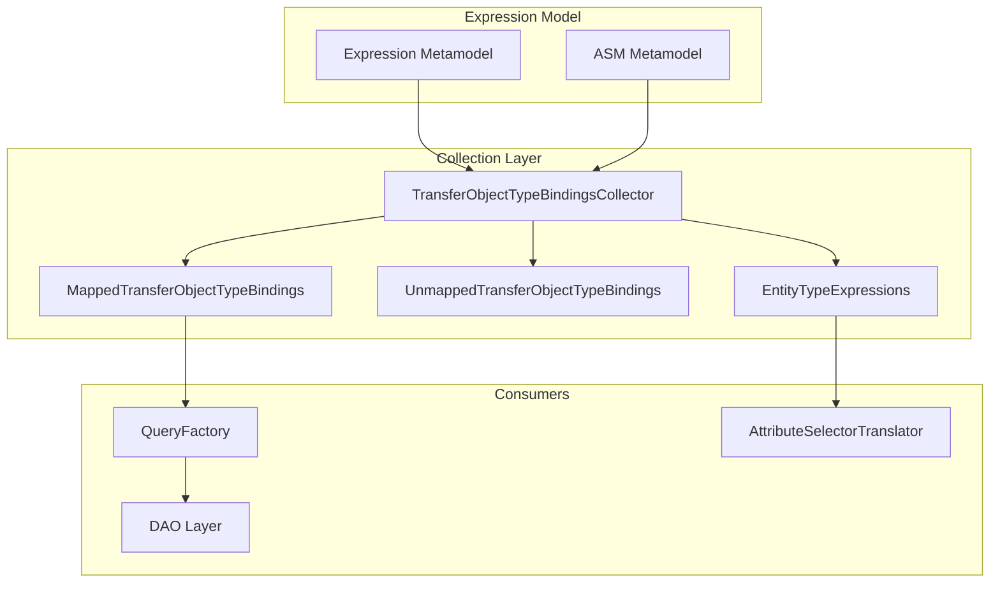

# JUDO Runtime Core - Expression

## Overview

The Expression module bridges business logic expression definitions with the runtime query and data access layers. It collects and organizes expression metadata from the metamodel for derived attributes and computed properties.

## Key Concepts

- **Expression Bindings**: Map transfer object attributes to entity expressions
- **Derived Attributes**: Computed values based on entity data
- **Transfer Object Graph**: Tree structure of mapped transfer objects
- **Expression Collection**: Lightweight metadata organization for downstream consumers

## Architecture



## Extension Points

| Class | Purpose |
|-------|---------|
| `TransferObjectTypeBindingsCollector` | Expression tree orchestrator |
| `MappedTransferObjectTypeBindings` | Expression tree nodes for mapped types |
| `UnmappedTransferObjectTypeBindings` | Unmapped DTO expression holder |
| `EntityTypeExpressions` | Entity-level expression cache |

## Quick Start

```java
// Get bindings collector
TransferObjectTypeBindingsCollector collector = 
    injector.getInstance(TransferObjectTypeBindingsCollector.class);

// Get expression tree for transfer object
MappedTransferObjectTypeBindings bindings = 
    collector.getTransferObjectGraph(transferObjectType);

// Access getter expressions
Map<EAttribute, DataExpression> getters = 
    bindings.getGetterAttributeExpressions();

// Access filter expression
LogicalExpression filter = bindings.getFilter();
```

## Expression Types

| Type | Purpose | Example |
|------|---------|---------|
| `DataExpression` | Value computation | `price * quantity` |
| `ReferenceExpression` | Navigation | `order.customer` |
| `LogicalExpression` | Filters | `status == 'ACTIVE'` |

## Dependencies

- `judo-meta-asm` - Abstract Syntax Model
- `judo-meta-expression` - Expression metamodel
- `ExpressionEvaluator` - Expression evaluation runtime
