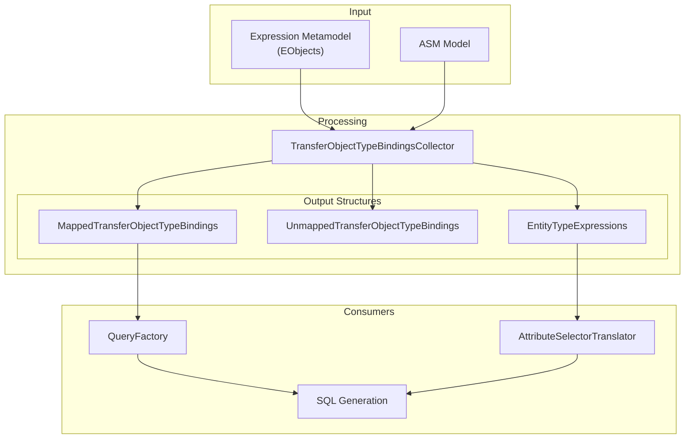
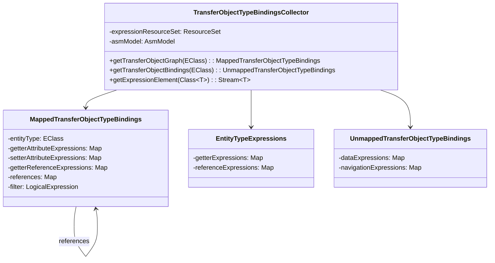
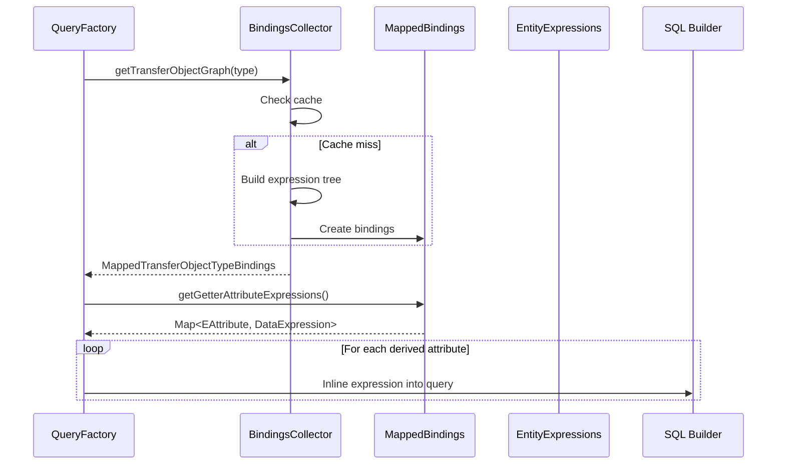
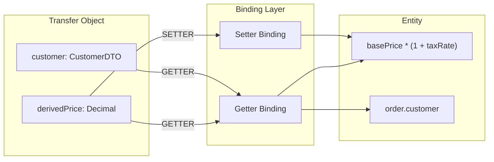
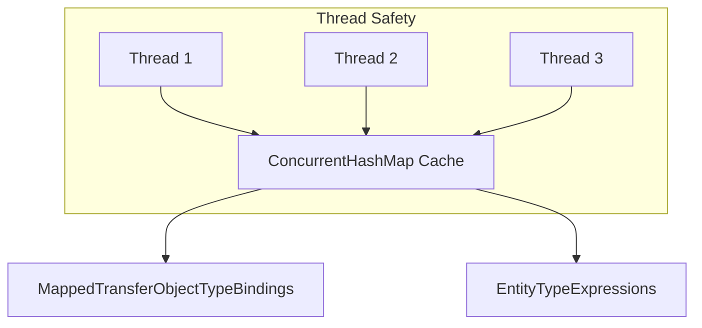
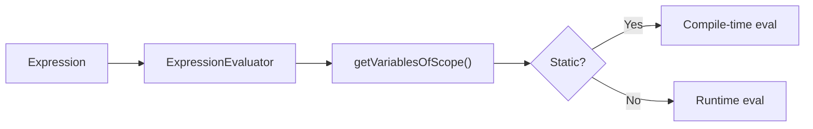

# Expression Module Architecture

## Data Flow

## Class Structure

## Expression Resolution Flow

## Binding Types

## Threading Model

All internal maps use `ConcurrentHashMap`:

## Expression Evaluation

