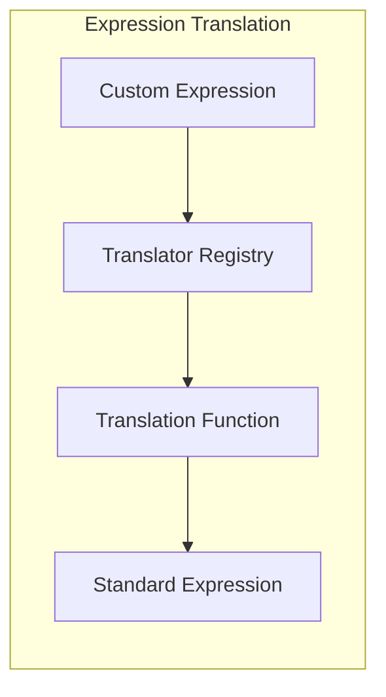
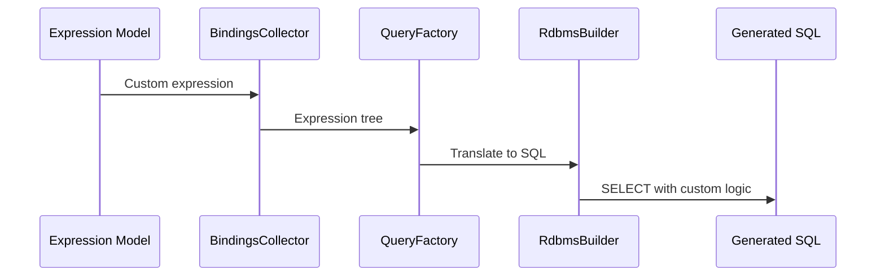

# Custom Functions

Guide for adding custom expression translators to the JUDO Expression module.

## Translator Architecture



## Creating a Custom Translator

### Step 1: Define Your Expression Type

If using a custom expression class:

```java
public class DiscountExpression extends DataExpression {
    private DataExpression basePrice;
    private DataExpression discountPercent;
    
    public DataExpression getBasePrice() { return basePrice; }
    public DataExpression getDiscountPercent() { return discountPercent; }
}
```

### Step 2: Implement the Translator

```java
public class DiscountExpressionTranslator 
    implements Function<DiscountExpression, Expression> {
    
    @Override
    public Expression apply(DiscountExpression expr) {
        // Transform: basePrice * (1 - discountPercent / 100)
        return new DecimalArithmeticExpression(
            expr.getBasePrice(),
            DecimalOperator.MULTIPLY,
            new DecimalArithmeticExpression(
                new IntegerConstant(1),
                DecimalOperator.SUBTRACT,
                new DecimalArithmeticExpression(
                    expr.getDiscountPercent(),
                    DecimalOperator.DIVIDE,
                    new IntegerConstant(100)
                )
            )
        );
    }
}
```

### Step 3: Register the Translator

```java
public class CustomTranslatorModule extends AbstractModule {
    
    @Provides
    @Singleton
    public Translator provideTranslator() {
        Translator translator = new Translator();
        
        // Register custom translator
        translator.register(
            DiscountExpression.class,
            new DiscountExpressionTranslator()
        );
        
        return translator;
    }
}
```

## Built-in Translators

The expression module includes translators for:

| Expression Type | Translator | Output |
|-----------------|------------|--------|
| `StringConstant` | `StringConstantTranslator` | SQL string literal |
| `IntegerConstant` | `IntegerConstantTranslator` | SQL integer |
| `DecimalConstant` | `DecimalConstantTranslator` | SQL decimal |
| `IntegerComparison` | `IntegerComparisonTranslator` | SQL comparison |
| `StringComparison` | `StringComparisonTranslator` | SQL comparison |

## Advanced: Aggregate Functions

For custom aggregations:

```java
public class WeightedAverageTranslator 
    implements Function<WeightedAverageExpression, Expression> {
    
    @Override
    public Expression apply(WeightedAverageExpression expr) {
        // SUM(value * weight) / SUM(weight)
        return new DecimalArithmeticExpression(
            new AggregatedExpression(
                AggregateType.SUM,
                new DecimalArithmeticExpression(
                    expr.getValue(),
                    DecimalOperator.MULTIPLY,
                    expr.getWeight()
                )
            ),
            DecimalOperator.DIVIDE,
            new AggregatedExpression(
                AggregateType.SUM,
                expr.getWeight()
            )
        );
    }
}
```

## Integration with Query Layer

Custom expressions flow through to SQL generation:



## Testing Custom Translators

```java
@Test
void testDiscountTranslation() {
    DiscountExpression expr = new DiscountExpression(
        new DecimalConstant(100.0),
        new DecimalConstant(20.0)
    );
    
    DiscountExpressionTranslator translator = 
        new DiscountExpressionTranslator();
    
    Expression result = translator.apply(expr);
    
    // Verify structure
    assertThat(result).isInstanceOf(DecimalArithmeticExpression.class);
    
    // Evaluate
    Object value = evaluator.evaluate(result, context);
    assertThat(value).isEqualTo(new BigDecimal("80.0"));
}
```

## See Also

- `/judo-runtime:expression-syntax` - Expression fundamentals
- `agent-docs/extension-points.md` - All extension interfaces
