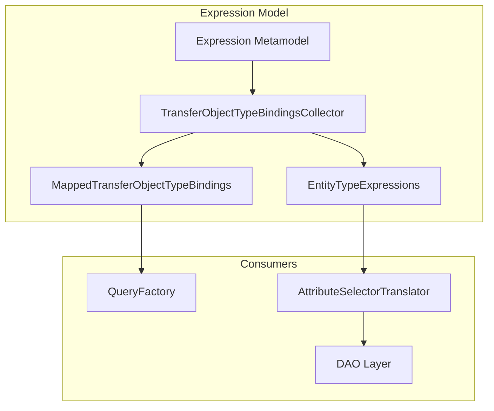
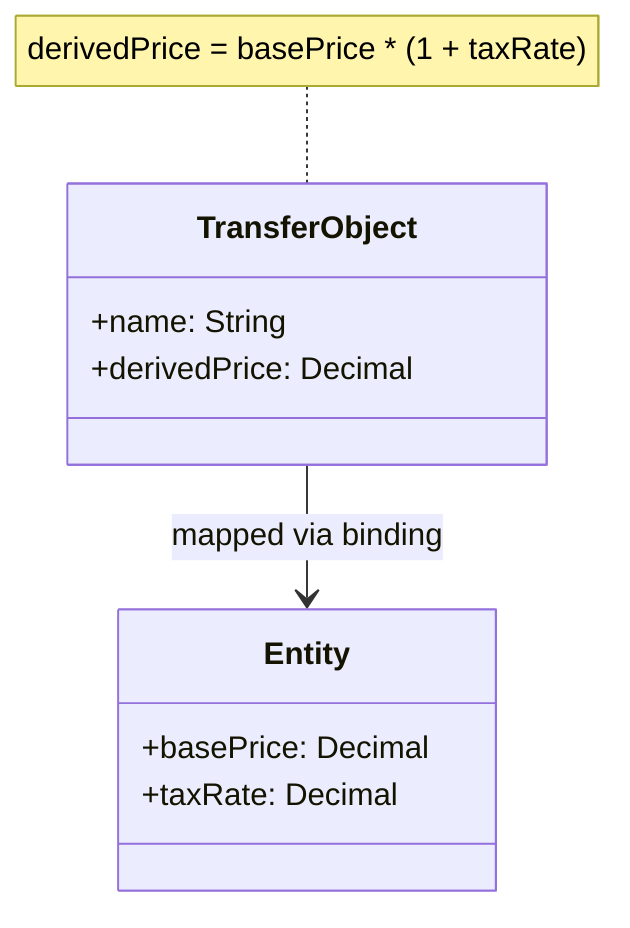

# Expression Syntax

Guide for understanding the JUDO expression metamodel, bindings, and derived attribute handling.

## Expression Architecture



## Key Concepts

### 1. Transfer Object Bindings

Transfer objects map to entity types via bindings:



### 2. Expression Types

| Type | Purpose | Example |
|------|---------|---------|
| `DataExpression` | Value computation | `basePrice * 1.2` |
| `ReferenceExpression` | Navigation | `order.customer` |
| `LogicalExpression` | Filters | `status == 'ACTIVE'` |

### 3. Binding Roles

| Role | Direction | Usage |
|------|-----------|-------|
| `GETTER` | Entity → TransferObject | Read derived values |
| `SETTER` | TransferObject → Entity | Write mapped values |

## TransferObjectTypeBindingsCollector

The main orchestrator for expression resolution:

```java
// Get expression tree for a transfer object type
MappedTransferObjectTypeBindings bindings = 
    collector.getTransferObjectGraph(transferObjectType);

// Get getter expression for an attribute
DataExpression getterExpr = 
    bindings.getGetterAttributeExpressions().get(attribute);

// Get filter expression
Optional<LogicalExpression> filter = 
    Optional.ofNullable(bindings.getFilter());
```

## MappedTransferObjectTypeBindings

Represents an expression tree node:

```java
public class MappedTransferObjectTypeBindings {
    // Entity this transfer object maps to
    private EClass entityType;
    
    // Attribute expressions (getter/setter)
    private Map<EAttribute, DataExpression> getterAttributeExpressions;
    private Map<EAttribute, DataExpression> setterAttributeExpressions;
    
    // Reference expressions
    private Map<EReference, ReferenceExpression> getterReferenceExpressions;
    
    // Nested transfer object mappings
    private Map<EReference, MappedTransferObjectTypeBindings> references;
    
    // Filter for this transfer object
    private LogicalExpression filter;
}
```

## Debugging Expression Resolution

### Issue 1: Missing Binding

**Symptom**: `IllegalStateException: Attribute is not mapped`

**Debug**:
```java
// Check if binding exists
TransferObjectTypeBindingsCollector collector = ...;
MappedTransferObjectTypeBindings bindings = 
    collector.getTransferObjectGraph(transferObjectType);

bindings.getGetterAttributeExpressions().forEach((attr, expr) -> {
    log.debug("Attribute: {} -> Expression: {}", attr.getName(), expr);
});
```

### Issue 2: Wrong Expression Type

**Symptom**: `IllegalStateException: Getter binding is not a DataExpression`

**Check**: Verify binding role matches expression type:
- `GETTER` attributes → `DataExpression`
- `GETTER` references → `ReferenceExpression`

### Issue 3: Circular References

**Protection**: The collector uses `processedMappedTransferObjectTypeBindings` cache to prevent infinite recursion.

## Expression Evaluation

Expressions are evaluated by the `ExpressionEvaluator`:

```java
// Get variables required by expression
Set<String> variables = ExpressionEvaluator.getVariablesOfScope(
    expression, 
    scope
);

// Check if expression is static (no variables)
boolean isStatic = variables.isEmpty();
```

## Common Patterns

### Derived Attribute

```
TransferObject.totalPrice = Entity.quantity * Entity.unitPrice
```

Binding:
```java
@binding(role = GETTER, expression = "self.quantity * self.unitPrice")
Decimal totalPrice;
```

### Computed Filter

```
TransferObject only shows active entities
```

Filter binding:
```java
@filter(expression = "self.status == Status#ACTIVE")
```

## See Also

- `agent-docs/architecture.md` - Expression module architecture
- `/judo-runtime:custom-functions` - Add custom translators
