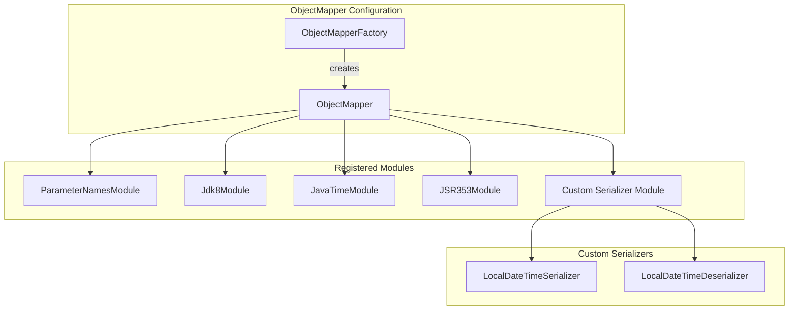
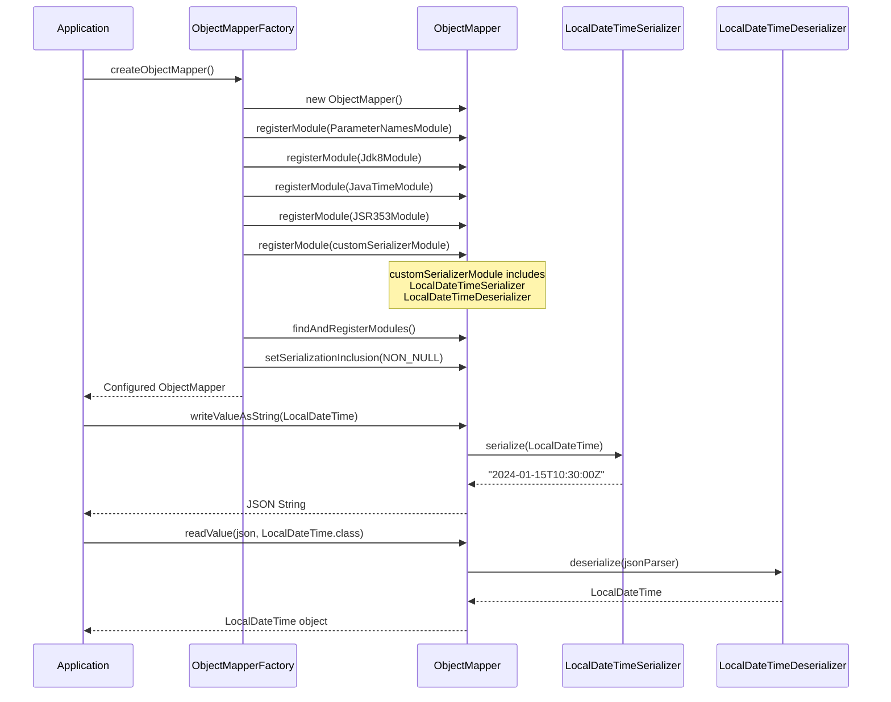

# Configure JSON Serialization

Guide for configuring Jackson ObjectMapper and custom serializers in JUDO applications.

## Overview

The `judo-runtime-core-jackson` module provides:
- Pre-configured `ObjectMapper` via `ObjectMapperFactory`
- Custom `LocalDateTime` serialization with UTC timezone support
- Registered Jackson modules for Java 8 types

## Architecture



## Serialization Flow



## Core Classes

### ObjectMapperFactory

Factory class that creates a pre-configured `ObjectMapper` instance.

```java
package hu.blackbelt.judo.runtime.core.jackson;

public class ObjectMapperFactory {

    public static ObjectMapper createObjectMapper() {
        SimpleModule customSerializerModule = new SimpleModule()
                .addSerializer(LocalDateTime.class, new LocalDateTimeSerializer())
                .addDeserializer(LocalDateTime.class, new LocalDateTimeDeserializer());

        ObjectMapper mapper = new ObjectMapper()
                .registerModule(new ParameterNamesModule())
                .registerModule(new Jdk8Module())
                .registerModule(new JavaTimeModule())
                .registerModule(new JSR353Module())
                .registerModule(customSerializerModule);

        mapper.findAndRegisterModules();
        mapper.setSerializationInclusion(JsonInclude.Include.NON_NULL);
        return mapper;
    }
}
```

**Configuration Applied:**

| Configuration | Value | Purpose |
|--------------|-------|---------|
| `ParameterNamesModule` | Registered | Support constructor parameter names |
| `Jdk8Module` | Registered | Optional/Stream support |
| `JavaTimeModule` | Registered | Java 8 Date/Time API |
| `JSR353Module` | Registered | JSON-P (javax.json) support |
| `SerializationInclusion` | `NON_NULL` | Exclude null values from output |

### LocalDateTimeSerializer

Serializes `LocalDateTime` to ISO-8601 offset format with UTC timezone.

```java
package hu.blackbelt.judo.runtime.core.jackson.serializer;

public class LocalDateTimeSerializer extends JsonSerializer<LocalDateTime> {

    @Override
    public void serialize(LocalDateTime localDateTime, 
                         JsonGenerator jsonGenerator, 
                         SerializerProvider serializerProvider) throws IOException {
        // Converts LocalDateTime to UTC offset format
        // Example: 2024-01-15T10:30:00 -> "2024-01-15T10:30:00Z"
        jsonGenerator.writeString(
            DateTimeFormatter.ISO_OFFSET_DATE_TIME
                .format(localDateTime.atOffset(ZoneOffset.UTC))
        );
    }
}
```

**Output Format:** `2024-01-15T10:30:00Z` (ISO-8601 with UTC offset)

### LocalDateTimeDeserializer

Deserializes JSON strings to `LocalDateTime`, supporting both local and offset formats.

```java
package hu.blackbelt.judo.runtime.core.jackson.deserializer;

public class LocalDateTimeDeserializer extends JsonDeserializer<LocalDateTime> {

    @Override
    public LocalDateTime deserialize(JsonParser jsonParser, 
                                     DeserializationContext context) throws IOException {
        String rawTimestamp = jsonParser.getText();

        try {
            // Try parsing as local date-time first
            return LocalDateTime.parse(rawTimestamp, DateTimeFormatter.ISO_LOCAL_DATE_TIME);
        } catch (DateTimeParseException e) {
            // Fall back to offset date-time, converting to UTC
            return OffsetDateTime.parse(rawTimestamp, DateTimeFormatter.ISO_OFFSET_DATE_TIME)
                    .atZoneSameInstant(ZoneOffset.UTC)
                    .toLocalDateTime();
        }
    }
}
```

**Accepted Input Formats:**

| Format | Example | Result |
|--------|---------|--------|
| ISO Local | `2024-01-15T10:30:00` | Parsed directly |
| ISO Local with millis | `2024-01-15T10:30:00.123` | Parsed directly |
| ISO Offset | `2024-01-15T12:30:00+02:00` | Converted to `2024-01-15T10:30:00` (UTC) |
| ISO Offset UTC | `2024-01-15T10:30:00Z` | Converted to `2024-01-15T10:30:00` (UTC) |

## Usage

### Basic Usage

```java
import hu.blackbelt.judo.runtime.core.jackson.ObjectMapperFactory;

// Create pre-configured ObjectMapper
ObjectMapper mapper = ObjectMapperFactory.createObjectMapper();

// Serialize
LocalDateTime dateTime = LocalDateTime.of(2024, 1, 15, 10, 30, 0);
String json = mapper.writeValueAsString(Map.of("timestamp", dateTime));
// Output: {"timestamp":"2024-01-15T10:30:00Z"}

// Deserialize
String input = "\"2024-01-15T12:30:00+02:00\"";
LocalDateTime parsed = mapper.readValue(input, LocalDateTime.class);
// Result: 2024-01-15T10:30:00 (converted to UTC)
```

### With Guice

```java
public class JacksonModule extends AbstractModule {
    
    @Override
    protected void configure() {
        bind(ObjectMapper.class)
            .toProvider(ObjectMapperFactory::createObjectMapper)
            .in(Singleton.class);
    }
}
```

### With Spring

```java
@Configuration
public class JacksonConfig {
    
    @Bean
    @Primary
    public ObjectMapper objectMapper() {
        return ObjectMapperFactory.createObjectMapper();
    }
}
```

### With JAX-RS

```java
@Provider
public class JacksonContextResolver implements ContextResolver<ObjectMapper> {
    
    private final ObjectMapper objectMapper;
    
    public JacksonContextResolver() {
        this.objectMapper = ObjectMapperFactory.createObjectMapper();
    }
    
    @Override
    public ObjectMapper getContext(Class<?> type) {
        return objectMapper;
    }
}
```

## Custom Serializer Extension

### Adding a Custom Type Serializer

```java
public class CustomObjectMapperFactory {
    
    public static ObjectMapper createObjectMapper() {
        // Start with JUDO's base configuration
        ObjectMapper mapper = ObjectMapperFactory.createObjectMapper();
        
        // Add custom serializers
        SimpleModule customModule = new SimpleModule("custom-module")
            .addSerializer(Money.class, new MoneySerializer())
            .addDeserializer(Money.class, new MoneyDeserializer());
        
        mapper.registerModule(customModule);
        
        return mapper;
    }
}

public class MoneySerializer extends JsonSerializer<Money> {
    @Override
    public void serialize(Money value, JsonGenerator gen, 
                         SerializerProvider provider) throws IOException {
        gen.writeStartObject();
        gen.writeNumberField("amount", value.getAmount());
        gen.writeStringField("currency", value.getCurrency().getCurrencyCode());
        gen.writeEndObject();
    }
}
```

### Custom Date Format

```java
public class CustomDateTimeSerializer extends JsonSerializer<LocalDateTime> {
    
    private static final DateTimeFormatter FORMATTER = 
        DateTimeFormatter.ofPattern("yyyy-MM-dd HH:mm:ss");
    
    @Override
    public void serialize(LocalDateTime value, JsonGenerator gen, 
                         SerializerProvider provider) throws IOException {
        gen.writeString(FORMATTER.format(value));
    }
}
```

## Configuration Options

### Modify Serialization Inclusion

```java
ObjectMapper mapper = ObjectMapperFactory.createObjectMapper();

// Include all properties (including null)
mapper.setSerializationInclusion(JsonInclude.Include.ALWAYS);

// Exclude empty collections/strings
mapper.setSerializationInclusion(JsonInclude.Include.NON_EMPTY);
```

### Configure Features

```java
ObjectMapper mapper = ObjectMapperFactory.createObjectMapper();

// Fail on unknown properties (default: false)
mapper.configure(DeserializationFeature.FAIL_ON_UNKNOWN_PROPERTIES, true);

// Write dates as ISO strings (already configured via modules)
mapper.configure(SerializationFeature.WRITE_DATES_AS_TIMESTAMPS, false);

// Pretty print output
mapper.configure(SerializationFeature.INDENT_OUTPUT, true);
```

## Dependencies

The module requires these Jackson dependencies (managed via parent POM):

```xml
<dependencies>
    <dependency>
        <groupId>com.fasterxml.jackson.module</groupId>
        <artifactId>jackson-module-parameter-names</artifactId>
    </dependency>
    <dependency>
        <groupId>com.fasterxml.jackson.datatype</groupId>
        <artifactId>jackson-datatype-jsr310</artifactId>
    </dependency>
    <dependency>
        <groupId>com.fasterxml.jackson.datatype</groupId>
        <artifactId>jackson-datatype-jdk8</artifactId>
    </dependency>
    <dependency>
        <groupId>com.fasterxml.jackson.datatype</groupId>
        <artifactId>jackson-datatype-jsr353</artifactId>
    </dependency>
</dependencies>
```

## Testing

### Unit Test Example

```java
import static org.hamcrest.CoreMatchers.equalTo;
import static org.hamcrest.MatcherAssert.assertThat;

@Test
void shouldSerializeLocalDateTimeToUtcOffset() throws JsonProcessingException {
    ObjectMapper mapper = ObjectMapperFactory.createObjectMapper();
    LocalDateTime dateTime = LocalDateTime.of(2024, 1, 15, 10, 30, 0);
    
    String json = mapper.writeValueAsString(dateTime);
    
    assertThat(json, equalTo("\"2024-01-15T10:30:00Z\""));
}

@Test
void shouldDeserializeOffsetToUtc() throws JsonProcessingException {
    ObjectMapper mapper = ObjectMapperFactory.createObjectMapper();
    String json = "\"2024-01-15T12:30:00+02:00\"";
    
    LocalDateTime result = mapper.readValue(json, LocalDateTime.class);
    
    assertThat(result, equalTo(LocalDateTime.of(2024, 1, 15, 10, 30, 0)));
}
```

## Common Patterns

### REST API Response Serialization

```java
@GET
@Path("/events")
@Produces(MediaType.APPLICATION_JSON)
public Response getEvents() {
    List<Event> events = eventService.findAll();
    // ObjectMapper from ObjectMapperFactory handles LocalDateTime correctly
    return Response.ok(events).build();
}
```

### Payload Processing

```java
public class PayloadProcessor {
    
    private final ObjectMapper mapper;
    
    public PayloadProcessor() {
        this.mapper = ObjectMapperFactory.createObjectMapper();
    }
    
    public Map<String, Object> parse(String json) throws JsonProcessingException {
        return mapper.readValue(json, new TypeReference<>() {});
    }
    
    public String serialize(Map<String, Object> payload) throws JsonProcessingException {
        return mapper.writeValueAsString(payload);
    }
}
```

## See Also

- `judo-runtime-core-jaxrs` - JAX-RS provider integration
- `judo-runtime-core-jaxrs-cxf` - Apache CXF integration
- Jackson Documentation: https://github.com/FasterXML/jackson
