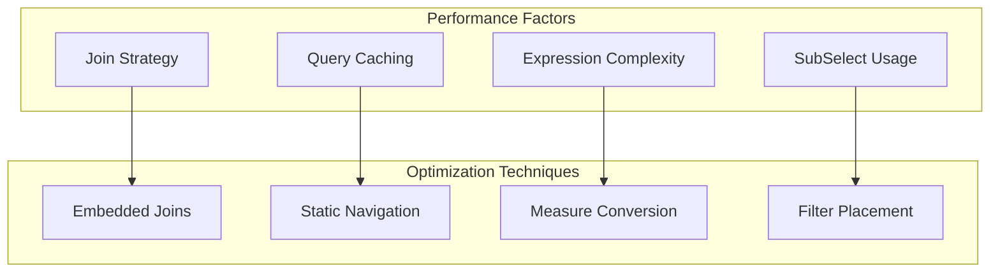
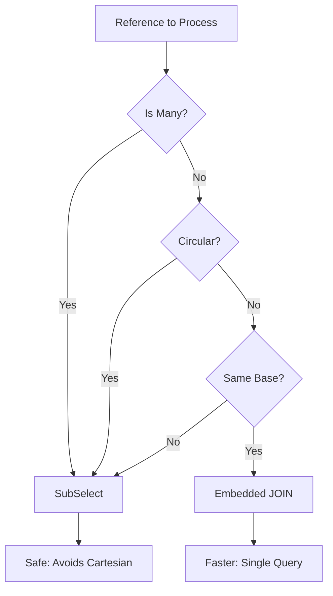
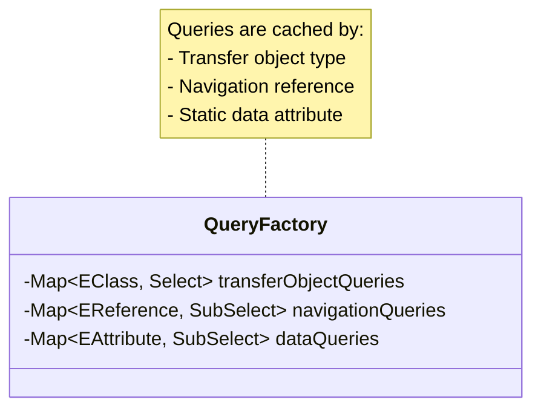
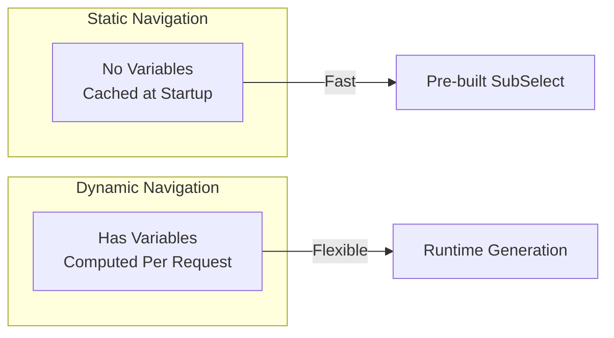
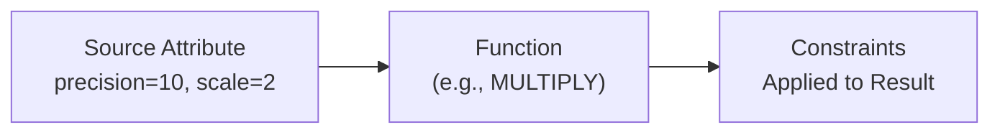
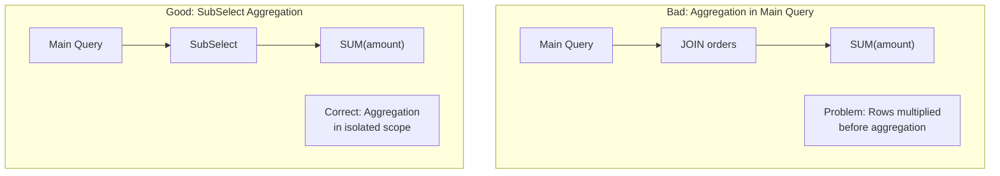
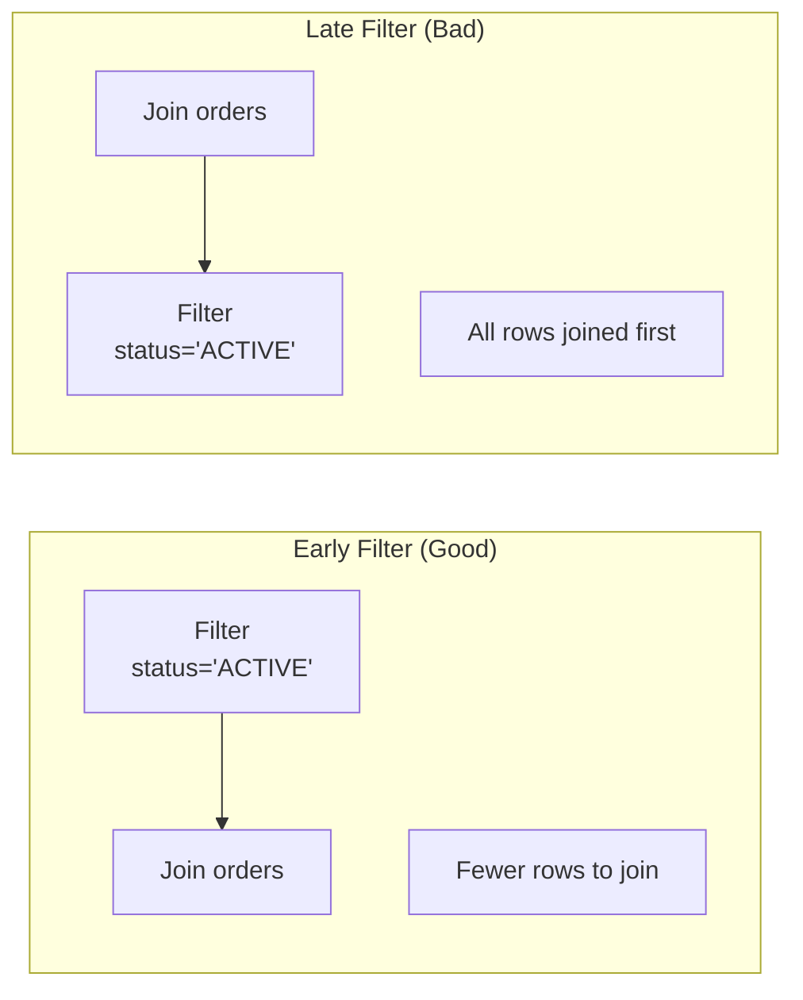
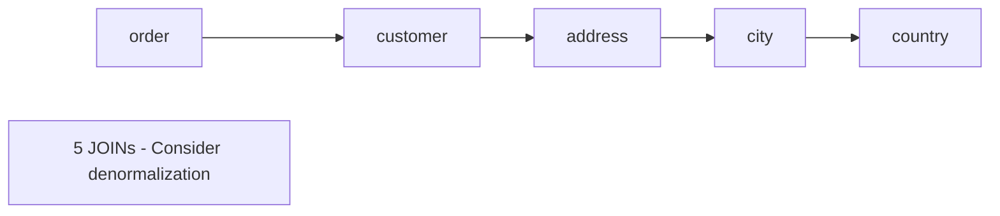
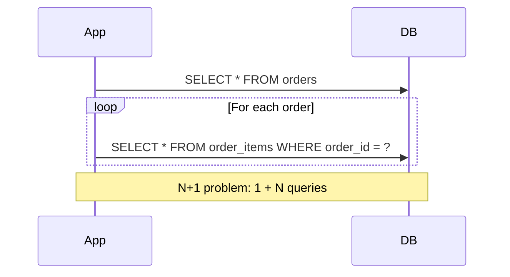
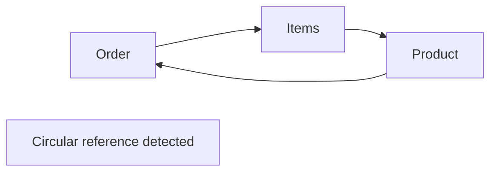

# Query Optimization

Guide for optimizing JUDO query performance, including join strategies, caching, and expression optimization.

## Query Optimization Overview



## Join Strategy Optimization

### Embedded vs SubSelect References

The query factory chooses between embedded JOINs and SubSelects based on these criteria:



### Decision Criteria

| Criterion | Embedded JOIN | SubSelect |
|-----------|---------------|-----------|
| Single reference | Preferred | Fallback |
| Collection reference | Never | Always |
| Circular reference | Never | Always |
| Different base node | Never | Always |
| Aggregation needed | Never | Required |

### Code: Reference Handling

```java
// From QueryFactory.addReferences()
final boolean includedByJoin = !reference.isMany() &&
        !referenceChain.contains(reference) &&
        !subSelect.getNavigationJoins().stream()
            .anyMatch(j -> j instanceof SubSelectJoin && 
                           isCircularAggregation(referenceChain, reference)) &&
        AsmUtils.equals(subSelect.getBase(), context.getNode());

subSelect.setExcluding(includedByJoin);
```

## Caching Strategies

### Query Cache Structure



### Cache Lookup

```java
// Get cached query for transfer object type
Optional<Select> query = queryFactory.getQuery(transferObjectType);

// Get cached navigation subselect
Optional<SubSelect> navigation = queryFactory.getNavigation(navigationReference);

// Get cached data query (for static attributes)
Optional<SubSelect> dataQuery = queryFactory.getDataQuery(attribute);
```

### Static vs Dynamic Navigations

Static navigations can be pre-computed and cached:



**Check if static**:
```java
// Reference is static if no variables in expression
boolean isStatic = queryFactory.isStaticReference(reference);
boolean isStaticAttr = queryFactory.isStaticAttribute(attribute);
```

## Expression Optimization

### Measure Conversion Efficiency

Measure rate calculations use configurable precision:

```java
// From Constants.java
public static final int MEASURE_RATE_CALCULATION_SCALE = 30;  // High precision for rates
public static final int MEASURE_CONVERTING_PRECISION = 100;   // RDBMS precision
public static final int MEASURE_CONVERTING_SCALE = 15;        // RDBMS scale
```

**Optimization**: Only apply measure conversion when units differ:

```java
// From ExpressionToFeatureConverter.applyMeasureByUnit()
if (Objects.equals(dividend, divisor)) {
    return feature;  // Skip conversion - same units
} else {
    // Apply rate conversion
    final Feature rateConstant = newConstantBuilder()
            .withValue(divisor.divide(dividend, 
                MEASURE_RATE_CALCULATION_SCALE, 
                RoundingMode.HALF_UP))
            .build();
    // ... create multiplication function
}
```

### Function Constraint Propagation

Constraints (precision, scale, maxLength) are propagated to optimize storage:



## SubSelect Optimization

### Aggregation Placement

Place aggregations in SubSelects to avoid row multiplication:



### SubSelect Types

| Type | Use Case | Performance |
|------|----------|-------------|
| Simple SubSelect | Collection references | Good |
| Correlated SubSelect | Filtered collections | Slower |
| Aggregated SubSelect | COUNT, SUM, etc. | Requires grouping |

## Filter Optimization

### Filter Placement

Filters should be placed as early as possible in the join chain:



### Implementing Early Filters

```java
// Filter is added to node in addFilter()
private void addFilter(MappedTransferObjectTypeBindings bindings, Context context) {
    final Node self = context.getVariables().get(JqlExpressionBuilder.SELF_NAME);
    if (bindings.getFilter() != null) {
        final Feature feature = dataExpressionToFeature(
            bindings.getFilter(), context, null, null);
        self.getFilters().add(newFilterBuilder()
                .withAlias("f" + self.getAlias())
                .withFeature(feature)
                .build());
    }
}
```

## Performance Anti-Patterns

### Anti-Pattern 1: Deep Navigation Chains



**Solution**: Use CustomJoinDefinition for complex paths:

```java
CustomJoinDefinition.builder()
    .navigationSql("SELECT country_id FROM order_country_view WHERE order_id = :sourceId")
    .sourceIdParameterName("sourceId")
    .build();
```

### Anti-Pattern 2: N+1 Queries



**Solution**: Use SubSelect with batch loading (built into QueryFactory):

```java
// Navigation queries use IN clause batching
subSelect.setSourceIdSetParameter("sourceIds");  // For batch queries
```

### Anti-Pattern 3: Circular Aggregation



**Detection**: QueryFactory automatically detects and handles:

```java
private boolean isCircularAggregation(List<EClass> sourceTypes, 
                                       List<EClass> checkedTypes, 
                                       List<EReference> references) {
    if (references.stream()
            .map(r -> r.getEReferenceType())
            .anyMatch(t -> sourceTypes.contains(t))) {
        return true;  // Circular detected - use SubSelect instead
    }
    // ... recursive check
}
```

## Monitoring Query Performance

### Enable Query Logging

```java
// In logback configuration
<logger name="hu.blackbelt.judo.runtime.core.query" level="DEBUG"/>
<logger name="hu.blackbelt.judo.runtime.core.query.QueryFactory" level="TRACE"/>
```

### Key Log Messages

| Message Pattern | Meaning |
|-----------------|---------|
| `Creating logical query skeleton for...` | Query generation started |
| `Adding SUBQUERY reference: ...` | SubSelect chosen over JOIN |
| `Adding JOIN reference: ...` | Embedded JOIN used |
| `Static navigation: ...` | Navigation is cacheable |
| `Invalid query model: ...` | Query validation failed |

### Performance Metrics

```java
// Track query generation time
long start = System.currentTimeMillis();
QueryFactory factory = new QueryFactory(...);
long duration = System.currentTimeMillis() - start;
log.info("Query factory initialization: {}ms", duration);

// Track query count
log.info("Cached queries: {}", factory.transferObjectQueries.size());
log.info("Navigation queries: {}", factory.navigationQueries.size());
```

## Optimization Checklist

### Query Structure
- [ ] Single references use embedded JOINs
- [ ] Collection references use SubSelects
- [ ] Circular references avoided in JOINs
- [ ] Filters placed early in chain

### Caching
- [ ] Static navigations are pre-computed
- [ ] Query cache is populated at startup
- [ ] Reusable queries are cached

### Expressions
- [ ] Measure conversions only when needed
- [ ] Constraints propagated correctly
- [ ] Aggregations in SubSelects

### Custom Joins
- [ ] Complex navigations use CustomJoinDefinition
- [ ] Views/functions for complex paths
- [ ] Batch parameters for collections

## See Also

- `/judo-runtime:query-translation` - Query translation details
- `/judo-runtime:custom-queries` - Custom query implementation
- `agent-docs/performance.md` - Performance tuning guide
