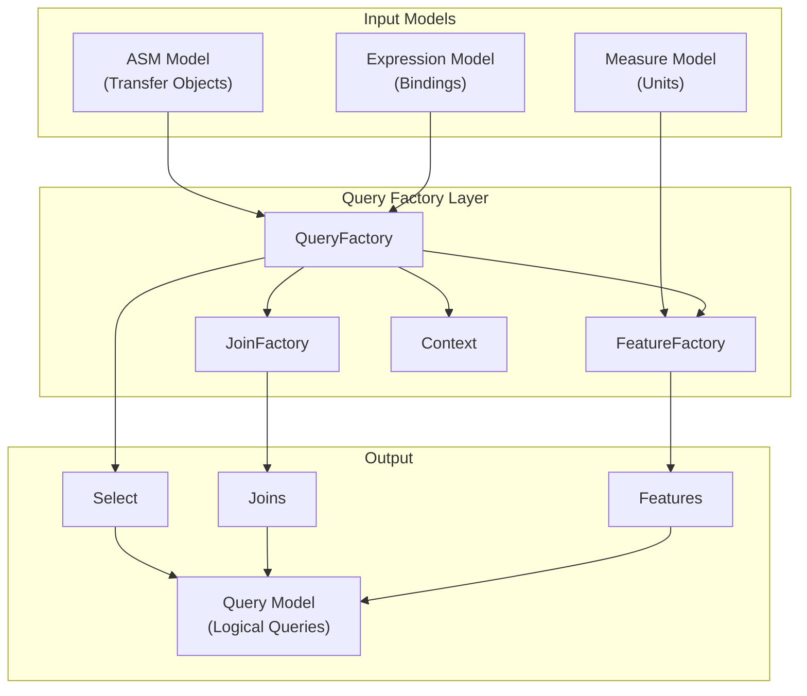
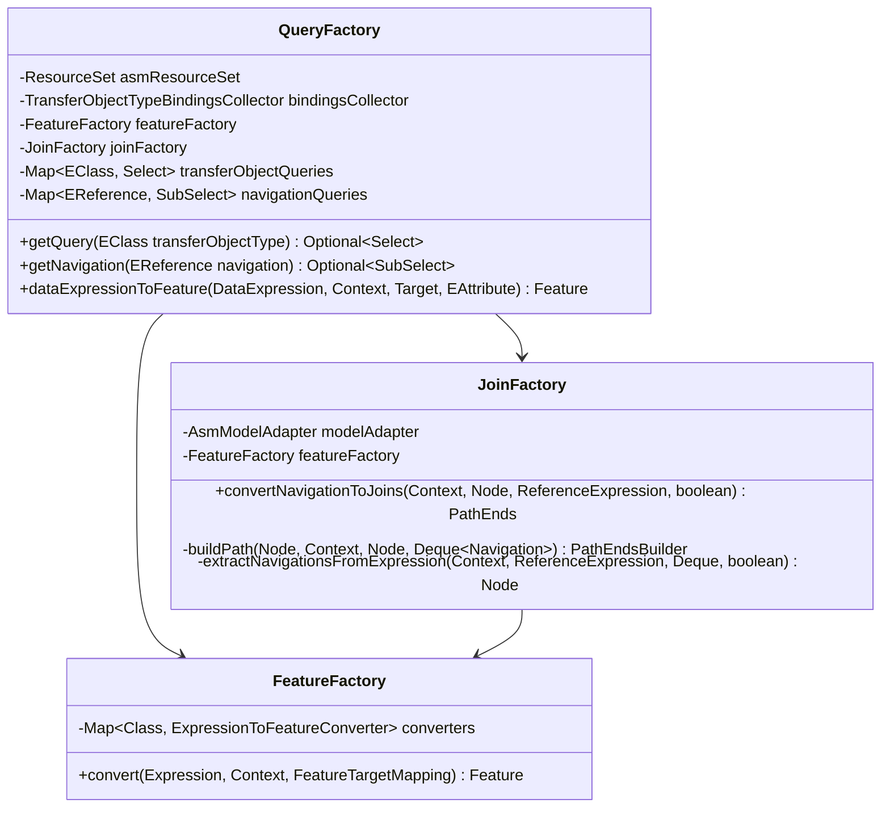
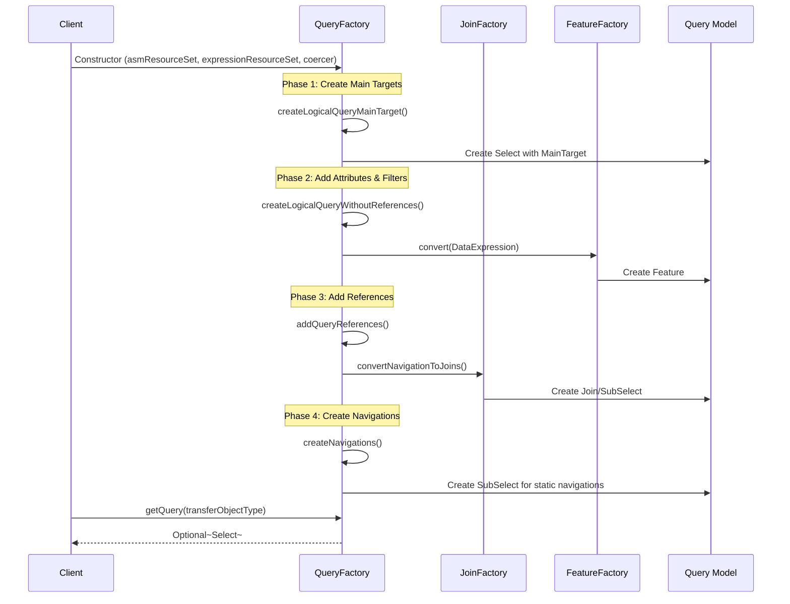
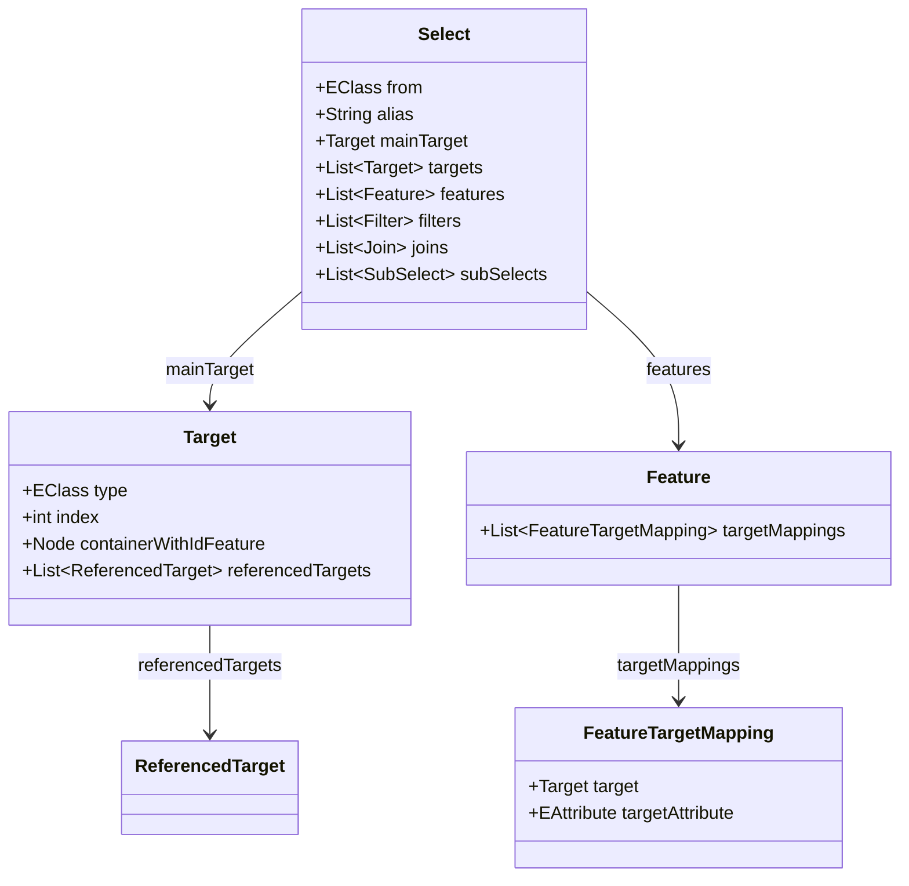
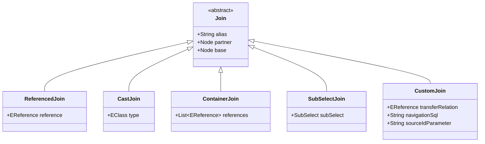
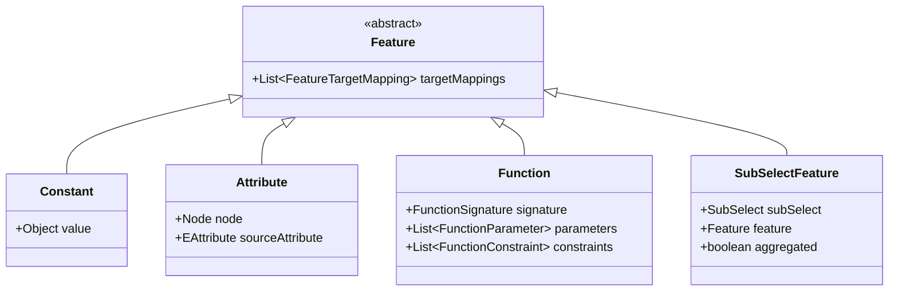
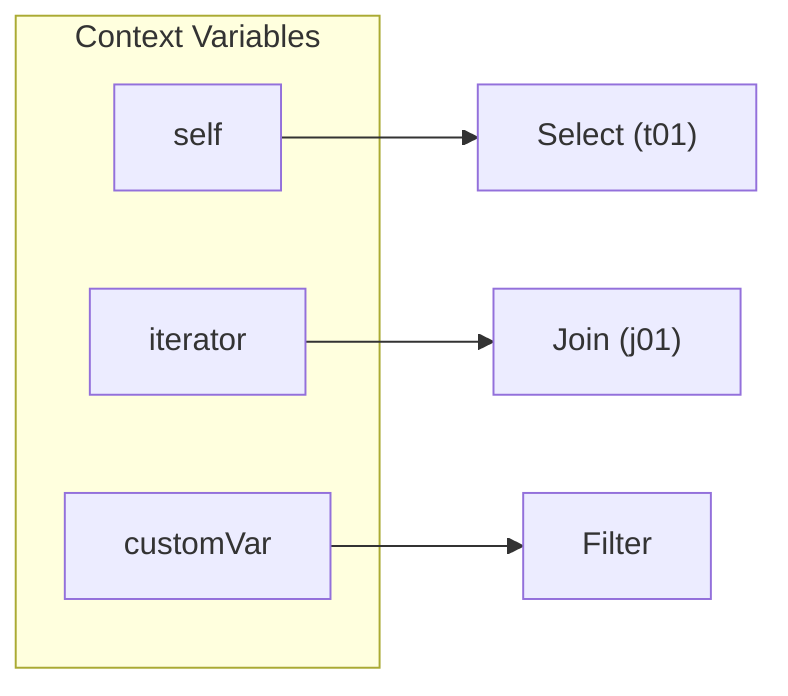
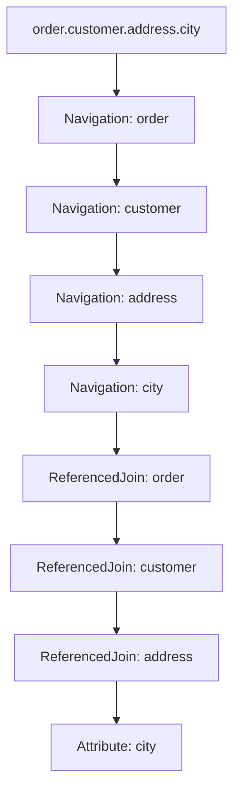

# Query Translation

Guide for understanding the JUDO query model translation from expressions to logical queries that can be converted to SQL.

## Query Translation Architecture



## Core Components

### QueryFactory

The main entry point for logical query generation. Creates queries for mapped transfer object types.



### Query Generation Flow



## Query Model Structure

### Select (Main Query)



### Join Types



## Expression to Feature Conversion

### Converter Registry

The `FeatureFactory` maintains a registry of expression-to-feature converters:

| Expression Type | Converter | SQL Function |
|-----------------|-----------|--------------|
| `Constant` | `ConstantToFeatureConverter` | Literal value |
| `AttributeSelector` | `AttributeToFeatureConverter` | Column reference |
| `IntegerArithmeticExpression` | `IntegerArithmeticExpressionToFeatureConverter` | +, -, *, / |
| `DecimalArithmeticExpression` | `DecimalArithmeticExpressionToFeatureConverter` | +, -, *, / |
| `StringComparison` | `StringComparisonToFeatureConverter` | =, <>, LIKE |
| `KleeneExpression` | `KleeneExpressionToFeatureConverter` | AND, OR |
| `NegationExpression` | `NegationExpressionToFeatureConverter` | NOT |
| `CountExpression` | `CountExpressionToFeatureConverter` | COUNT(*) |
| `IntegerAggregatedExpression` | `IntegerAggregatedExpressionToFeatureConverter` | SUM, AVG, MIN, MAX |
| `SubString` | `SubStringToFeatureConverter` | SUBSTRING |
| `Concatenate` | `ConcatenateToFeatureConverter` | CONCAT |

### Feature Types



## Context Management

The `Context` class tracks query building state:

```java
@Builder
public class Context {
    // Current node being processed
    private Node node;
    
    // Created query objects to add to resource
    private List<EObject> createdQueryObjects;
    
    // Variable name -> Node mapping (e.g., "self" -> Select)
    private Map<String, Node> variables;
    
    // Counters for unique aliases
    private AtomicInteger sourceCounter;  // t01, t02, ...
    private AtomicInteger targetCounter;  // index for targets
}
```

### Variable Resolution



## Navigation Translation

### Path Extraction

The `JoinFactory.extractNavigationsFromExpression()` method converts expressions to navigation steps:



### Navigation Types

| Expression | Navigation Type | Result |
|------------|-----------------|--------|
| `ObjectNavigationExpression` | `featureName` | ReferencedJoin |
| `CollectionFilterExpression` | `condition` | Filter on Join |
| `CastObject` | `cast` | CastJoin |
| `ContainerExpression` | `container` | ContainerJoin |
| `SortExpression` | `orderBy` | OrderBy on Node |
| `SubCollectionExpression` | `limit/offset` | SubSelect with limit |
| `ObjectSelectorExpression` | `objectSelector` | SubSelectJoin |

## Custom Joins

For complex navigations, use `CustomJoinDefinition`:

```java
CustomJoinDefinition.builder()
    .navigationSql("SELECT target_id FROM complex_view WHERE source_id = :sourceId")
    .sourceIdParameterName("sourceId")
    .build();
```

Register with QueryFactory:

```java
Map<EReference, CustomJoinDefinition> customJoins = new HashMap<>();
customJoins.put(myReference, customJoinDefinition);

QueryFactory factory = QueryFactory.builder()
    .asmResourceSet(asmResourceSet)
    .measureResourceSet(measureResourceSet)
    .expressionResourceSet(expressionResourceSet)
    .coercer(coercer)
    .customJoinDefinitions(customJoins)
    .build();
```

## Debugging Query Translation

### Issue 1: Missing Query

**Symptom**: `getQuery(transferObjectType)` returns empty

**Debug**:
```java
// Check if transfer object is mapped
AsmUtils asmUtils = new AsmUtils(asmResourceSet);
boolean isMapped = asmUtils.isMappedTransferObjectType(transferObjectType);
log.debug("Is mapped: {}", isMapped);

// Check entity type mapping
Optional<EClass> entityType = asmUtils.getMappedEntityType(transferObjectType);
log.debug("Entity type: {}", entityType);
```

### Issue 2: Wrong Join Type

**Symptom**: Unexpected JOIN in generated SQL

**Debug**:
```java
Select select = queryFactory.getQuery(transferObjectType).get();
select.getJoins().forEach(join -> {
    log.debug("Join type: {}, alias: {}, partner: {}", 
        join.getClass().getSimpleName(), 
        join.getAlias(), 
        join.getPartner().getAlias());
});
```

### Issue 3: Feature Not Found

**Symptom**: `IllegalStateException: Unsupported expression`

**Check**: Verify converter exists in `FeatureFactory`:
```java
// List supported expression types
featureFactory.converters.keySet().forEach(cls -> 
    log.debug("Supported: {}", cls.getSimpleName())
);
```

## Table Alias Format

Aliases are generated using:
- Source tables: `t01`, `t02`, ... (format: `t{0,number,00}`)
- Joins: `j01`, `j02`, ...
- SubSelects: `s01`, `s02`, ...
- Filters: `f{alias}` (e.g., `ft01`)

## See Also

- `/judo-runtime:query-optimization` - Query performance optimization
- `/judo-runtime:expression-syntax` - Expression model details
- `agent-docs/architecture.md` - Query module architecture
