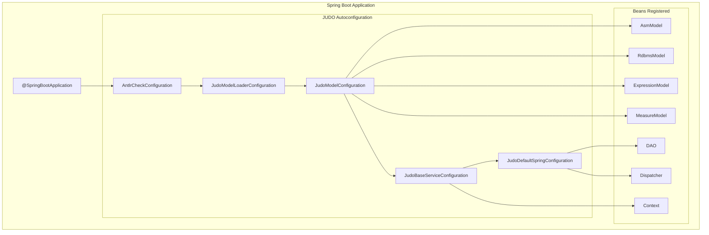
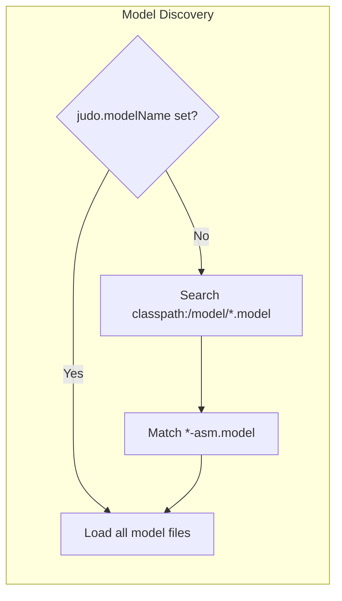
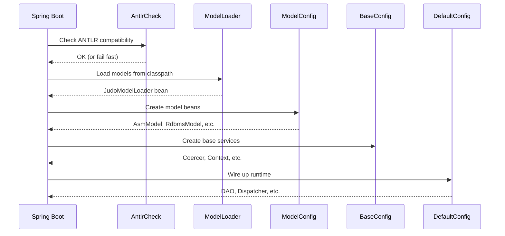
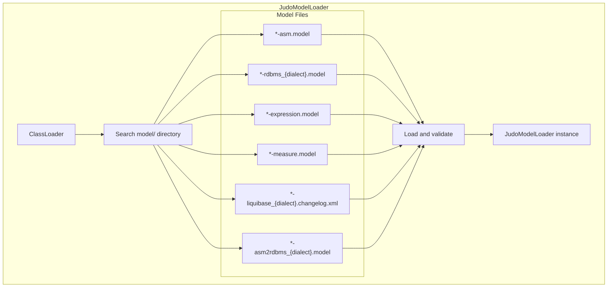

# JUDO Spring Boot Autoconfiguration

Understanding how JUDO integrates with Spring Boot through autoconfiguration for seamless runtime setup.

## Overview

The `judo-runtime-core-spring` module provides Spring Boot autoconfiguration that automatically sets up the JUDO runtime when your application starts. It handles model loading, bean registration, and service configuration without requiring manual setup.

## Architecture Diagram



## Configuration Classes

### 1. AntlrCheckConfiguration

**Purpose**: Validates ANTLR runtime compatibility at startup.

**Location**: `hu.blackbelt.judo.runtime.core.spring.AntlrCheckConfiguration`

```java
@Configuration
public class AntlrCheckConfiguration {
    @Bean
    AntlrCheckBeanRegistration antlrCheckBeanRegistration() {
        return new AntlrCheckBeanRegistration();
    }
}
```

**Why it matters**: JUDO requires ANTLR runtime < 3.5 due to specific API dependencies. This check prevents cryptic runtime errors.

### 2. JudoModelLoaderConfiguration

**Purpose**: Discovers and loads JUDO models from the classpath.

**Location**: `hu.blackbelt.judo.runtime.core.spring.JudoModelLoaderConfiguration`

**Key Property**:
```properties
# application.properties
judo.modelName=mymodel
```

**Auto-discovery**: If `judo.modelName` is not set, it searches for `*-asm.model` files in `classpath:/model/`.



### 3. JudoModelConfiguration

**Purpose**: Exposes loaded models as Spring beans.

**Location**: `hu.blackbelt.judo.runtime.core.spring.JudoModelConfiguration`

**Beans Provided**:

| Bean | Type | Description |
|------|------|-------------|
| `asmModel` | `AsmModel` | Abstract Syntax Model |
| `rdbmsModel` | `RdbmsModel` | Relational Database Model |
| `expressionModel` | `ExpressionModel` | Expression Model |
| `measureModel` | `MeasureModel` | Measurement Model |
| `asm2RdbmsTrace` | `Asm2RdbmsTransformationTrace` | Model transformation trace |

### 4. JudoBaseServiceConfiguration

**Purpose**: Provides fundamental JUDO services.

**Location**: `hu.blackbelt.judo.runtime.core.spring.JudoBaseServiceConfiguration`

**Beans Provided**:

| Bean | Type | Description |
|------|------|-------------|
| `coercer` | `Coercer` | Type conversion |
| `dataTypeManager` | `DataTypeManager` | Data type handling |
| `identifierProvider` | `IdentifierProvider` | UUID generation |
| `metricsCollector` | `MetricsCollector` | Performance metrics |
| `context` | `Context` | Thread context |
| `operationCallInterceptorProvider` | `OperationCallInterceptorProvider` | Interceptor registry |
| `dispatcherFunctionProvider` | `DispatcherFunctionProvider` | Custom functions |
| `passwordPolicy` | `PasswordPolicy` | Password validation |
| `export` | `Export` | Export functionality |

### 5. JudoDefaultSpringConfiguration

**Purpose**: Wires up the complete JUDO runtime.

**Location**: `hu.blackbelt.judo.runtime.core.spring.JudoDefaultSpringConfiguration`

**Beans Provided**:

| Bean | Type | Description |
|------|------|-------------|
| `accessManager` | `AccessManager` | Authorization |
| `dao` | `DAO` | Data access |
| `dispatcher` | `Dispatcher` | Operation routing |
| `actorResolver` | `ActorResolver` | Actor resolution |
| `payloadValidator` | `PayloadValidator` | Validation |
| `identifierSigner` | `IdentifierSigner` | ID signing |
| `variableResolver` | `VariableResolver` | Expression variables |
| `queryFactory` | `QueryFactory` | Query building |
| `rdbmsBuilder` | `RdbmsBuilder` | SQL generation |

## Bean Lifecycle



## Model Loading Process



## Conditional Bean Registration

### JudoDataSourceCondition

Controls bean creation based on DataSource availability:

```java
public class JudoDataSourceCondition extends AnyNestedCondition {
    JudoDataSourceCondition() {
        super(ConfigurationPhase.REGISTER_BEAN);
    }

    @ConditionalOnBean(DataSource.class)
    private static final class DataSourceBeanCondition { }
}
```

Use with: `@Conditional(JudoDataSourceCondition.class)`

## Configuration Properties

| Property | Default | Description |
|----------|---------|-------------|
| `judo.modelName` | (auto-discover) | Name of the JUDO model to load |

## Customizing Autoconfiguration

### Override a Bean

```java
@Configuration
public class MyJudoConfiguration {
    
    @Bean
    @Primary
    public IdentifierProvider myIdentifierProvider() {
        return new MyCustomIdentifierProvider();
    }
}
```

### Disable Specific Autoconfiguration

```java
@SpringBootApplication(exclude = {
    JudoDefaultSpringConfiguration.class
})
public class MyApplication { }
```

### Add Custom Interceptors

```java
@Configuration
public class InterceptorConfig {
    
    @Autowired
    private OperationCallInterceptorProvider interceptorProvider;
    
    @PostConstruct
    public void registerInterceptors() {
        interceptorProvider.getCallOperationInterceptors()
            .add(new MyCustomInterceptor());
    }
}
```

## Troubleshooting

### ANTLR Incompatibility

**Error**: `AntlrRuntimeIncompatibilityException: The antlr-runtime version must be < 3.5`

**Solution**: Exclude conflicting ANTLR versions:
```xml
<dependency>
    <groupId>some.group</groupId>
    <artifactId>some-artifact</artifactId>
    <exclusions>
        <exclusion>
            <groupId>org.antlr</groupId>
            <artifactId>antlr-runtime</artifactId>
        </exclusion>
    </exclusions>
</dependency>
```

### Model Not Found

**Error**: `The model "X" could not be found`

**Solution**:
1. Verify model files exist in `src/main/resources/model/`
2. Check model name matches file prefix
3. Set `judo.modelName` explicitly in `application.properties`

### Missing Dialect

**Error**: `Dialect name have to be defined`

**Solution**: Ensure a Dialect bean is available (from `judo-runtime-core-spring-hsqldb` or `judo-runtime-core-spring-postgresql`).

## See Also

- `/judo-runtime:spring-integration` - Full Spring integration guide
- Database modules: `judo-runtime-core-spring-hsqldb`, `judo-runtime-core-spring-postgresql`
