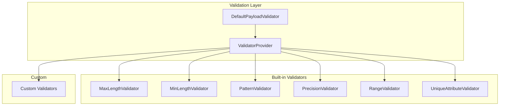

# JUDO Runtime Core - Validator

## Overview

The Validator module provides a pluggable data validation framework that enforces business rules and constraints on payload data. It uses a provider pattern to manage validator instances and supports custom validation logic.

## Key Concepts

- **Validator Interface**: Implement to create custom validation logic
- **ValidatorProvider**: Manages validator lifecycle and retrieval
- **DefaultPayloadValidator**: Main orchestrator that validates entire payloads
- **ValidationResult**: Structured error information with location and details

## Architecture



## Extension Points

| Interface | Purpose |
|-----------|---------|
| `Validator` | Custom validation logic |
| `ValidatorProvider` | Validator lifecycle management |

## Quick Start

```java
// Create custom validator
public class EmailValidator implements Validator {
    @Override
    public boolean isApplicable(EStructuralFeature feature) {
        return feature.getName().endsWith("Email");
    }
    
    @Override
    public Collection<ValidationResult> validateValue(
            Payload payload, EStructuralFeature feature, 
            Object value, Map<String, Object> context) {
        // Validation logic
    }
}

// Register validator
validatorProvider.addValidator(new EmailValidator());

// Validate payload
List<ValidationResult> results = payloadValidator.validatePayload(
    eClass, payload, context, false
);
```

## Built-in Error Codes

| Code | Description |
|------|-------------|
| `ERROR_MISSING_REQUIRED_ATTRIBUTE` | Required attribute is null |
| `ERROR_MAX_LENGTH_VALIDATION_FAILED` | String exceeds max length |
| `ERROR_PATTERN_VALIDATION_FAILED` | String doesn't match pattern |
| `ERROR_PRECISION_VALIDATION_FAILED` | Number exceeds precision |

## Dependencies

- `judo-dao-api` - DAO interface for database checks
- `judo-meta-asm` - Abstract Syntax Model
- `judo-dispatcher-api` - Context and payload handling
