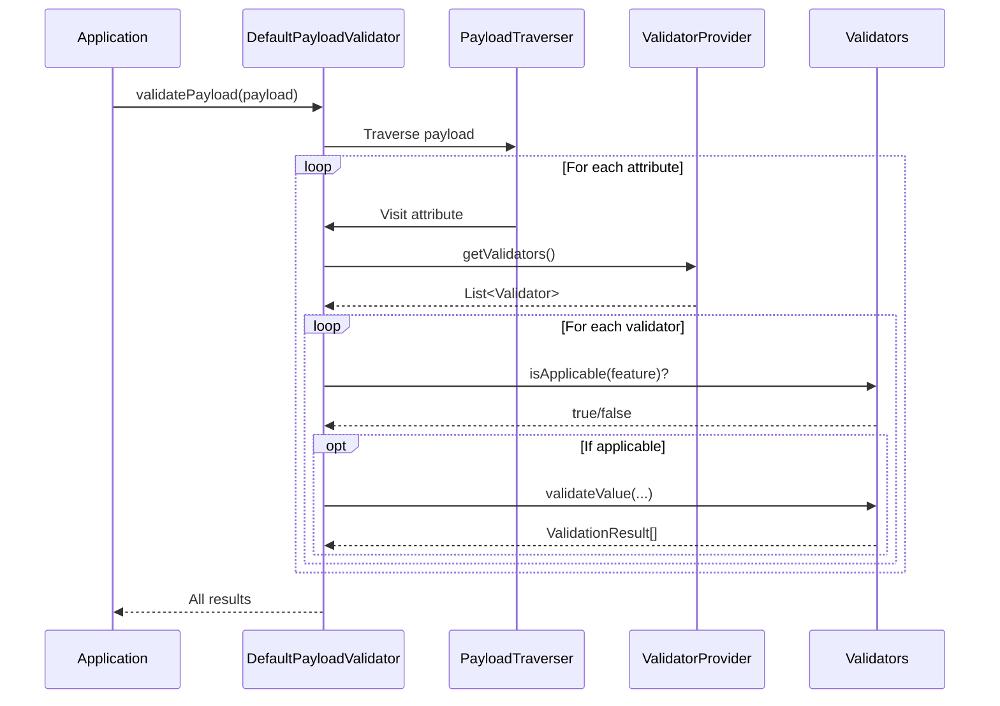
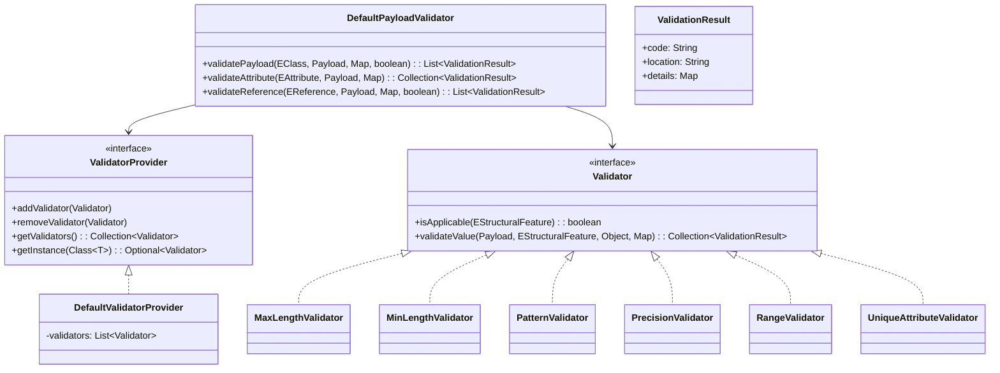
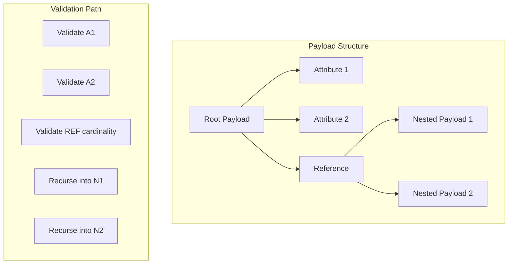
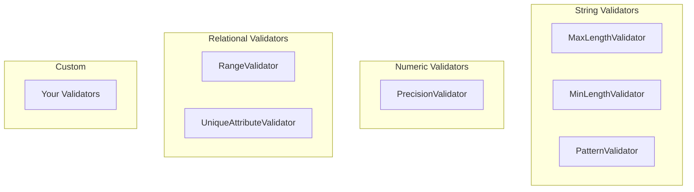
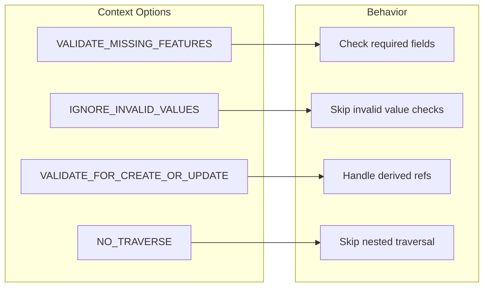

# Validator Module Architecture

## Validation Flow

```mermaid
sequenceDiagram
    participant App as Application
    participant DPV as DefaultPayloadValidator
    participant PT as PayloadTraverser
    participant VP as ValidatorProvider
    participant Val as Validators
    
    App->>DPV: validatePayload(payload)
    DPV->>PT: Traverse payload
    
    loop For each attribute
        PT->>DPV: Visit attribute
        DPV->>VP: getValidators()
        VP-->>DPV: List<Validator>
        
        loop For each validator
            DPV->>Val: isApplicable(feature)?
            Val-->>DPV: true/false
            opt If applicable
                DPV->>Val: validateValue(...)
                Val-->>DPV: ValidationResult[]
            end
        end
    end
    
    DPV-->>App: All results
```

## Component Structure

```mermaid
classDiagram
    class Validator {
        <<interface>>
        +isApplicable(EStructuralFeature): boolean
        +validateValue(Payload, EStructuralFeature, Object, Map): Collection~ValidationResult~
    }
    
    class ValidatorProvider {
        <<interface>>
        +addValidator(Validator)
        +removeValidator(Validator)
        +getValidators(): Collection~Validator~
        +getInstance(Class~T~): Optional~Validator~
    }
    
    class DefaultPayloadValidator {
        +validatePayload(EClass, Payload, Map, boolean): List~ValidationResult~
        +validateAttribute(EAttribute, Payload, Map): Collection~ValidationResult~
        +validateReference(EReference, Payload, Map, boolean): List~ValidationResult~
    }
    
    class DefaultValidatorProvider {
        -validators: List~Validator~
    }
    
    class ValidationResult {
        +code: String
        +location: String
        +details: Map
    }
    
    Validator <|.. MaxLengthValidator
    Validator <|.. MinLengthValidator
    Validator <|.. PatternValidator
    Validator <|.. PrecisionValidator
    Validator <|.. RangeValidator
    Validator <|.. UniqueAttributeValidator
    ValidatorProvider <|.. DefaultValidatorProvider
    DefaultPayloadValidator --> ValidatorProvider
    DefaultPayloadValidator --> Validator
```

## Payload Traversal

```mermaid
flowchart TB
    subgraph "Payload Structure"
        R["Root Payload"]
        A1["Attribute 1"]
        A2["Attribute 2"]
        REF["Reference"]
        N1["Nested Payload 1"]
        N2["Nested Payload 2"]
    end
    
    R --> A1
    R --> A2
    R --> REF
    REF --> N1
    REF --> N2
    
    subgraph "Validation Path"
        V1["Validate A1"]
        V2["Validate A2"]
        V3["Validate REF cardinality"]
        V4["Recurse into N1"]
        V5["Recurse into N2"]
    end
```

## Validator Hierarchy

```mermaid
flowchart TB
    subgraph "String Validators"
        ML["MaxLengthValidator"]
        MN["MinLengthValidator"]
        PT["PatternValidator"]
    end
    
    subgraph "Numeric Validators"
        PR["PrecisionValidator"]
    end
    
    subgraph "Relational Validators"
        RV["RangeValidator"]
        UV["UniqueAttributeValidator"]
    end
    
    subgraph "Custom"
        CV["Your Validators"]
    end
```

## Context Flow

```mermaid
flowchart LR
    subgraph "Context Options"
        VMF["VALIDATE_MISSING_FEATURES"]
        IIV["IGNORE_INVALID_VALUES"]
        VCU["VALIDATE_FOR_CREATE_OR_UPDATE"]
        NT["NO_TRAVERSE"]
    end
    
    subgraph "Behavior"
        B1["Check required fields"]
        B2["Skip invalid value checks"]
        B3["Handle derived refs"]
        B4["Skip nested traversal"]
    end
    
    VMF --> B1
    IIV --> B2
    VCU --> B3
    NT --> B4
```
