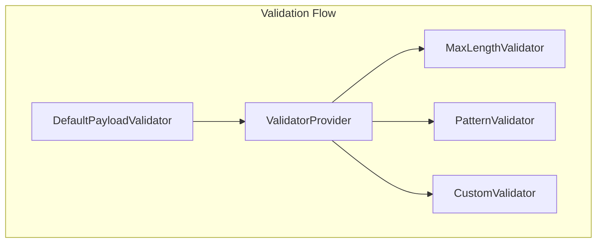

# Custom Validators

Guide for creating custom validation logic in JUDO applications.

## Validator Architecture



## Validator Interface

```java
package hu.blackbelt.judo.runtime.core.validator;

public interface Validator {
    
    /**
     * Determines if this validator applies to the given feature.
     */
    boolean isApplicable(EStructuralFeature feature);
    
    /**
     * Validates a value and returns validation results.
     */
    Collection<ValidationResult> validateValue(
        Payload payload,
        EStructuralFeature feature,
        Object value,
        Map<String, Object> context
    );
}
```

## Creating a Custom Validator

### Example: Email Validator

```java
public class EmailValidator implements Validator {
    
    private static final Pattern EMAIL_PATTERN = 
        Pattern.compile("^[A-Za-z0-9+_.-]+@[A-Za-z0-9.-]+$");
    
    public static final String ERROR_INVALID_EMAIL = "INVALID_EMAIL";
    
    @Override
    public boolean isApplicable(EStructuralFeature feature) {
        // Apply to String attributes ending with "Email"
        return feature instanceof EAttribute 
            && feature.getEType().getInstanceClass() == String.class
            && feature.getName().toLowerCase().endsWith("email");
    }
    
    @Override
    public Collection<ValidationResult> validateValue(
            Payload payload,
            EStructuralFeature feature,
            Object value,
            Map<String, Object> context) {
        
        Collection<ValidationResult> results = new ArrayList<>();
        
        if (value instanceof String) {
            String email = (String) value;
            if (!email.isEmpty() && !EMAIL_PATTERN.matcher(email).matches()) {
                Validator.addValidationError(
                    Map.of("value", email, "attribute", feature.getName()),
                    context.get(DefaultPayloadValidator.LOCATION_KEY),
                    results,
                    ERROR_INVALID_EMAIL
                );
            }
        }
        
        return results;
    }
}
```

### Example: Cross-Field Validator

```java
public class DateRangeValidator implements Validator {
    
    public static final String ERROR_END_BEFORE_START = "END_DATE_BEFORE_START";
    
    @Override
    public boolean isApplicable(EStructuralFeature feature) {
        // Apply to endDate attributes
        return feature.getName().equals("endDate");
    }
    
    @Override
    public Collection<ValidationResult> validateValue(
            Payload payload,
            EStructuralFeature feature,
            Object value,
            Map<String, Object> context) {
        
        Collection<ValidationResult> results = new ArrayList<>();
        
        if (value instanceof LocalDate) {
            LocalDate endDate = (LocalDate) value;
            LocalDate startDate = payload.getAsLocalDate("startDate");
            
            if (startDate != null && endDate.isBefore(startDate)) {
                Validator.addValidationError(
                    Map.of(
                        "startDate", startDate.toString(),
                        "endDate", endDate.toString()
                    ),
                    context.get(DefaultPayloadValidator.LOCATION_KEY),
                    results,
                    ERROR_END_BEFORE_START
                );
            }
        }
        
        return results;
    }
}
```

## Registration

### With Guice

```java
public class CustomValidatorModule extends AbstractModule {
    
    @Override
    protected void configure() {
        // Get or create the validator provider
        bind(EmailValidator.class).asEagerSingleton();
        bind(DateRangeValidator.class).asEagerSingleton();
    }
    
    @Provides
    @Singleton
    public ValidatorProvider validatorProvider(
            EmailValidator emailValidator,
            DateRangeValidator dateRangeValidator) {
        
        ValidatorProvider provider = new DefaultValidatorProvider();
        provider.addValidator(emailValidator);
        provider.addValidator(dateRangeValidator);
        return provider;
    }
}
```

### Dynamic Registration

```java
// Add at runtime
validatorProvider.addValidator(new EmailValidator());

// Replace existing validator
validatorProvider.replaceValidator(new CustomEmailValidator());

// Remove by type
validatorProvider.removeValidatorType(EmailValidator.class);
```

## Built-in Error Codes

| Code | Description |
|------|-------------|
| `ERROR_MISSING_REQUIRED_ATTRIBUTE` | Required attribute is null |
| `ERROR_MAX_LENGTH_VALIDATION_FAILED` | String exceeds max length |
| `ERROR_MIN_LENGTH_VALIDATION_FAILED` | String below min length |
| `ERROR_PATTERN_VALIDATION_FAILED` | String doesn't match pattern |
| `ERROR_PRECISION_VALIDATION_FAILED` | Number exceeds precision |
| `ERROR_SCALE_VALIDATION_FAILED` | Decimal exceeds scale |
| `ERROR_NOT_ACCEPTED_BY_RANGE` | Value not in allowed range |

## Validation Context

Access context information:

```java
@Override
public Collection<ValidationResult> validateValue(..., Map<String, Object> context) {
    
    // Get current location (for nested objects)
    String location = (String) context.get(DefaultPayloadValidator.LOCATION_KEY);
    
    // Check if validating for create
    Boolean isCreate = (Boolean) context.get(
        DefaultPayloadValidator.VALIDATE_FOR_CREATE_OR_UPDATE_KEY);
    
    // Access the root payload
    Payload root = (Payload) context.get("rootPayload");
}
```

## See Also

- `/judo-validator:validation-rules` - Configure validation rules
- `agent-docs/extension-points.md` - All extension interfaces
