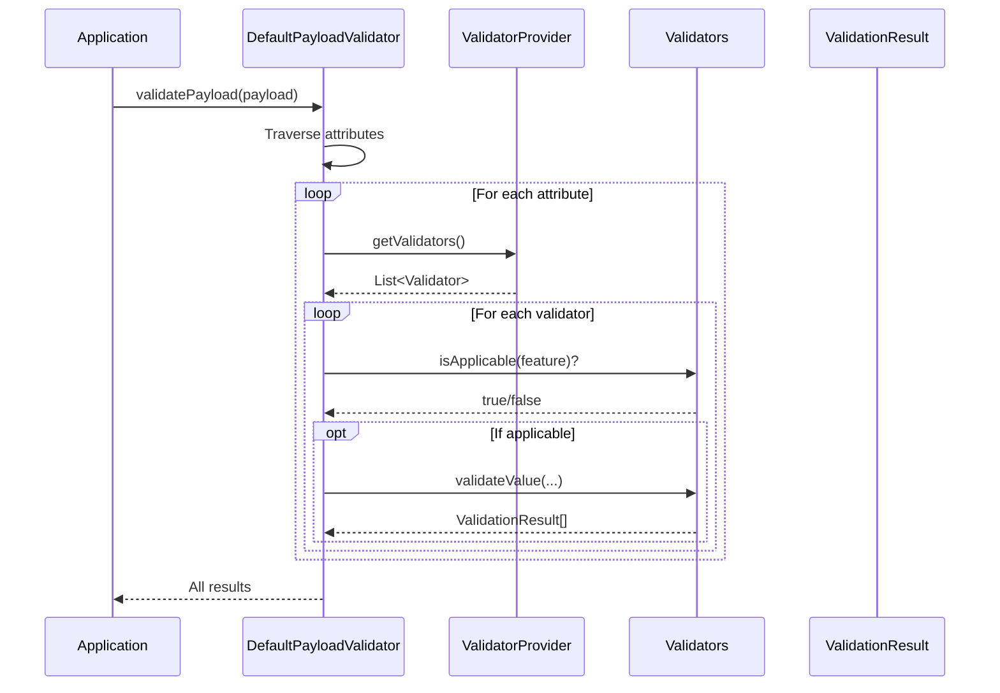
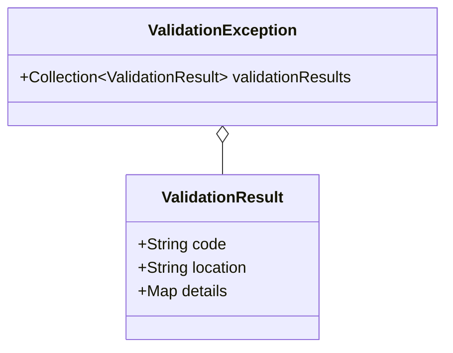

# Validation Rules

Guide for configuring and debugging JUDO validation rules.

## Validation Flow



## Built-in Validators

| Validator | Constraint | Applies To |
|-----------|------------|------------|
| `MaxLengthValidator` | `maxLength` | String attributes |
| `MinLengthValidator` | `minLength` | String attributes |
| `PatternValidator` | `pattern` (regex) | String attributes |
| `PrecisionValidator` | `precision`, `scale` | Numeric attributes |
| `RangeValidator` | Range-of references | Embedded references |
| `UniqueAttributeValidator` | Identifier uniqueness | Identifier attributes |

## Constraint Annotations

Constraints are defined in the ASM metamodel:

```java
// Check constraints on an attribute
List<EAnnotation> constraints = AsmUtils
    .getExtensionAnnotationListByName(attribute, "constraints");

constraints.forEach(constraint -> {
    constraint.getDetails().forEach((key, value) -> {
        System.out.println(key + " = " + value);
    });
});
```

### Example Constraints

```
@constraints(maxLength = 100)
String name;

@constraints(pattern = "^[A-Z]{2}[0-9]{6}$")
String accountNumber;

@constraints(precision = 10, scale = 2)
Decimal price;
```

## Validation Context Options

Control validation behavior:

```java
Map<String, Object> context = new HashMap<>();

// Validate required fields (default: true)
context.put(DefaultPayloadValidator.VALIDATE_MISSING_FEATURES_KEY, true);

// Skip invalid value validation (default: false)
context.put(DefaultPayloadValidator.IGNORE_INVALID_VALUES_KEY, false);

// Mark as create operation (affects derived references)
context.put(DefaultPayloadValidator.VALIDATE_FOR_CREATE_OR_UPDATE_KEY, true);

// Skip nested object traversal
context.put(DefaultPayloadValidator.NO_TRAVERSE_KEY, true);

List<ValidationResult> results = validator.validatePayload(
    eClass, payload, context, false
);
```

## Debugging Validation

### Enable Logging

```xml
<logger name="hu.blackbelt.judo.runtime.core.validator" level="DEBUG"/>
```

### Issue 1: Validation Passes But Shouldn't

**Checklist**:
1. Is validator registered?
```java
validatorProvider.getValidators().forEach(v -> 
    log.debug("Registered: {}", v.getClass().getName())
);
```

2. Is `isApplicable()` returning true?
```java
validators.stream()
    .filter(v -> v.isApplicable(feature))
    .forEach(v -> log.debug("Applicable: {}", v.getClass().getName()));
```

3. Are constraints present in metamodel?
```java
AsmUtils.getExtensionAnnotationListByName(feature, "constraints")
    .forEach(a -> log.debug("Constraint: {}", a.getDetails()));
```

### Issue 2: Nested Validation Errors

Check the location in the error:

```java
results.forEach(r -> {
    log.error("Location: {}", r.getLocation());
    log.error("Code: {}", r.getCode());
    log.error("Details: {}", r.getDetails());
});
```

Location format: `orders[0]/items[2].price`

### Issue 3: Precision Validation Fails Unexpectedly

The `PrecisionValidator` counts significant digits:

```java
// 123.45 has precision 5 (not 3)
BigDecimal value = new BigDecimal("123.45");
log.debug("Precision: {}", value.precision());  // 5
log.debug("Scale: {}", value.scale());          // 2
```

## Validation Results



### Handling Results

```java
try {
    validator.validatePayload(eClass, payload, context, true);
} catch (ValidationException e) {
    e.getValidationResults().forEach(result -> {
        switch (result.getCode()) {
            case Validator.ERROR_MISSING_REQUIRED_ATTRIBUTE:
                handleMissingField(result);
                break;
            case Validator.ERROR_MAX_LENGTH_VALIDATION_FAILED:
                handleMaxLength(result);
                break;
            default:
                handleGenericError(result);
        }
    });
}
```

## Required String Handling

Control empty string validation:

```java
// Accept empty strings as valid for required fields
validator.setRequiredStringValidatorOption(
    RequiredStringValidatorOption.ACCEPT_EMPTY
);

// Require non-empty strings (default)
validator.setRequiredStringValidatorOption(
    RequiredStringValidatorOption.ACCEPT_NON_EMPTY
);
```

## See Also

- `/judo-validator:custom-validators` - Create custom validators
- `agent-docs/extension-points.md` - All extension interfaces
