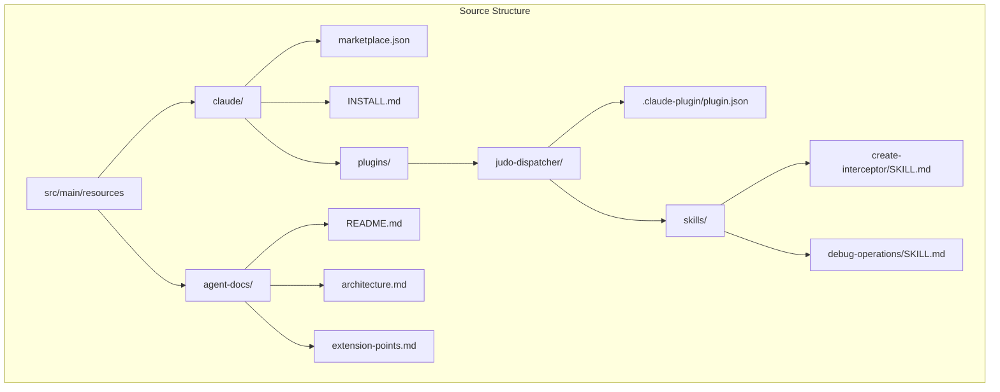
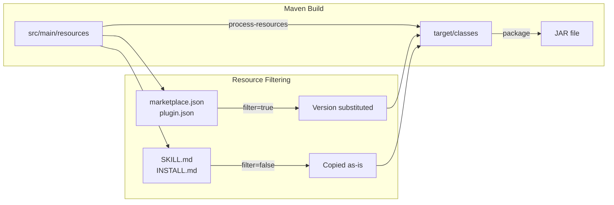
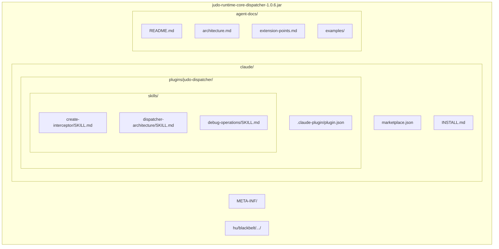
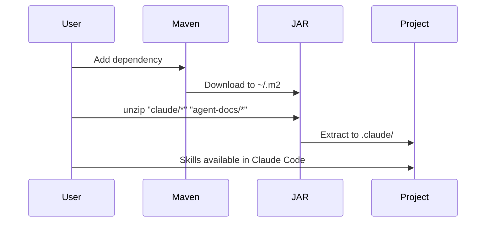
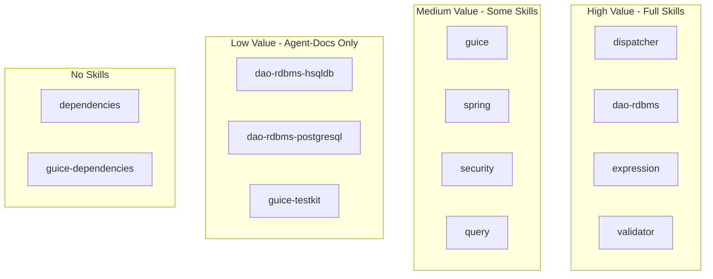
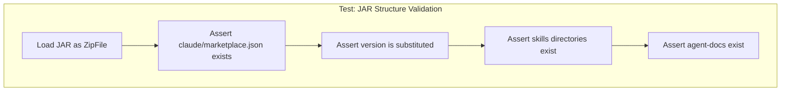
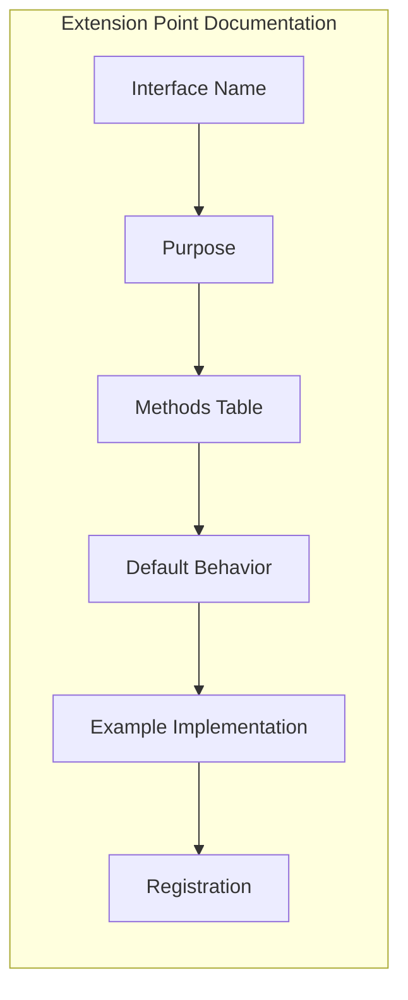

# Design: Submodule Agent Docs & Skills

## Architecture Overview



## Build Flow



## JAR Structure



## Consumer Installation Flow



## Module Categories



## File Specifications

### marketplace.json Schema

```json
{
  "name": "judo-runtime-core-dispatcher",
  "version": "${project.version}",
  "description": "Module description",
  "groupId": "hu.blackbelt.judo.runtime",
  "artifactId": "judo-runtime-core-dispatcher",
  "repository": "https://github.com/BlackBeltTechnology/judo-runtime-core",
  "plugins": [
    {
      "name": "judo-dispatcher",
      "path": "./plugins/judo-dispatcher",
      "description": "Skills for working with JUDO Dispatcher"
    }
  ],
  "agentDocs": "./agent-docs"
}
```

### plugin.json Schema

```json
{
  "name": "judo-dispatcher",
  "version": "${project.version}",
  "description": "Skills for JUDO Dispatcher",
  "skills": [
    {
      "name": "create-interceptor",
      "path": "./skills/create-interceptor",
      "description": "Create custom operation interceptors"
    }
  ]
}
```

## Maven Configuration

```xml
<build>
    <resources>
        <!-- Standard resources without filtering -->
        <resource>
            <directory>src/main/resources</directory>
            <excludes>
                <exclude>claude/marketplace.json</exclude>
                <exclude>claude/plugins/*/.claude-plugin/plugin.json</exclude>
            </excludes>
        </resource>
        <!-- JSON files with version substitution -->
        <resource>
            <directory>src/main/resources</directory>
            <filtering>true</filtering>
            <includes>
                <include>claude/marketplace.json</include>
                <include>claude/plugins/*/.claude-plugin/plugin.json</include>
            </includes>
        </resource>
    </resources>
</build>
```

## JUnit Test Strategy



### Test Implementation

```java
@Test
void jarContainsClaudeSkillPackage() throws Exception {
    // Find the built JAR
    Path jarPath = findBuiltJar("judo-runtime-core-dispatcher");
    
    try (JarFile jar = new JarFile(jarPath.toFile())) {
        // Verify marketplace.json exists and has version
        JarEntry marketplace = jar.getJarEntry("claude/marketplace.json");
        assertNotNull(marketplace, "marketplace.json should exist");
        
        String content = readEntry(jar, marketplace);
        assertFalse(content.contains("${project.version}"), 
            "Version should be substituted");
        assertTrue(content.contains("1.0.6"), 
            "Should contain actual version");
        
        // Verify plugin structure
        assertNotNull(jar.getJarEntry("claude/plugins/judo-dispatcher/.claude-plugin/plugin.json"));
        assertNotNull(jar.getJarEntry("claude/plugins/judo-dispatcher/skills/create-interceptor/SKILL.md"));
        
        // Verify agent-docs
        assertNotNull(jar.getJarEntry("agent-docs/README.md"));
    }
}
```

## Extension Points Documentation Pattern

For each extension interface, document:



## Decisions

| Decision | Choice | Rationale |
|----------|--------|-----------|
| Diagram format | Mermaid | Better LLM comprehension, less tokens than ASCII |
| agent-docs location | Sibling to claude/ | Cleaner separation, both at resource root |
| Version substitution | Maven filtering | Built-in, no custom plugin needed |
| Test approach | JUnit with JarFile | Standard Java, runs in build |
| Reference module | dispatcher | Richest extension points |
